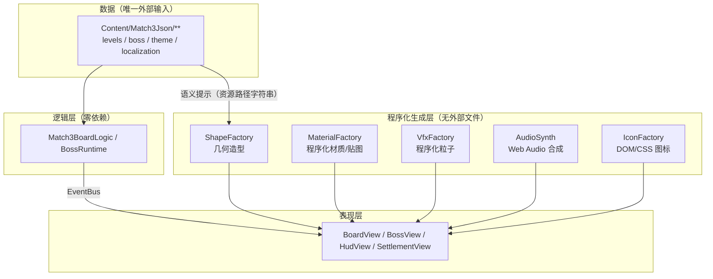
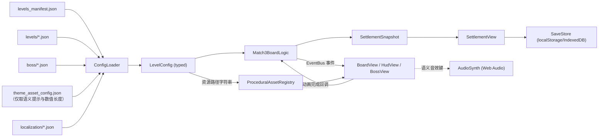
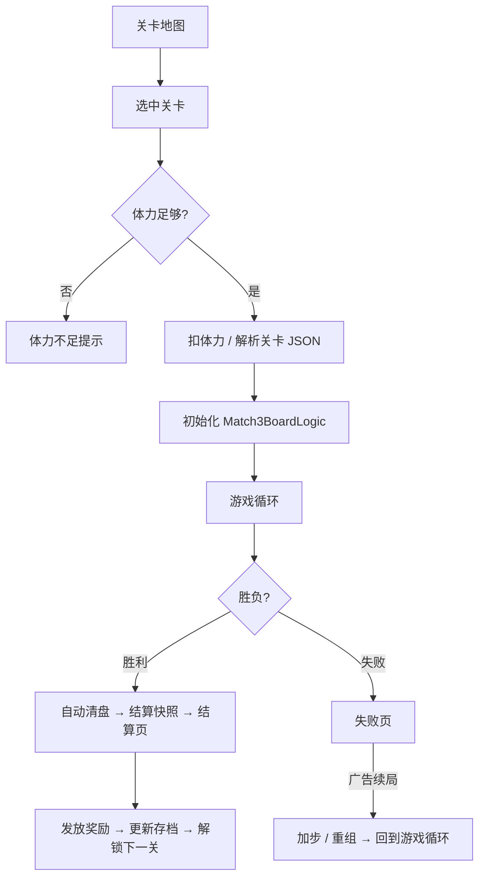

# Gemer Three.js Web 版开发规格书（给实现 AI 的完整交付文档）

> **文档定位**：这是一份**实现规格书**，不是设计草稿。实现方（另一个 AI / 开发者）应当只依赖本文档 + `Content/Match3Json/**` 数据文件，就能独立完成 Web 端（Three.js）的 Match3 主玩法、主线关卡、Boss 关玩法，并**直接复用 UE 工程里创作的关卡 JSON**。
>
> **事实来源**：本文档玩法规则、字段、默认值、公式均从当前 UE 工程源码与配置实测得出，来源文件已在各章节标注。若与源码冲突，以 `Source/Gemer/**` 为准。
>
> **代码基线**：UE 5.8 / Gemer 2026-09 基线。
> **文档版本**：v2.0（2026-09-12）。
>
> ---
>
> ## ⚠️ v2.0 重大变更：零外部资产
>
> Web 版**完全不依赖任何外部资产文件**：
>
> | 维度 | v1.0（旧） | **v2.0（本版，生效）** |
> | --- | --- | --- |
> | 3D 造型 | 导出 UE `.uasset` → glTF | **Three.js 程序化几何生成**（无任何模型文件） |
> | 贴图 | 导出 PNG | **Canvas / Shader 程序化生成**（无任何图片文件） |
> | 美术风格 | 还原 UE 美术 | **全新抽象简约风格**（几何语言 + 语义色板） |
> | 音效 / 音乐 | 导出 `.ogg` | **Web Audio 实时合成 / 生成式音频**（无任何音频文件） |
> | 粒子 | 导出 Niagara 参数 | **程序化粒子系统**（Three.js Points / 自研） |
> | 随机数 | 必须与 UE `FRandomStream` 位级一致 | **使用独立随机算法即可，不要求同步** |
> | 资源管线 | 需要 `.uasset → glTF` 导出工具 | **无需任何导出管线**（仅同步 JSON） |
>
> **`Content/Match3Json/**` 中所有 `/Game/...` 资源路径字段**在本版中被重新解释为**语义提示（semantic hints）**，
> 用于选择程序化生成配方，而**不是**用于加载文件。详见 [2.1](#21-资产路径的重新解释程序化语义提示) 与 [第 5 章](#第-5-章-程序化美术与音频规格零外部资产)。

---

## 目录

- [第 0 章 目标、范围与非目标](#第-0-章-目标范围与非目标)
- [第 1 章 总体架构（UE → Web 分层映射）](#第-1-章-总体架构ue--web-分层映射)
- [第 2 章 数据层：JSON 配置与关卡规范](#第-2-章-数据层json-配置与关卡规范)
- [第 3 章 Match3 核心玩法规格](#第-3-章-match3-核心玩法规格)
- [第 4 章 Boss 玩法规格](#第-4-章-boss-玩法规格)
- [第 5 章 程序化美术与音频规格（零外部资产）](#第-5-章-程序化美术与音频规格零外部资产)
- [第 6 章 关卡共享与数据管线（零资产依赖）](#第-6-章-关卡共享与数据管线零资产依赖)
- [第 7 章 存档、进度与流程](#第-7-章-存档进度与流程)
- [第 8 章 工程结构、任务拆分与里程碑](#第-8-章-工程结构任务拆分与里程碑)
- [第 9 章 验收与自测清单](#第-9-章-验收与自测清单)
- [附录 A 枚举与常量速查](#附录-a-枚举与常量速查)
- [附录 B 事件总线契约](#附录-b-事件总线契约)
- [附录 C 实现陷阱清单（务必逐条核对）](#附录-c-实现陷阱清单务必逐条核对)

---

# 第 0 章 目标、范围与非目标

## 0.1 目标

1. **主玩法**：完整复刻 UE 版 Match3 规则（交换、匹配、特殊块、连锁、重力补块、障碍系统、计分、目标、胜负、评星、死局重组）。
2. **主线关卡**：读取 `levels_manifest.json` + `levels/*.json`，支持 100 个主线关卡、关卡解锁链、星级存档。
3. **Boss 玩法**：完整复刻 Boss 配置加载、弱点伤害、技能调度、重生阶段、BossCoin、失败条件。
4. **配置全量读取**：能读取 `Content/Match3Json/**` 下所有配置文件（见 [2.2 配置清单](#22-配置清单)）。
5. **关卡共享**：在 UE 工程里新创作/修改的关卡 JSON，**无需改动 Web 代码**即可被 Web 端加载并正确运行。
6. **零外部资产（v2.0 新增，核心目标）**：整个 Web 版**不加载任何模型 / 贴图 / 音频 / 字体 / 视频文件**。所有视觉由 Three.js 程序化生成，所有声音由 Web Audio 实时合成。产物只有 HTML + JS + 关卡 JSON。

## 0.2 范围内（本期必须实现）

| 模块 | 说明 |
| --- | --- |
| Match3 逻辑内核 | 纯 TypeScript，无渲染依赖，可在 Node 里跑单测 |
| 棋盘 3D 渲染 | Three.js 程序化几何，正交相机，倾斜棋盘 |
| **程序化美术系统** | 形状语法 + 语义色板 + 程序化材质/贴图（**无外部文件**） |
| **程序化音频系统** | Web Audio 实时合成音效 + 生成式音乐（**无外部文件**） |
| 主 HUD | 目标面板、步数、分数、道具栏、大招（DOM/CSS + 程序化图标） |
| Boss HUD + Boss 表现 | 血条、弱点图标、**参数化程序化 Boss 造型**、技能演出 |
| 结算页 | 胜利/失败、星级、奖励、失败续局（加步/重组） |
| 关卡地图 | 纵向分块地图、解锁状态、星级（程序化背景与路径） |
| 本地化 | 中英文，key 查询 |
| 存档 | 进度、星级、货币、道具、BossCoin 拥有列表 |

## 0.3 范围外（本期不实现，但需预留接口）

- 颗粒流沙模式（`particle_flow`）——但配置解析要能识别并优雅跳过/提示。
- Slide Puzzle（`slide_puzzle`）、PvP（`pvp`）、MatchDuel、Tower 爬塔。
- 真实广告 SDK、后端/EOS、排行榜、社交。
- 还原 UE 原版美术外观（本版采用**全新抽象简约风格**，不复刻 UE 资产）。

## 0.4 硬性约束（不可违反）

1. **JSON 字段名与语义不可改**：Web 端必须适配 UE 端的字段名与大小写规则，不能要求 UE 端改配置。
2. **零外部资产**：不得引入任何 `.glb` / `.gltf` / `.png` / `.jpg` / `.svg` / `.mp3` / `.ogg` / `.wav` / `.woff` 文件。
   唯一允许的外部输入是 **`Content/Match3Json/**` 下的 JSON 数据文件**。
3. **逻辑与表现分离**：逻辑层不得引用 Three.js / Web Audio / DOM。表现层只订阅事件，不得反向改规则结果。
4. **数据驱动**：任何关卡行为差异必须来自 JSON，不允许在 Web 代码里写 `if (levelId === 'level_010')` 这类分支。
5. **确定性呈现**：同一个 `levelId` + 同一个 `typeId`，每次打开必须得到**完全相同**的造型与颜色（用 hash 派生，不用真随机）。
6. **随机数独立**：玩法随机使用 Web 端自选的 PRNG（见 [3.1.5](#315-随机源独立实现不要求与-ue-同步)），
   **不要求与 UE 端同步**；但同一 `RandomSeed` 在 Web 端内必须可复现。

## 0.5 零资产架构总览



**核心机制**：JSON 里的 `/Game/Models/paper/Paper.Paper` 这类字符串不再表示"要加载的文件"，
而是作为 **registry key** 被 `ShapeFactory` 查询，命中则用预设配方，未命中则用 **hash 派生配方**（见 [5.2](#52-程序化资产注册表procedural-asset-registry)）。
这样"新关卡引用新资源路径"永远不会崩溃，也不会随机变色。

---

# 第 1 章 总体架构（UE → Web 分层映射）

## 1.1 UE 三层边界（必须照搬）

UE 工程的核心边界（来源：`Documents/Gemer.md` §2.1）：

```
逻辑层  UMatch3BoardLogicComponent   → 规则计算、状态推进、目标进度、胜负判定
场景桥接 AMatch3BoardActor           → 输入入口、关卡加载桥接、棋盘实体与坐标组织
表现桥接 UMatch3PresentationComponent → 订阅逻辑事件，转发给 BP/VFX/UI
```

**Web 端必须保持同样的三层，只是换名字：**

| UE 层 | Web 对应模块 | 职责 | 禁止做的事 |
| --- | --- | --- | --- |
| Logic | `Match3BoardLogic` | 规则、状态机、计分、目标、Boss 运行时 | 不引用 THREE、不碰 DOM |
| Bridge | `BoardController` | 输入解析、关卡加载、坐标换算、动画调度 | 不做逐格规则判定 |
| Presentation | `BoardView` + `HudView` + `BossView` | 网格/模型/特效/UI 渲染 | 不改逻辑状态 |
| Event | `EventBus` | 逻辑 → 表现的单向事件流 | 表现不得回写逻辑 |

## 1.2 逻辑层文件拆分（建议与 UE 1:1）

UE 端逻辑按域拆文件（来源：`Documents/SourceCodeRoleMap.md` §3.1）。Web 端建议同样拆分，便于逐文件对照移植：

| UE 文件 | Web 文件 | 内容 |
| --- | --- | --- |
| `Match3BoardLogicComponent.cpp` | `logic/BoardLogic.ts` | 公共入口、初始化、共享工具 |
| `Match3BoardLogicComponent.Gameplay.cpp` | `logic/BoardLogic.Gameplay.ts` | 交换、可消除判定、特殊交换 |
| `Match3BoardLogicComponent.Cascade.cpp` | `logic/BoardLogic.Cascade.ts` | 清除、掉落、补块、连锁主循环 |
| `Match3BoardLogicComponent.CascadeFlow.cpp` | `logic/BoardLogic.CascadeFlow.ts` | 级联阶段推进 |
| `Match3BoardLogicComponent.CascadePostSettle.cpp` | `logic/BoardLogic.CascadePostSettle.ts` | 稳定后收敛 |
| `Match3BoardLogicComponent.Animation.cpp` | `logic/BoardLogic.Animation.ts` | 动画等待标记与回调 |
| `Match3BoardLogicComponent.State.cpp` | `logic/BoardLogic.State.ts` | 胜负、失败原因、复活 |
| `Match3BoardLogicComponent.BossRuntime.cpp` | `logic/BossRuntime.ts` | Boss HP/弱点/阶段 |
| `Match3BoardLogicComponent.BossScheduler.cpp` | `logic/BossScheduler.ts` | 按步/按时调度 |
| `Match3BoardLogicComponent.BossEffects.cpp` | `logic/BossEffects.ts` | 技能效果实现 |
| `Match3BoardLogicComponent.BossTurnBlockers.cpp` | `logic/BossTurnBlockers.ts` | 回合障碍推进、扩散、移动障碍 |
| `Match3BoardLogicComponent.BossCoin.cpp` | `logic/BossCoin.ts` | BossCoin 规则与效果 |
| `ParticleFlow/ParticleFlowLogic.cpp` | （范围外） | — |

## 1.3 建议技术选型

| 关注点 | 建议 | 理由 |
| --- | --- | --- |
| 语言 | TypeScript 5.x（`strict: true`） | 类型约束可防止 JSON 字段拼写错误 |
| 构建 | Vite | 快速冷启、原生 ESM |
| 3D | `three`（≥ r160） | 正交相机、InstancedMesh、程序化几何/材质齐备。**不用 GLTFLoader** |
| 程序化贴图 | `CanvasTexture` / `DataTexture` / `ShaderMaterial` | 无需图片文件即可生成图案 |
| UI | DOM/CSS 覆盖层（不用 three 内 UI） | 文本排版、多语言、自适应远比 Canvas 内绘制简单 |
| UI 图标 | 内联 SVG 字符串 / CSS 形状 / `CanvasTexture` | 不引入图片文件 |
| 音频 | **Web Audio API**（`AudioContext`）+ `THREE.AudioListener` / `PositionalAudio` 做空间化 | 音源全部为程序化生成的 `AudioBuffer` |
| 状态管理 | 自研 EventBus（不要 Redux） | 与 UE 委托模型对齐 |
| 单测 | Vitest（Node 环境，无 WebGL） | 逻辑层必须可在纯 Node 下测试 |
| 断言/校验 | Zod 或手写 validator | JSON 来自外部工程，必须容错并给出清晰报错 |

> **关键**：逻辑内核必须在 Node 环境可运行（无 `window` / `document` / WebGL / AudioContext 依赖），这样才能对 100 个关卡做批量回归。
>
> **依赖白名单**：生产依赖只允许 `three`（+ 可选 `zod`）。**禁止**任何提供模型/贴图/音频/字体的依赖或 CDN 资源。

## 1.4 数据流



> 注意 `theme_asset_config.json` 在本版中**只用于两类用途**：
> ① 取数值型语义（如分段模型**数组长度** → 决定障碍 HP 段数）；
> ② 取键集合语义（如哪些 `typeId` / `bossId` 存在）。
> 其中的 `/Game/...` 路径字符串**一律不用于加载文件**，只作为程序化配方的查找键。

## 1.5 动画等待协议（必须成对设计）

UE 端逻辑层在需要动画时会"挂起"并等表现层回调（来源：`Match3BoardLogicComponent.Animation.cpp`）。Web 端必须复刻该协议：

```
逻辑：设置 PendingAnimationPhase = Clear / Move / Spawn / Shuffle / BossConvert / ...
      广播事件（携带 batchId 与数据）
      返回 false（本轮不继续）
表现：播完动画 → 调用 logic.notifyClearAnimationCompleted(batchId)
逻辑：校验 batchId → 清 PendingAnimationPhase → 继续 ContinueCascadeUntilDoneOrWait()
```

**三条铁律**：
1. 每个 `notifyXxxCompleted` 必须校验 `batchId`，过期回调直接丢弃（防竞态）。
2. 每个挂起必须有**超时兜底**（建议 2s），超时后强制继续，防止死锁。
3. 若逻辑层被配置为"同步模式"（无动画），则直接返回 `true` 继续，不产生挂起。

---

# 第 2 章 数据层：JSON 配置与关卡规范

## 2.1 资产路径的重新解释（程序化语义提示）

UE 配置里所有资源路径都是 **Unreal 资产路径**，形如：

```
/Game/Models/Tiles/Tiles.Tiles              // 元素基础网格
/Game/Models/Tiles/Tile1Mat.Tile1Mat        // 元素 1 材质
/Game/Models/boom/Boom.Boom                 // 特殊块（炸弹）造型
/Game/Models/paper/Paper.Paper              // 障碍（纸团）造型
/Game/Niagara/Cleared01NG.Cleared01NG       // 消除粒子
/Game/Sounds/ClickCue.ClickCue              // 音效
/Game/Music/BGM.BGM                         // 音乐
/Game/Images/Coin.Coin                      // 图标贴图
/Game/Map/Map1.Map1                         // 地图背景
```

### 2.1.1 本版处理原则

> **这些字符串不是文件路径，是"配方键（recipe key）"。**

Web 端**不做任何文件加载**。取而代之：

```ts
// 输入：JSON 中的资源路径字符串
// 输出：程序化生成描述（不是 URL！）
resolve(unrealPath: string): ProceduralRecipe
// 例：resolve("/Game/Models/paper/Paper.Paper")
//  → { family: "blocker", typeId: 4, shape: "crumpledBlob",
//      palette: "paper", material: "matte", roughness: 0.9 }
```

### 2.1.2 逻辑路径提取

```
步骤 1：去掉 "/Game/" 前缀
        → "Models/paper/Paper.Paper"
步骤 2：去掉最后一个 "." 之后的部分（UE 的 <Name>.<Name> 后缀）
        → "Models/paper/Paper"
步骤 3：得到 { dir: "Models/paper", name: "Paper" }，作为 registry 查找键
```

### 2.1.3 三级查找（`ProceduralAssetRegistry`）

| 优先级 | 匹配方式 | 示例 | 结果 |
| --- | --- | --- | --- |
| 1 | **完整逻辑路径精确匹配** | `Models/paper/Paper` | 使用显式注册的配方 |
| 2 | **文件名匹配**（忽略目录） | `Paper` | 使用按名注册的配方 |
| 3 | **目录族匹配** | `Models/paper/**` | 使用族默认配方（`blocker` 族 + hash 派生参数） |
| 4 | **hash 兜底** | 未知路径 | 由路径字符串 hash 派生**稳定**的几何与颜色 |

> **必须实现第 4 级兜底**。这是"新关卡零改动可用"的关键：即使策划引入了 Web 端从未见过的资源路径，
> 也能生成一个稳定、可辨识的造型，而不是崩溃或随机变色。

### 2.1.4 确定性要求

```
// 同一个路径必须永远得到同一个结果
recipe = registry.resolve(path)
assert(recipe === registry.resolve(path))          // 纯函数、无副作用
```

- 禁止在 `resolve` 内使用 `Math.random()` / `Date.now()`。
- hash 函数建议用 FNV-1a 或 xxhash（见 [5.2.3](#523-hash-派生配方兜底机制)）。
- 结果应缓存（`Map<string, ProceduralRecipe>`）。

### 2.1.5 仍需读取的"数值型"语义

有一类字段虽然长得像资源路径，但其**数组长度具有玩法意义**，必须读取：

| 字段 | 玩法用途 |
| --- | --- |
| `BlockerTypeDefs[].DamageStageMeshes` | 数组长度 = 障碍 HP 段数（当 `bUseDamageStageMeshesAsHp = true`） |
| `theme.blockerTypeFallbackDamageStageMeshes[typeId]` | 同上（关卡未填时的托底），**只取 `.length`，忽略字符串内容** |
| `theme.rewardBlockerFallbackDamageStageMeshes[variantId]` | 奖励块变体存在性判定（单值 → 1 段） |

> 这条很容易被忽略：**分段模型数量决定障碍 HP**，属于玩法数据而非纯表现数据。

---

## 2.2 配置清单

以下是 Web 端需要读取的全部配置（来源：`Content/Match3Json/` 实测扫描）。

### 2.2.1 本期必须读取

| 文件 | 顶层结构 | 用途 |
| --- | --- | --- |
| `levels_manifest.json` | `{ bIgnoreLevelLockForTesting, levels[] }` | 关卡总索引、解锁链、模式路由 |
| `levels/*.json` | 见 [2.4](#24-关卡-json-schemalevel) | 关卡主体 |
| `boss/*.json` | 见 [2.5](#25-boss-json-schema) | Boss 外部配置（13 个文件） |
| `boss/boss_default.json` | 同上 | Boss 配置回退兜底 |
| `boss/boss_coin_skills.json` | 见 [2.6](#26-bosscoin-配置) | BossCoin 技能表 |
| `boss/skills.json` | `{ skills[] }` | 技能名/描述字典（仅文案） |
| `theme_asset_config.json` | 见 [2.7](#27-主题配置的语义用法) | **只取语义提示与数值长度**，路径字符串不加载文件 |
| `localization/texts_index.json` | `{ files[] }` | 本地化文件索引 |
| `localization/ui_text.json` | `{ module, entries[] }` | 人工覆盖文案（**优先级最高**） |
| `localization/ui_texts.json` | `{ module, entries[] }` | 自动生成文案 |
| `localization/codex_texts.json` | `{ entries[] }` | 图鉴文案 |
| `localization/guide_texts.json` | `{ entries[] }` | 向导文案 |
| `settlement/failure_reasons.json` | `{ FailureReasonFontSize, Descriptions }` | 失败原因文案 |
| `catalog/currencies.json` | `{ currencies[] }` | 货币定义 |
| `catalog/items.json` | `{ items[] }` | 道具定义 |
| `life/life_policy.json` | 见下 | 体力策略 |
| `adaptive_layout_config.json` | 见 [5.8](#58-自适应布局) | 跨设备适配 |

`life/life_policy.json` 实测内容：
```json
{ "maxLives": 5, "initialLives": 5, "regenIntervalSec": 1800, "entryCostPerLevel": 1 }
```

### 2.2.2 本期可延后（但要能解析不报错）

| 文件 | 说明 |
| --- | --- |
| `reward/reward_rules.json` | `{ modeRules, levelRules }` 奖励规则 |
| `reward/spin_wheel_config.json` | 转盘 |
| `ads/ads_config.json` | 广告（Web 端建议直接桩化） |
| `guide/guide_steps.json` | 向导步骤（`bEnabled`, `Steps`） |
| `codex/codex_entries.json` | 图鉴条目 |
| `catalog/products.json` | 商品 |
| `catalog/item_level_limits.json` | 道具等级限制 |
| `stats/battle_stats_config.json` | 战绩统计 UI 配置 |
| `slidepuzzle/*`、`pvp/*`、`pvpLevels/*`、`matchduel/*`、`tower/*`、`particleflow/*` | 其它模式 |

### 2.2.3 命名与大小写规则（易错点）

| 配置类型 | 大小写风格 | 解析方式 |
| --- | --- | --- |
| `levels/*.json` | **PascalCase**（`LevelId`/`Board`/`Goal`） | 大小写不敏感解析更安全 |
| `boss/*.json` | **lowerCamelCase**（`bossId`/`maxHp`/`weaknesses`） | 大小写不敏感 |
| `theme_asset_config.json` | lowerCamelCase 顶层 + **PascalCase 内嵌 UE 属性**（如 `"TileTypeMeshes"`） | 大小写不敏感 |
| `boss_coin_skills.json` | lowerCamelCase | **严格大小写不敏感**（UE 端手工实现） |
| `localization/*.json` | 固定 schema | 严格 |

> **实现要求**：JSON 解析器必须**统一做大小写不敏感的字段查找**（先精确匹配，失败再全表 `toLowerCase()` 扫描）。UE 的 `FJsonObjectConverter` 基于 `FName` 比较（不区分大小写），所以 `maxHp` 与 `maxHP` 都能生效。Web 端必须兼容。
>
> **特例**：Boss 的 HP 字段需要**同时**尝试 `maxHp` 与 `maxHP`、`initialHp` 与 `initialHP`（UE 端在自动映射之外还手工读了一遍）。

## 2.3 `levels_manifest.json` Schema

```jsonc
{
  "bIgnoreLevelLockForTesting": false,   // true = 忽略解锁限制（仅测试用）
  "levels": [
    {
      "levelId": "level_001",            // 唯一 ID，必须与 levels/*.json 的 LevelId 一致
      "order": 1,                        // 排序序号；Boss 关通常用负数偏移；-1 表示特殊入口
      "displayName": "1",                // 展示名（多为数字；正式文案走本地化）
      "modeId": "match3",                // match3 | boss? | particle_flow | slide_puzzle | pvp
      "configFile": "levels/level_001.json",  // 相对 Content/Match3Json 的路径
      "chapterId": "chapter_01",         // 章节分组（用于地图分块）
      "bInitiallyUnlocked": true,        // 初始是否解锁
      "bEnabled": true,                  // 是否在游戏中出现
      "outcomes": {
        "firstWinEffects": [             // 首次通关效果
          { "type": "UnlockLevel", "targetId": "level_002" },
          { "type": "PlayPresentationCue", "targetId": "level_001_clear" }
        ],
        "repeatWinEffects": [],          // 重复通关效果
        "loseEffects": []
      }
    }
  ]
}
```

**实测统计**（当前基线）：
- 共 **122** 个条目；`bEnabled: true` 的可用关卡约 100 个主线。
- `modeId` 分布：`match3` = 100、`slide_puzzle` = 11、`particle_flow` = 10、`pvp` = 1。
- 注意：`bEnabled: false` 的条目（如 `level_test`、`level_pvp`）**不进入正式流程**。

**`outcomes` effect type 已知值**：
| type | 语义 |
| --- | --- |
| `UnlockLevel` | 解锁 `targetId` 指定关卡 |
| `PlayPresentationCue` | 播放演出提示（Web 端可映射为过场动画/音效） |

**加载策略（Web 端）**：
1. 读 manifest → 过滤 `bEnabled === true`。
2. 按 `modeId` 分组；本期只加载 `match3`（Boss 关也是 `modeId: "match3"`，靠关卡内 `Boss.bEnabled` 区分）。
3. 关卡 JSON **懒加载**（进关前加载），manifest 常驻。
4. 解锁状态由本地存档维护，`bInitiallyUnlocked` 只作为初始值。

## 2.4 关卡 JSON Schema（`levels/*.json`）

> 来源：`Source/Gemer/Match3/Match3Config.h`（`FMatch3LevelConfig` 及其子结构）+ `Content/Match3Json/levels/*.json` 实测。
> **未在结构体中定义的字段不会生效**——Web 端也应忽略未知字段（但要记录 warning）。

### 2.4.1 顶层字段

| 字段 | 类型 | 默认值 | 说明 |
| --- | --- | --- | --- |
| `LevelId` | string | `"level_default"` | 关卡唯一标识 |
| `CellSize` | float | `100.0` | **可选覆盖**：单格世界尺寸（仅当 JSON 显式声明时生效） |
| `BoardLocationOffset` | `{X,Y,Z}` | `(0,0,0)` | **可选覆盖**：棋盘位置偏移 |
| `bEnableUltimateSkill` | bool | `true` | **可选覆盖**：是否启用大招 |
| `InitialUltimateReadyTileType` | int | `0` | 开局直接给就绪大招的元素类型；`<=0` 不注入 |
| `Board` | object | — | 棋盘主体（见 2.4.2） |
| `TilePool` | object | — | 元素池（见 2.4.3） |
| `Rules` | object | — | 规则开关（见 2.4.4） |
| `Score` | object | — | 计分参数（见 2.4.5） |
| `Goal` | object | — | 目标（见 2.4.6） |
| `Boss` | object | — | Boss 配置（见 2.4.7） |
| `StarRating` | object | — | 评星参数（见 2.4.8） |
| `SpecialCombos` | array | `[]` | 特殊块组合覆盖（见 2.4.9） |
| `VictoryNiagaraPath` | string | `""` | 过关粒子覆盖 |
| `VictoryNiagaraBossPath` | string | `""` | 过关粒子的 Boss 参数资源 |
| `VictorySoundPath` | string | `""` | 过关音效覆盖 |
| `Lighting` | object | — | 灯光（见 2.4.10） |
| `ParticleModeConfig` | object | — | 颗粒流沙（范围外） |

**覆盖语义**：`CellSize` / `BoardLocationOffset` / `bEnableUltimateSkill` 三个字段有"是否显式声明"标志（UE 端为 `bHasCellSizeOverride` 等）。Web 端解析时必须区分"字段缺失"与"字段等于默认值"，**只有字段存在时才覆盖主题/全局默认**。

### 2.4.2 `Board` 字段

| 字段 | 类型 | 默认值 | 说明 |
| --- | --- | --- | --- |
| `Rows` | int | `9` | 行数，必须 > 0 |
| `Cols` | int | `9` | 列数，必须 > 0 |
| `Mask` | string[] | `[]` | 每行 `0/1`，`1` = 该格可用（可交互） |
| `Blocked` | string[] | `[]` | 每行 `0/1`，`1` = 初始有 1 层障碍（**被 `BlockedTypes` 取代，优先级低**） |
| `BlockedTypes` | string[] | `[]` | 每行 `0-9/A-Z`，字符即障碍 TypeId（`0` = 无障碍）。**优先于 `Blocked`** |
| `BlockedHP` | string[] | `[]` | 每行 `0-9/A-Z`，字符即初始 HP（`0` = 用类型默认 HP） |
| `BlockedTransformTarget` | string[] | `[]` | 每行 `0-9/A-Z`，格子级转化目标 TypeId（`0` = 用 TypeDef 默认） |
| `StickyMask` | string[] | `[]` | 每行 `0/1`，`1` = 初始普通块带"黏住" |
| `LarvaeMask` | string[] | `[]` | 每行 `0/1`，`1` = 初始普通块带"孑孓" |
| `BubbleMask` | string[] | `[]` | 每行 `0/1`，`1` = 初始普通块带"气泡" |
| `BubbleSpawnIntervalMoves` | int | `2` | 气泡生成步数间隔 |
| `BubbleSpawnPoints` | `{Row,Col}[]` | `[]` | 气泡上浮后尝试生成新泡的候选坐标 |
| `BlockerTypeDefs` | array | `[]` | 障碍类型定义表（见 2.4.2.1） |
| `LarvaeBlockerTypePool` | int[] | `[]` | 孑孓格被清除后随机转换的目标障碍 TypeId 池 |
| `Pipe` | object | 关闭 | 管道覆盖层（见 2.4.2.2） |
| `InitialTiles` | int[] | `[]` | 初始普通块铺盘，按行展开，长度应为 `Rows*Cols`，`0` = 空 |
| `CellCustomModels` | array | `[]` | 格子自定义模型（仅表现，见 2.4.2.3） |
| `InitialSpecials` | array | `[]` | 开局强制放置特殊块（见 2.4.2.4） |
| `BlockerRandomizeConfigs` | array | `[]` | 障碍随机生成配置（见 2.4.2.5） |
| `RewardBlockerVariants` | array | `[]` | 奖励块变体定义（见 2.4.2.6） |
| `RewardBlockerPlacements` | array | `[]` | 奖励块固定落位（见 2.4.2.7） |
| `RandomSeed` | int | `0` | `0` = 运行时随机；否则为固定种子 |

**字符编码规则**（`0-9/A-Z`）：
```
'0'..'9'  →  0..9
'A'..'Z'  → 10..35
```
解析函数：`charToInt(c) = c >= '0' && c <= '9' ? c - '0' : (c >= 'A' && c <= 'Z' ? c - 'A' + 10 : 0)`

**Mask / BlockedTypes 行数校验**：必须等于 `Rows`，每行长度必须等于 `Cols`；不满足则拒绝加载并报错。

#### 2.4.2.1 `BlockerTypeDefs[]` 字段（`FMatch3BlockerTypeDef`）

| 字段 | 类型 | 默认值 | 说明 |
| --- | --- | --- | --- |
| `TypeId` | int | `1` | 障碍类型 ID（> 0） |
| `bDestructible` | bool | `true` | 是否可破坏；`false` = 占位障碍 |
| `DefaultHP` | int | `1` | 默认耐久 |
| `BreakScore` | int | `-1` | 击破得分；`<0` 回退 `Score.BlockerBreakScore` |
| `bDamageByAdjacentClear` | bool | `false` | 是否可被旁消伤害 |
| `AdjacentDamageSourceTileTypes` | int[] | `[]` | 限制旁消来源元素类型；空 = 不限 |
| `bAdjacentDamageRequiresNormalMatch` | bool | `false` | 仅普通三消的旁侧清除有效 |
| `bAdjacentDamageAllowSpecialExplosion` | bool | `false` | 允许特殊爆炸旁侧伤害 |
| `bAdjacentDamageAllowUltimateBySourceType` | bool | `false` | 允许大招按来源类型旁侧伤害 |
| `bImmuneToDirectHitDamage` | bool | `false` | 免疫所有直击伤害 |
| `bMovable` | bool | `false` | 每回合自动移动 1 格 |
| `bSwapOnMatchOnly` | bool | `false` | 可被交换，但必须交换后形成消除（如小黄鸭） |
| `bAllowGloveSwap` | bool | `true` | 手套是否可交换 |
| `bFailOnEscape` | bool | `false` | 到边缘再次移动是否判负 |
| `bEscapeTriggersDefeat` | bool | `true` | 逃脱是否立即失败 |
| `bMoveRandomEachTurn` | bool | `false` | 移动型障碍随机方向（否则朝边缘贪心） |
| `bSignalOnBreak` | bool | `false` | 破碎时广播逻辑信号 |
| `BreakSignalTag` | FName | `None` | 信号标签 |
| `bInterceptSpecialTiles` | bool | `false` | 回合末拦截最近特殊块 |
| `InterceptTargetBlockerType` | int | `17` | 拦截后转化的障碍 TypeId |
| `InterceptFlyDurationSeconds` | float | `0.22` | 拦截动画单程时长 |
| `bUseDamageStageMeshesAsHp` | bool | `false` | HP 由分段模型数量决定 |
| `DamageStageMeshes` | string[] | `[]` | 按 HP 从高到低的分段模型路径 |
| `bAllowFinalStageRepeatHit` | bool | `false` | 最后阶段重复命中不破碎 |
| `FinalStageSignalTag` | FName | `None` | 最后阶段重复命中的信号标签 |
| `bFinalStageRepeatHitRequiresAdjacentClear` | bool | `true` | 最后阶段重复命中是否仅接受旁消 |
| `bTransformOnFinalStageBreak` | bool | `false` | HP 归零后就地转化为另一障碍 |
| `FinalStageTransformBlockerType` | int | `0` | 转化目标 TypeId |
| `bSpreadEachTurn` | bool | `false` | 每回合扩散 |
| `SpreadCountPerTurn` | int | `1` | 每次扩散数量 |
| `bSpreadAsSticky` | bool | `false` | 扩散改为附加黏住 |
| `bCorrodeToMaskOnTimeout` | bool | `false` | 到时把格子变不可用（mask=0） |
| `CorrodeDelaySeconds` | float | `10.0` | 腐蚀延迟秒数 |
| `bComposite2x2` | bool | `false` | 2×2 复合障碍 |
| `bComposite1x3Vertical` | bool | `false` | 1×3 竖向复合障碍 |
| `bWeaknessBlocker` | bool | `false` | 弱点障碍（Boss 关联） |
| `CompositeRows` | int | `1` | 弱点障碍复合行数 |
| `CompositeCols` | int | `1` | 弱点障碍复合列数 |
| `WeaknessHPOverride` | int | `-1` | 弱点障碍 HP 覆盖；`0` = 不可销毁占位；`<0` = 不覆盖 |
| `bWeaknessDamageByAdjacentClear` | bool | `false` | 弱点障碍是否接受旁消 |
| `WeaknessBossDamagePerHit` | int | `0` | 每次命中对 Boss 的伤害 |
| `bWeaknessUseSkeletalMeshVisual` | bool | `false` | 是否用骨骼资源表现 |
| `bRestoreTilesOnBreak` | bool | `false` | 2×2 复合击破后恢复为普通块 |
| `bIsMouthBlocker` | bool | `false` | 嘴障碍 |
| `MouthTriggerFlyCount` | int | `5` | 触发转换的"倔强的灰"数量阈值 |
| `MouthFlyTileType` | int | `4` | 目标元素类型 |
| `MouthTargetBlockerType` | int | `15` | 转换目标障碍 TypeId |
| `bIsRewardBlocker` | bool | `false` | 奖励块 |
| `bInstantFillUltimateOnBreak` | bool | `false` | 击破立即充满大招 |
| `BreakRewardCurrencyId` | FName | `None` | 击破发放货币 Id |
| `BreakRewardCurrencyAmount` | int | `0` | 货币数量 |
| `BreakRewardItemId` | FName | `None` | 击破发放道具 Id |
| `BreakRewardItemCount` | int | `0` | 道具数量 |
| `BreakRewardMoveCount` | int | `0` | 击破增加步数 |
| `BreakNiagaraPath` | string | `""` | 关卡级击破粒子覆盖 |

**校验规则（必须实现，来自 `Match3Config.cpp`）**：
- `bWeaknessBlocker = true` 时**不允许**同时开 `bComposite2x2` / `bComposite1x3Vertical` / `bMovable` / `bSpreadEachTurn` / `bCorrodeToMaskOnTimeout`。
- `bTransformOnFinalStageBreak` 与 `bAllowFinalStageRepeatHit` **互斥**。
- `bTransformOnFinalStageBreak = true` 时 `FinalStageTransformBlockerType` 必须 > 0 且能在 `BlockerTypeDefs` 找到。
- `Goal.BlockerBreakByType` 中每个 `TypeId` 必须在 `BlockerTypeDefs` 中存在。
- `Boss.SealFailThreshold` 必须在 `[0, 1]`。

#### 2.4.2.2 `Pipe` 字段（`FMatch3PipeConfig`）

| 字段 | 类型 | 默认值 | 说明 |
| --- | --- | --- | --- |
| `bEnabled` | bool | `false` | 总开关 |
| `Mask` | string[] | `[]` | 每行 `0/1`，`1` = 有管道 |
| `BlockedMask` | string[] | `[]` | 每行 `0/1`，`1` = 开局阻塞 |
| `OpenMask` | string[] | `[]` | 每行 `0-9/A-Z`，按位开口掩码：**上=1，右=2，下=4，左=8** |
| `ProxyTileTypeMask` | string[] | `[]` | 每行 `0-9/A-Z`，阻塞态代理基础元素类型（`0` = 默认） |
| `HPMask` | string[] | `[]` | 每行 `0-9/A-Z`，阻塞态耐久（`0` = 默认） |
| `DefaultProxyTileType` | int | `1` | 默认代理元素类型 |
| `DefaultHP` | int | `1` | 默认耐久 |
| `DefaultOpenMask` | int | `15` | 默认开口掩码（四方向全开） |
| `GoalMode` | enum | `"AllOpen"` | `AllOpen`（全部疏通）/ `AllFlowing`（全部通水） |
| `Sources` | `{Row,Col}[]` | `[]` | 水源坐标（仅 `AllFlowing` 参与判定） |
| `Ends` | `{Row,Col}[]` | `[]` | 终点坐标（表现层渲染用） |

> 实测样例（`level_051.json`）：8 行 5 列，`GoalMode: "AllFlowing"`，`Sources: [{Row:7,Col:4}]`，`Ends: [{Row:0,Col:4}]`。

#### 2.4.2.3 `CellCustomModels[]`

| 字段 | 类型 | 默认 | 说明 |
| --- | --- | --- | --- |
| `Row` / `Col` | int | `0` | 目标格 |
| `MeshPath` | string | `""` | 自定义模型路径（可留空，走主题托底） |
| `RelativePosition` | `{X,Y,Z}` | `(0,0,0)` | 相对格中心偏移 |
| `RelativeRotation` | `{Pitch,Yaw,Roll}` | `(0,0,0)` | 相对棋盘朝向旋转 |
| `RelativeScale` | `{X,Y,Z}` | `(1,1,1)` | 相对棋盘基础缩放 |

#### 2.4.2.4 `InitialSpecials[]`

| 字段 | 类型 | 默认 | 说明 |
| --- | --- | --- | --- |
| `Row` / `Col` | int | `-1` | 目标格 |
| `SpecialType` | enum | `None` | `LineHorizontal` / `LineVertical` / `Bomb3x3` / `ColorBomb` |

#### 2.4.2.5 `BlockerRandomizeConfigs[]`

| 字段 | 类型 | 默认 | 说明 |
| --- | --- | --- | --- |
| `BlockerTypeId` | int | `0` | 要随机出现的障碍类型 |
| `AppearanceProbability` | float | `0.0` | 每格出现概率 `[0,1]` |
| `MaxInstanceCount` | int | `0` | 最多生成数量；`0` = 无限制 |
| `GlobalTriggerProbability` | float | `1.0` | 整体触发概率（先判它，再判每格） |
| `TargetableTileTypes` | int[] | `[]` | 仅在这些元素类型位置替换；空 = 所有位置 |
| `RewardVariantId` | FName | `None` | 奖励块变体 Id |

#### 2.4.2.6 `RewardBlockerVariants[]`（`FMatch3RewardBlockerVariantDef`）

| 字段 | 类型 | 默认 | 说明 |
| --- | --- | --- | --- |
| `VariantId` | FName | `None` | 变体唯一标识 |
| `bInstantFillUltimateOnBreak` | bool | `false` | 击破立即充满大招 |
| `BreakRewardCurrencyId` | FName | `None` | 货币 Id |
| `BreakRewardCurrencyAmount` | int | `0` | 货币数量 |
| `BreakRewardItemId` | FName | `None` | 道具 Id |
| `BreakRewardItemCount` | int | `0` | 道具数量 |
| `BreakRewardMoveCount` | int | `0` | 增加步数 |
| `BreakNiagaraPath` | string | `""` | 变体击破粒子 |

**当前基线推荐变体命名**（来源：`Documents/Match3Levels.md` §7.3）：

| VariantId | 奖励 |
| --- | --- |
| `giftcoin` | `BreakRewardCurrencyId: "coin"` |
| `giftgem` | `BreakRewardCurrencyId: "gem"` |
| `giftstar` | 高额金币 |
| `giftultimate` | `bInstantFillUltimateOnBreak: true` |
| `giftstep` | `BreakRewardMoveCount: 10` |
| `giftglove` / `gifthammer` / `giftrocket` / `giftbrush` / `giftfinger` | 对应道具 |

**发放时机（重要）**：
- **货币奖励**：胜利结算统一发放。
- **道具奖励**：击破**即时**发放，并触发道具栏飞行/刷新表现。
- **步数奖励**：击破即时生效。

#### 2.4.2.7 `RewardBlockerPlacements[]`

| 字段 | 类型 | 说明 |
| --- | --- | --- |
| `Row` / `Col` | int | 目标格 |
| `VariantId` | FName | 该格奖励变体 Id |

### 2.4.3 `TilePool` 字段

| 字段 | 类型 | 默认 | 说明 |
| --- | --- | --- | --- |
| `TileTypes` | int[] | `[]` | 可生成的元素类型列表 |
| `Weights` | int[] | `[]` | 与 `TileTypes` 一一对应的权重 |
| `NonRegeneratingTileTypes` | int[] | `[]` | **禁止被自动补块生成**（只能初始配置或显式转换放置） |
| `InertTileTypes` | int[] | `[]` | 惰性块：**可参与匹配**，但不计 Collect、不计基础得分、不作为旁消伤害来源 |

### 2.4.4 `Rules` 字段

| 字段 | 类型 | 默认 | 说明 |
| --- | --- | --- | --- |
| `MinMatchCount` | int | `3` | 匹配长度阈值（横竖共用） |
| `bAllowDiagonalSwap` | bool | `false` | 允许对角交换 |
| `bInvalidSwapBounceBack` | bool | `true` | 无效交换回弹 |
| `bEnsureAtLeastOneMove` | bool | `true` | 保证至少一个可行动作（死局自动重组） |
| `bAvoidAutoCascadeAtStart` | bool | `true` | 开局避免自动连锁 |
| `bUseTopSpawnAfterInternalSettle` | bool | `false` | 补块模式（见 [3.5](#35-重力与补块)） |
| `bEnableSpecialSpecialSwapCombo` | bool | `false` | 允许特殊块+特殊块交换触发组合技 |
| `bDrainSuctionCountsForCollectGoal` | bool | `true` | 地漏吸入命中目标色是否计 Collect |
| `bEnableGloveTool` | bool | `true` | 手套道具开关 |
| `bGloveAllowNormalTiles` | bool | `true` | 手套可换普通块 |
| `bGloveAllowSpecialTiles` | bool | `true` | 手套可换特殊块 |
| `bGloveAllowBlockers` | bool | `true` | 手套可换障碍 |
| `bGloveAllowStickyCell` | bool | `false` | 手套可换黏住格 |
| `bGloveAllowLarvaeCell` | bool | `false` | 手套可换孑孓格 |
| `bGloveAllowPipeCell` | bool | `false` | 手套可换管道格 |
| `bGloveAllowFrozenCell` | bool | `false` | 手套可换冻结格 |
| `bGloveAllowMovementLockedCell` | bool | `false` | 手套可换移动锁格 |
| `GloveDisallowTileTypes` | int[] | `[]` | 手套禁换的元素类型 |
| `GloveDisallowBlockerTypeIds` | int[] | `[]` | 手套禁换的障碍类型 |

### 2.4.5 `Score` 字段

| 字段 | 类型 | 默认 | 说明 |
| --- | --- | --- | --- |
| `BaseClearScore` | int | `50` | 每格基础分 |
| `ExtraPerMoreThan3` | int | `20` | 超出 3 连后每格额外分 |
| `SpecialTriggerScore` | int | `120` | 每个被清除特殊块的额外分 |
| `ComboMultiplierStep` | float | `0.4` | 连锁倍率步进 |
| `BlockerBreakScore` | int | `80` | 每击破 1 层障碍的基础分 |

### 2.4.6 `Goal` 字段

| 字段 | 类型 | 默认 | 说明 |
| --- | --- | --- | --- |
| `TargetScore` | int | `3000` | 评分归一化基准（**不参与过关判定**） |
| `MaxMoves` | int | `30` | 步数上限；`-1` = 无限步（UI 显示 ∞） |
| `Collect` | array | `[]` | 收集目标列表 |
| `TargetBlockerBreakCount` | int | `0` | 击破障碍总数目标；`0` = 无 |
| `BlockerBreakByType` | array | `[]` | 按类型击破目标；**配置后优先于 `TargetBlockerBreakCount`** |

`Goal.Collect[]`：

| 字段 | 类型 | 默认 | 说明 |
| --- | --- | --- | --- |
| `TileType` | int | `1` | 目标元素类型 |
| `Count` | int | `10` | 需要数量 |
| `bCountSpecialClear` | bool | `true` | 是否统计特殊块造成的消除 |

`Goal.BlockerBreakByType[]`：

| 字段 | 类型 | 默认 | 说明 |
| --- | --- | --- | --- |
| `TypeId` | int | `1` | 障碍类型 |
| `Count` | int | `1` | 目标击破数量 |

### 2.4.7 `Boss` 字段（关卡内联）

| 字段 | 类型 | 默认 | 说明 |
| --- | --- | --- | --- |
| `ConfigFile` | string | `""` | 外部 Boss 配置相对路径（如 `boss/boss01.json`） |
| `bEnabled` | bool | `false` | 是否 Boss 关 |
| `BossId` | FName | `None` | Boss 唯一标识 |
| `MaxHP` | int | `100` | 最大生命 |
| `InitialHP` | int | `0` | 初始生命；`<=0` 回退 `MaxHP` |
| `Weaknesses` | array | `[]` | 弱点列表 |
| `BlockerWeaknessTriggers` | array | `[]` | 障碍信号弱点 |
| `Skills` | array | `[]` | 技能列表 |
| `bEnableRebirthPhase` | bool | `false` | 是否启用重生 |
| `RebirthSpawnBlockerType` | int | `0` | 二阶段生成障碍 TypeId |
| `RebirthSpawnCount` | int | `0` | 二阶段生成数量 |
| `RebirthMaxHp` | int | `0` | 二阶段最大 HP |
| `RebirthInitialHp` | int | `0` | 二阶段初始 HP |
| `RebirthWeaknesses` | array | `[]` | 二阶段弱点覆盖 |
| `RebirthBlockerWeaknessTriggers` | array | `[]` | 二阶段信号弱点覆盖 |
| `RebirthPhases` | array | `[]` | 多阶段重生配置（见 2.5.4） |
| `SealFailThreshold` | float | `1.0` | 棋盘封印失败阈值 `[0,1]` |
| `Presentation` | object | — | 表现配置（见 2.5.5） |

### 2.4.8 `StarRating` 字段

| 字段 | 类型 | 默认 | 说明 |
| --- | --- | --- | --- |
| `ThreeStarScore` | int | `4500` | 3 星目标分（**仅当 `Goal.TargetScore <= 0` 时作为归一化基准**） |
| `ScoreWeight` | float | `0.7` | 分数权重 |
| `MoveWeight` | float | `0.3` | 剩余步权重 |
| `OverCollectWeight` | float | `0.2` | 超额收集权重 |
| `TwoStarThreshold` | float | `0.74` | 2 星阈值 |
| `ThreeStarThreshold` | float | `0.95` | 3 星阈值 |
| `FourStarThreshold` | float | `1.02` | 4 星阈值 |
| `FiveStarThreshold` | float | `1.10` | 5 星阈值 |
| `MinScoreFor2Star` | int | `0` | 2 星最低分 |
| `MinScoreFor3Star` | int | `0` | 3 星最低分 |
| `MinScoreFor4Star` | int | `0` | 4 星最低分（未配置回退 3 星线） |
| `MinScoreFor5Star` | int | `0` | 5 星最低分（未配置回退 4 星线） |
| `ScoreNormCap` | float | `1.2` | 分数归一化上限 |
| `OverCollectNormCap` | float | `1.0` | 超额收集归一化上限 |

### 2.4.9 `SpecialCombos[]` 字段

| 字段 | 类型 | 默认 | 说明 |
| --- | --- | --- | --- |
| `A` / `B` | enum | `None` | 组合双方（无序匹配） |
| `bClearWholeBoard` | bool | `false` | 清整盘 |
| `bClearAllOfOtherType` | bool | `false` | 清对方类型全部棋子 |
| `BombRadius` | int | `0` | 以交换中心爆炸半径（0 = 不爆炸） |
| `bClearSwapRow` | bool | `false` | 额外清交换行 |
| `bClearSwapCol` | bool | `false` | 额外清交换列 |
| `SwapRowBandHalfWidth` | int | `0` | 行清除带宽半径（1 = 上下各 1 行，共 3 行） |
| `SwapColBandHalfWidth` | int | `0` | 列清除带宽半径 |

> **实测**：当前所有关卡 JSON 的 `SpecialCombos` 基本只配置 `LineHorizontal + LineVertical`，其余走**内置兜底矩阵**（见 [3.3.3](#333-特殊块组合内置兜底矩阵实际生效)）。

### 2.4.10 `Lighting` 字段

| 字段 | 类型 | 默认 | 说明 |
| --- | --- | --- | --- |
| `bEnableDirectionalLight` | bool | `true` | 启用平行光 |
| `bEnableSkyLight` | bool | `true` | 启用天光 |
| `DirectionalLightIntensity` | float | `-1.0` | `-1` = 平台默认（iOS=1, Android=4, 其它=3） |
| `SkyLightIntensity` | float | `-1.0` | `-1` = 平台默认（均 1） |

## 2.5 Boss JSON Schema（`boss/*.json`）

> 来源：`Source/Gemer/Match3/Match3Config.h`（`FMatch3BossConfig` 等）+ `boss/boss01.json` ~ `boss10.json` 实测。
> **全部使用 lowerCamelCase。**

### 2.5.1 加载优先级（必须完全一致）

```
关卡 JSON 的 "Boss" 内联块（PascalCase）
  │
  ├─ 若 bEnabled == true 且 ConfigFile 非空：
  │     ① 尝试加载 Content/Match3Json/<ConfigFile>          （如 boss/boss01.json）
  │     ② 失败 → 加载 boss/boss_default.json
  │     ③ 都失败 → 保留关卡内联配置（仅打 warning）
  │
  └─ 成功后：外部文件 **整体覆盖** 内联块
             （即内联的 BossId / SealFailThreshold 等全部被替换）
```

**路径解析**：先当绝对路径检查文件是否存在；否则拼接 `<ContentRoot>/Match3Json/<相对路径>`。

### 2.5.2 顶层字段

| 字段 | 类型 | 默认 | 说明 |
| --- | --- | --- | --- |
| `bEnabled` | bool | `false` | 是否启用 |
| `bossId` | string | `""` | 唯一标识（**必须与主题 `bossLevelIcon*ByBossId` 的键一致**） |
| `displayName` | string | `""` | 展示名（英文） |
| `maxHp` **或** `maxHP` | int | `100` | 最大生命（两个拼写都要支持） |
| `initialHp` **或** `initialHP` | int | `0` | 初始生命；`<=0` 回退 `maxHp` |
| `weaknesses` | array | `[]` | 弱点列表 |
| `blockerWeaknessTriggers` | array | `[]` | 障碍信号弱点 |
| `skills` | array | `[]` | 技能列表 |
| `sealFailThreshold` | float | `1.0` | 封印失败阈值 `[0,1]`；`0` = 禁用该判定 |
| `bEnableRebirthPhase` | bool | `false` | 旧式重生开关 |
| `rebirthSpawnBlockerType` | int | `0` | 旧式二阶段障碍 |
| `rebirthSpawnCount` | int | `0` | 旧式二阶段数量 |
| `rebirthMaxHp` | int | `0` | 旧式二阶段最大 HP |
| `rebirthInitialHp` | int | `0` | 旧式二阶段初始 HP |
| `rebirthWeaknesses` | array | `[]` | 旧式二阶段弱点 |
| `rebirthBlockerWeaknessTriggers` | array | `[]` | 旧式二阶段信号弱点 |
| `rebirthPhases` | array | `[]` | **多阶段重生（优先于旧式字段）** |
| `presentation` | object | — | 表现配置 |

**弱点字段** `weaknesses[]`：

| 字段 | 类型 | 默认 | 说明 |
| --- | --- | --- | --- |
| `tileType` | int | `1` | 对应元素类型 |
| `damagePerClear` | int | `1` | 每次消除的 HP 变化（**正 = 扣血，负 = 回血**） |
| `bExcludeUltimateClears` | bool | `false` | 大招清除该类型时不掉血 |

**信号弱点字段** `blockerWeaknessTriggers[]`：

| 字段 | 类型 | 默认 | 说明 |
| --- | --- | --- | --- |
| `signalTag` | string | `""` | 障碍破碎信号标签 |
| `damagePerTrigger` | int | `1` | 每次触发的伤害（仅正值有效） |

**技能字段** `skills[]`：

| 字段 | 类型 | 默认 | 说明 |
| --- | --- | --- | --- |
| `bEnabled` | bool | `true` | 技能开关 |
| `skillId` | string | `""` | 技能标识 |
| `effectType` | string | `""` | 效果类型；**为空时回退 `skillId`** |
| `intervalMoves` | int | `3` | 按步触发间隔 |
| `intervalSecondsMin` | float | `0.0` | 按时触发最小间隔（`>0` 即进入计时调度，**不再走按步**） |
| `intervalSecondsMax` | float | `0.0` | 按时触发最大间隔 |
| `priority` | int | `0` | 优先级（同回合取最大；平分取配置中靠前者） |
| `minActivePhase` | int | `1` | 最小生效阶段 |
| `maxActivePhase` | int | `0` | 最大生效阶段（`<=0` = 无上限） |
| `paramA` | int | `0` | 通用参数 A |
| `paramB` | int | `0` | 通用参数 B |
| `intervalHits` | int | `1` | 按受击次数触发间隔（仅 on-hit 技能） |
| `landingScaleFactor` | float | `0.0` | land_convert 落地缩放（0 → 运行时 0.4） |
| `landingHoldSeconds` | float | `0.0` | 落地停留时长（0 → 运行时 0.5） |
| `landingNiagaraPath` | string | `""` | 落地粒子 |
| `bossFeedbackSourceBoneName` | string | `""` | 粒子起点骨骼 |
| `landingDiveStartSoundPath` | string | `""` | 下潜音效 |
| `landingSoundPath` | string | `""` | 转换音效 |
| `landingZOffset` | float | `0.0` | 落地 Z 偏移 |
| `bMoveBossOnLandConvert` | bool | `true` | 是否驱动 Boss 位移 |
| `bApplyLarvaeOnLand` | bool | `false` | 落地改为附加孑孓 |

**重生阶段字段** `rebirthPhases[]`：

| 字段 | 类型 | 默认 | 说明 |
| --- | --- | --- | --- |
| `spawnBlockerType` | int | `0` | 该阶段生成障碍 TypeId（**必须 > 0 才会重生**） |
| `spawnCount` | int | `0` | 生成数量（**必须 > 0 才会重生**） |
| `spawnBlockerHP` | int | `0` | 生成障碍 HP 覆盖；`<=0` 走类型逻辑 |
| `maxHp` | int | `0` | 该阶段最大 HP；`<=0` 回退 `maxHp` |
| `initialHp` | int | `0` | 该阶段初始 HP；`<=0` 回退该阶段 `maxHp` |
| `weaknesses` | array | `[]` | 弱点覆盖；**空数组 = 沿用一阶段** |
| `blockerWeaknessTriggers` | array | `[]` | 信号弱点覆盖；空 = 沿用一阶段 |
| `interceptedBlockerTransformTargets` | int[] | `[]` | 盲盒拦截转化目标池；空 = 用 TypeDef 默认 |
| `skeletalMeshPathOverride` | string | `""` | 该阶段模型覆盖；空 = 沿用一阶段 |

### 2.5.3 `presentation` 字段

| 字段 | 类型 | 默认 | 说明 |
| --- | --- | --- | --- |
| `skeletalMeshPath` | string | `""` | Boss 模型（空 = 占位表现） |
| `animBlueprintPath` | string | `""` | 动画蓝图（配置后替代 `animationPaths`） |
| `animationPaths` | string[] | `[]` | 动画映射，格式见下 |
| `idleNiagaraPath` | string | `""` | 常驻粒子 |
| `idleNiagaraColor` | `{r,g,b,a}` | 白 | 常驻粒子颜色参数 |
| `transformLocation` | `{X,Y,Z}` | `(0,0,0)` | 位置偏移 |
| `transformRotation` | `{Pitch,Yaw,Roll}` | `(0,0,0)` | 旋转偏移 |
| `transformScale` | `{X,Y,Z}` | `(1,1,1)` | 缩放 |
| `bAttachToBoardActor` | bool | `false` | 是否挂到棋盘（爬行类 Boss 需开） |
| `bFollowBossActorForHpBar` | bool | `false` | 血条是否跟随 Boss 屏幕位置 |
| `hpBarScreenOffset` | `{x,y}` | `(0,0)` | 血条屏幕偏移 |
| `poisonedSpecialMaterialPath` | string | `""` | 中毒特殊块材质（兼容字段） |
| `frozenTileVfxPath` | string | `""` | 冻结缠绕特效 |
| `frozenTileSfxPath` | string | `""` | 冻结音效 |
| `unfrozenTileVfxPath` | string | `""` | 解冻特效 |
| `unfrozenTileSfxPath` | string | `""` | 解冻音效 |
| `convertBlockerTileVfxPath` | string | `""` | 转障碍命中特效 |
| `convertBlockerTileSfxPath` | string | `""` | 转障碍命中音效 |
| `convertBlockerSourceBoneName` | string | `""` | 转障碍粒子起点骨骼 |
| `hitVfxPath` | string | `""` | 受击特效 |
| `bUseHitVfxAbsoluteTransform` | bool | `false` | 受击粒子用绝对变换 |
| `hitVfxWorldLocation` | `{X,Y,Z}` | `(0,0,200)` | 受击粒子绝对位置 |
| `hitVfxWorldRotation` | `{Pitch,Yaw,Roll}` | `(0,0,0)` | 受击粒子绝对旋转 |
| `hitVfxCenterOffset` | `{X,Y,Z}` | `(0,0,200)` | 受击粒子中心偏移 |
| `hitVfxRotationOffset` | `{Pitch,Yaw,Roll}` | `(0,0,0)` | 受击粒子旋转偏移 |
| `fakeDeathVfxPath` | string | `""` | 假死特效 |
| `victoryNiagaraPath` | string | `""` | Boss 胜利中心粒子 |
| `victoryNiagaraBossPath` | string | `""` | 胜利粒子的 Boss 参数资源 |
| `victorySoundPath` | string | `""` | Boss 胜利音效 |
| `randomFlight` | object | 关闭 | 随机飞行（见下） |
| `proximityHighlight` | object | 关闭 | OBB 高亮/粘液（见下） |
| `antFormation` | object | 关闭 | 编队表现（见下） |
| `plunderFormation` | object | 关闭 | 掠夺编队（见下） |

**`animationPaths` 格式**（字符串数组，冒号分隔）：
```
"idle:<资产路径>"
"hit:<资产路径>"
"defeat:<资产路径>"
"skill:<skillId>:<资产路径>"
"crawl:<资产路径>"            // 可选：环境循环
"wait:<资产路径>"             // 可选（也兼容 "pause:"）
"crawl_interval:<秒>"         // 可选
"wait_interval:<秒>"          // 可选
```
> 规则：`crawl` 与 `wait` 同时存在时，按"走一步 → crawl 一段 → 到点切 wait"播放；受击/技能动画结束后自动回到 wait。不填 interval 时用资源自身时长。

**`proximityHighlight` 字段**：

| 字段 | 类型 | 默认 | 说明 |
| --- | --- | --- | --- |
| `bEnabled` | bool | `true` | 启用 OBB 高亮 |
| `forwardOffset` | float | `45.0` | 中心前推偏移 |
| `halfLength` | float | `150.0` | OBB 半长 |
| `halfWidth` | float | `70.0` | OBB 半宽 |
| `halfHeight` | float | `20.0` | OBB 法线方向半高 |
| `bDebugDrawObb` | bool | `false` | 调试线框 |
| `bEnableStickyOnArrival` | bool | `false` | 到达后按 OBB 批量附粘液 |
| `bDisableBeforeFirstMove` | bool | `false` | 首次移动前禁用 OBB |
| `bEnableTileMaterialOverride` | bool | `true` | 是否替换 OBB 内元素材质 |
| `debugLineThickness` | float | `2.0` | 调试线宽 |

> **重要**：`presentation.proximityHighlight` **对象不存在时必须强制关闭全部相关开关**（UE 端手工判断 JSON 是否存在该对象）。Web 端同样处理。

**`antFormation` 字段**：`bEnabled(false)`、`antCount(5)`、`loopDistance(1000)`、`spacing(200)`、`moveSpeed(180)`、`bMoveRightToLeft(true)`、`groupLocationOffset`、`groupRotationOffset`、`groupScale`、`memberLocationOffset`、`memberRotationOffset`、`memberScale`。

**`plunderFormation` 字段**：`bUseDedicatedOffsets(false)`、`groupLocationOffset/RotationOffset/Scale`、`memberLocationOffset/RotationOffset/Scale`、`spacing(0)`、`startOffscreenDistance(0)`、`endOffscreenDistance(0)`、`payloadRelativeOffset((0,0,36))`、`payloadScale((0.22,0.22,0.22))`、`skillSoundPath`、`leadVfxPath`。

**`randomFlight` 字段**：`bEnabled(false)`、`minSpeed(120)`、`maxSpeed(240)`、`arrivalRadius(20)`、`screenMarginX(0.12)`、`screenMarginY(0.15)`、`retargetMinInterval(0.4)`、`retargetMaxInterval(1.2)`、`turnInterpSpeed(4)`、`pitchAmplitudeDeg(8)`、`pitchFrequency(1.8)`、`minPitchDeg(-28)`、`maxPitchDeg(28)`、`depthOffsetMin(-20)`、`depthOffsetMax(20)`、`bUsePresentationRotationAsForwardOffset(true)`、`bKeepUpright(true)`、`forwardRotationOffset`。

### 2.5.4 当前 10 个 Boss 的实测摘要

| 文件 | bossId | 名称 | maxHp / initialHp | 弱点 | 关键技能 |
| --- | --- | --- | --- | --- | --- |
| `boss01.json` | `boss_placeholder_01` | Earwig 蠼螋 | 200 / 200 | T3×3, T4×3 | `freeze_random_3`（每 5 步，3 个，2 回合） |
| `boss02.json` | `boss_placeholder_02` | Spider 蜘蛛 | — | — | `convert_random_blocker_3_4`（每 2 步，1~3 个，priority 30） |
| `boss03.json` | `boss_placeholder_03` | Red Worm 红虫 | — | — | — |
| `boss04.json` | `boss_placeholder_04` | Sowbug 鼠妇 | — | — | `hard_shell`（paramA=50 → 减伤 50%） |
| `boss05.json` | `boss_placeholder_05` | Moth Fly 蛾蚋 | — | — | `steal`（按时异步）、`land_convert`（每 2 步，paramA=15 水坑，priority 80） |
| `boss06.json` | `boss_placeholder_06` | Mosquito 蚊子 | — | — | `land_convert`（每步，`bApplyLarvaeOnLand=true`）+ `blockerWeaknessTriggers` |
| `boss07.json` | `boss_placeholder_07` | Gecko 壁虎 | — | — | `slime_adhesion`（每步，priority 10，表现层驱动） |
| `boss08.json` | `boss_placeholder_08` | Cockroach 大蟑螂 | — | — | 旧式重生：`rebirthSpawnBlockerType/Count` |
| `boss09.json` | `boss_placeholder_09` | White Ant 白蚁 | 120 / 120 | **`weaknesses: []`** | `plunder`（`intervalMoves: 0`，受击触发） |
| `boss10.json` | `boss_placeholder_10` | Slug 蛞蝓 | 320 / 20 | T4×4, T5×4 | 三阶段：`weakness_shift` + `slime_adhesion` + `mutate_special_on_hit` + `poison_player_system_on_hit` |

> **注意**：`boss09` 的受击窗口实际由关卡内 `TypeId=20` 蚁后弱点障碍提供（`weaknesses=[]`）；`boss10` 的 `bEnableRebirthPhase: false` 但 `rebirthPhases` 非空 → **数组优先**。

## 2.6 BossCoin 配置

> 文件：`Content/Match3Json/boss/boss_coin_skills.json`。**严格大小写不敏感**。

### 2.6.1 顶层

| 字段 | 类型 | 默认 | 说明 |
| --- | --- | --- | --- |
| `maxUsesPerRun` | int | `0` | 每局可用次数（`>=0`） |
| `defaultSuccessProbability` | float | `0.5` | 默认命中率 `[0,1]` |
| `animation` | object | — | 投掷动画参数（见下） |
| `coins` | array | `[]` | 硬币技能列表 |

`animation` 字段：`spawnOffset((0,0,220))`、`landingOffset((0,0,220))`、`tossHeight(620)`、`tossUpDuration(0.25)`、`spinDuration(0.6)`、`settleDuration(0.22)`、`revealDuration(0.3)`、`resultPauseDuration(0.2)`、`tossStartDelay(0.2)`、`minSpinTurns(6)`、`maxSpinTurns(10)`、`scale(2.0)`、`rotationOffset({pitch:0,yaw:-90,roll:90})`、`tossUpSoundPath`、`coinSwitchSoundPath`。

### 2.6.2 `coins[]` 字段

| 字段 | 类型 | 默认 | 说明 |
| --- | --- | --- | --- |
| `bossId` | string | — | 对应 Boss |
| `displayName` / `displayNameZh` | string | — | 名称 |
| `skillDescription` / `skillDescriptionZh` | string | — | 技能说明 |
| `usageDescription` / `usageDescriptionZh` | string | 见下 | 用法说明（默认 `"Tap the card to toss the coin [heads succeeds]"` / `"点击卡牌投掷硬币[正面有效]"`） |
| `coinMeshPath` | string | `""` | 硬币模型 |
| `iconTexturePath` | string | `""` | 图标 |
| `cardBottomTexturePath` | string | `/Game/Images/BossCoinCard_BG.BossCoinCard_BG` | 卡牌底图 |
| `effectType` | string | `RandomDestroyBlockers` | 效果类型（见 2.6.3） |
| `successProbability` | float | `defaultSuccessProbability` | 命中率 |
| `primaryCount` | int | `0` | 主数量参数 |
| `secondaryCount` | int | `0` | 次数量参数 |
| `primaryScalar` | float | `0` | 主系数 |
| `flyTileType` | int | `0` | `ConvertFliesToMoves` 的目标元素类型 |
| `bAllowRepeatWhileBuffActive` | bool | `false` | 增伤 buff 是否可重复 |
| `bClearAllBubbles` | bool | `false` | 是否清全部泡泡 |
| `blockerTypeIds` | int[] | `[]` | 目标障碍类型 |
| `spawnSpecialPool` | string[] | `[]` | 生成特殊块池 |
| `fallback` | object | — | 兜底（`randomDestroyBlockerCount(3)`、`rewardType("Score")`、`rewardAmount(1000)`） |
| `successParticlePath` | string | `""` | 成功粒子 |
| `failureParticlePath` | string | `""` | 失败粒子 |
| `sweepVisual` | object | 可选 | 存在才启用扫荡表现 |

### 2.6.3 `effectType` 取值（大小写不敏感，未知 → `RandomDestroyBlockers`）

`RandomDestroyBlockers`、`ClearSpecificBlockerTypes`、`DoubleNextBossDamage`、`ConvertFliesToMoves`、`ConvertBlockersToTiles`、`ClearWaterPitAndLarvae`、`ClearSticky`、`ClearCockroachAndSpawnSpecials`。

### 2.6.4 当前 10 个硬币技能（实测摘要）

| bossId | 名称 | effectType | 关键参数 |
| --- | --- | --- | --- |
| `boss_placeholder_01` | 蠼螋 | `ClearSpecificBlockerTypes` | `blockerTypeIds: [4]` |
| `boss_placeholder_02` | 蜘蛛 | `ClearSpecificBlockerTypes` | `[3]` |
| `boss_placeholder_03` | 红虫 | `ClearSpecificBlockerTypes` | `[5, 8]` |
| `boss_placeholder_04` | 鼠妇 | `DoubleNextBossDamage` | `primaryScalar: 2.0`, 不可重复 |
| `boss_placeholder_05` | 蛾蚋 | `ConvertFliesToMoves` | `primaryScalar: 1.0`, `flyTileType: 4`, `blockerTypeIds: [4]` |
| `boss_placeholder_06` | 蚊子 | `ClearWaterPitAndLarvae` | `[15]` |
| `boss_placeholder_07` | 壁虎 | `ClearSticky` | — |
| `boss_placeholder_08` | 蟑螂 | `ClearCockroachAndSpawnSpecials` | `primaryCount: 0`, `spawnSpecialPool: [LineHorizontal, LineVertical, Bomb3x3]` |
| `boss_placeholder_09` | 白蚁 | `ConvertBlockersToTiles` | `primaryCount: 2`, `bClearAllBubbles: true`, 另有 `sweepVisual` |
| `boss_placeholder_10` | 蛞蝓 | `ClearCockroachAndSpawnSpecials` | `blockerTypeIds: [22]`, `primaryCount: 0`, `secondaryCount: 3` |

## 2.7 主题配置的语义用法

> 文件：`Content/Match3Json/theme_asset_config.json`。
>
> **v2.0 定位变更**：本文件在旧版中是"资源映射表"，在本版中是**语义提示表**。
> 其中所有 `/Game/...` 字符串**不用于加载文件**，只用于：
> ① 提供程序化配方的查找键；② 提供数值型语义（数组长度、颜色值、尺寸）；
> ③ 提供键集合（哪些 `typeId` / `bossId` / `itemId` 存在）。

### 2.7.1 顶层结构（实测 16 个键）与 Web 端用法

| 键 | 类型 | Web 端用法 |
| --- | --- | --- |
| `enabled` | bool | 忽略（始终按启用处理） |
| `globalPropertyDefaults` | object | ✅ **读取数值**：`TextOutlineSize(2)`、`GoalIconSize(52)`、`GoalNumberFontSize(36)` |
| `iconDefs` | object | ⚠️ 只读**键名**：确认存在哪些图标语义键（`tile_1`~`tile_6`、`goal_blocker_1`~`goal_blocker_23`、`star_fill`、`level_*`…），路径忽略 |
| `mapDefs` | object | ⚠️ 只读**键集合与语义**（见 2.7.2） |
| `larvaeVisual` / `bubbleVisual` | object | ⚠️ 只读数值参数（缩放/偏移/颜色），路径忽略 |
| `rewardBlockerFallbackDamageStageMeshes` | object | ✅ **读取键集合**（哪些变体存在）+ 值类型（单值 → 1 段） |
| `blockerTypeFallbackDamageStageMeshes` | object | ✅ **读取数组长度**（→ HP 段数）；路径忽略 |
| `rewardBlockerFallbackBreakNiagaraPaths` | object | ⚠️ 只读键集合（确认变体存在） |
| `cellCustomModelFallback` | object | ⚠️ 只读键存在性（决定是否生成自定义格模型） |
| `particleFlowDefaults` / `particleFlowScene` | object | ❌ 范围外 |
| `levelPresentationDefaults` | object | ⚠️ 只读语义（表示"有 BGM / 有背景"→ 触发程序化音乐/背景生成） |
| `levelPresentationByLevelId` | object | ⚠️ 只读**键集合**（哪些 levelId 有独立表现配置 → 触发不同背景变体） |
| `levelMapChunks` | object | ✅ **完整读取**（数值 + 结构，见 2.7.4） |
| `groups` | object | ⚠️ 只读数值属性（`SpecialTypeFallbackColors` 的颜色值、尺寸类属性）；路径忽略 |

### 2.7.2 `mapDefs` 关键子表（只读键集合与语义）

| 键 | Web 端用途 |
| --- | --- |
| `itemIcons` / `itemIconsUn` | ✅ 确认道具 Id 集合（hammer/shuffle/rocket/glove/finger）→ 生成对应程序化图标 |
| `currencyIcons` | ✅ 确认货币 Id 集合（coin/gem）→ 生成程序化货币图标 |
| `collectTileIcons` | ✅ 确认哪些 `tileType` 可作为收集目标（1~6、16） |
| `tileTypeClearNiagara` | ⚠️ 键集合 = 有独立消除特效的元素类型（1~6）→ 选不同程序化粒子配色 |
| `bossLevelIconLockedByBossId` 等 4 张表 | ✅ 确认 `bossId` 集合 → 驱动 Boss 关卡节点程序化图标 |
| `bossWeaknessCollectTileIcons` | ✅ 确认弱点图标覆盖的元素类型（8 项） |
| `itemUseNiagara` / `itemSelectSounds` / `itemUseSounds` | ✅ 键集合 = 道具 Id → 选不同程序化音效配方 |
| `blockerTypeMeshes` | ✅ **键集合 = 需要造型的障碍 TypeId**（22 项）→ 逐个实现形状配方 |
| `blockerTypeSkeletalMeshes` | ✅ 键集合 = 需要"可动/有机"表现的障碍（13 项）→ 用程序化动画替代 |
| `blockerTypeIdleAnimations` / `blockerTypeSneezeAnimations` / `blockerTypeSpreadAnimations` | ✅ 键集合 = 有哪些行为动画（13/11/9 项）→ 驱动程序化动画选择 |
| `blockerTypeSpreadNiagara` / `blockerTypeSpreadSounds` | ✅ 键集合（11 项）→ 扩散特效/音效配方选择 |
| `blockerTypeMaterials` | ⚠️ 键集合（19 项）→ 材质配方选择（不读路径） |
| `tileTypePoisonMaterial` | ⚠️ 存在性 = 有中毒材质 → 启用中毒视觉（用统一紫色 shader，不读路径） |
| `blockerTypeHitNiagara` / `blockerTypeBreakNiagara` / `blockerTypeCorrosionTimeoutBreakNiagara` | ✅ 键集合（16/21/1 项）→ 命中/击破/腐蚀粒子配方选择 |
| `blockerTypeHitSounds` / `blockerTypeBreakSounds` | ✅ 键集合（17/19 项）→ 合成音效配方选择 |

**普通元素与特殊块的映射位于 `groups.widgets.<Widget>.properties` 内**（实测 `TileTypeMeshes`、`TileTypeMaterials`、`SpecialTypeMeshes`、`SpecialTypeMaterials`、`SpecialTypeFallbackColors`、`SpecialTypeOverlayNiagara`）：

```
TileTypeMeshes            → 键集合 = 需要造型的 TileType（1..6, 7=水坑）→ 程序化形状配方
TileTypeMaterials         → 键集合 = 需要材质的 TileType（1..6, 7）→ 程序化材质配方
SpecialTypeMeshes         → 键集合 = 4 种特殊块（Bomb3x3/ColorBomb/LineHorizontal/LineVertical）→ 程序化造型
SpecialTypeMaterials      → 同上
SpecialTypeFallbackColors → ✅ 读取颜色数值：LineHorizontal = (1, 0.8, 0.2, 1)
SpecialTypeOverlayNiagara → 键集合 = 特殊块常驻光效 → 程序化 overlay
```

> ⚠️ **这些映射不在 `mapDefs` 里**，而在 `groups.widgets.<Widget>.properties` 内，很容易找错位置。

### 2.7.3 `blockerTypeFallbackDamageStageMeshes`（**只取长度**）

```jsonc
{
  "9":  ["soap", "soap1", "soap2"],                                   // 长度 3 → 肥皂 HP 段数 = 3
  "14": ["Bathtubempty", "Bathtub01", "Bathtub02", "Bathtub03"],      // 长度 4 → 浴缸 HP 段数 = 4
  "16": ["box", "bugspraybag", "bugspray"],                           // 长度 3 → 杀虫剂 HP 段数 = 3
  "17": ["box"],                                                       // 长度 1 → 盲盒 HP 段数 = 1
  "22": ["moss1".."moss6"]                                             // 长度 6 → 苔藓菇 HP 段数 = 6
}
```

**使用契约（玩法相关，必须实现）**：
- 关卡 `BlockerTypeDefs` 保留 `bUseDamageStageMeshesAsHp: true` 时：
  - 优先用关卡 `DamageStageMeshes.length`（若关卡显式填写）。
  - 否则用 `theme.blockerTypeFallbackDamageStageMeshes[typeId].length`。
  - 两者都没有 → 回退 `DefaultHP`。
- **开关（关卡）+ 托底（theme）必须同时成立**，否则分段模型逻辑不启用。
- Web 端**只读 `.length`**，字符串内容完全忽略（那只是 UE 的模型名）。
- 视觉上：段数 = 造型的"破损阶段数"。Web 端用**参数化破损度**表现（见 [5.3.5](#535-障碍造型按-typeid-的抽象化方案)）。

### 2.7.4 `levelMapChunks`（关卡地图，**完整读取**）

```jsonc
{
  "defaults": {
    "levelsPerChunk": 12,
    "bossOrderOffset": -110,
    "designWidth": 1376, "designHeight": 1376,
    "background": { "texture": "/Game/Map/Map1.Map1", "scaleMode": "contain",
                    "userScale": 1.0, "fallbackTexture": "/Game/Map/Map.Map" },
    "pathStyle": { "thickness": 0.0, "lockedColor": {...}, "unlockedColor": {...}, "clearedColor": {...} },
    "modeStateIconSizeByModeId": { "slide_puzzle": 200.0 }
  },
  "chunkFallback": { "background": {...} }
}
```

**Web 端地图实现要点**：
- 按 `levelsPerChunk`（默认 12）把 manifest 中启用的关卡分块。
- 分块内**倒序排列**（关卡序号大的在上）。
- 用 `designWidth/designHeight` 作为设计基准做等比缩放。
- 路径用 Line / Bezier 连接节点，按关卡状态（locked / unlocked / cleared）取色
  （`pathStyle` 中的颜色若为全透明或 0，改用 [5.3.1](#531-语义色板) 的默认状态色）。
- `background.texture` / `fallbackTexture` 的路径**忽略**，改为**按 chunk 索引程序化生成背景**
  （见 [5.6.4](#564-关卡地图背景)）：不同 chunk 用不同色相偏移的抽象渐变 + 几何纹理。

### 2.7.5 汇总：theme 配置的五类字段

| 类别 | 示例 | 处理方式 |
| --- | --- | --- |
| **数值型** | 尺寸、颜色、缩放、偏移、`globalPropertyDefaults` | ✅ 直接读取并使用 |
| **长度型** | `blockerTypeFallbackDamageStageMeshes[typeId]` 数组长度 | ✅ 读取 `.length`（**决定障碍 HP 段数**） |
| **结构型** | `levelMapChunks` | ✅ 完整读取 |
| **键集合型** | `blockerTypeMeshes` 的键、`bossLevelIcon*ByBossId` 的键 | ✅ 读取键，用于选择程序化配方 |
| **路径型** | `/Game/...` 字符串值 | ❌ 不加载文件；仅作为 registry 查找键 |

## 2.8 本地化 Schema

### 2.8.1 文件结构

```jsonc
// localization/ui_text.json（人工覆盖，优先级最高）
{
  "module": "UI.ManualOverrides",
  "entries": [
    {
      "key": "UI.Common.FloatingHint.AdUnavailable",
      "text": "Rewarded ad is currently unavailable. Please try again later.",
      "kind": "TEXT",
      "sourceFile": "Content/Match3Json/localization/ui_text.json",
      "sourceLine": 1,
      "likelyUserFacing": true
    }
  ]
}
```

```jsonc
// localization/ui_texts.json（自动生成）
{ "module": "...", "generatedAtUtc": "...", "sourceRoot": "Source/Gemer",
  "entryCount": 193, "entries": [ { "key": "...", "text": "x%lld", "kind": "TEXT", ... } ] }
```

`localization/texts_index.json`：
```jsonc
{ "generatedAtUtc": "...", "sourceRoot": "Source/Gemer", "moduleCount": 3,
  "totalEntryCount": 146,
  "files": [ "Content/Match3Json/localization/ui_texts.json",
             "Content/Match3Json/localization/ui_text.json",
             "Content/Match3Json/localization/guide_texts.json",
             "Content/Match3Json/localization/codex_texts.json",
             "Content/Match3Json/localization/pvp_matchduel_texts.json" ] }
```

### 2.8.2 多语言键规则（强制）

来源：`Documents/Gemer.md` §5.4。

1. 所有玩家可见文案必须走 **key 查询**，禁止硬编码英文。
2. 中文至少同时提供 `.zh-CN` 与 `.zh` 后缀 key（避免设备 locale 细分导致回退英文）。
3. 合并优先级：`ui_text.json`（人工）> `ui_texts.json`（生成）。
4. 占位符（`{0}` / `%d` / `%lld` / `%s`）数量与类型在多语言条目中必须严格一致。
5. 主题文本与本地化文本的初始化顺序：**先应用主题，再解析本地化**（防止主题文本覆盖本地化结果）。

### 2.8.3 Web 端实现建议

```ts
// 键查找顺序（精确 → 带 locale 后缀 → 回退 en）
function resolve(key: string, locale: 'zh-CN' | 'zh' | 'en'): string {
  for (const k of [`${key}.${locale}`, key, `${key}.en`]) {
    const hit = dict.get(k);
    if (hit !== undefined) return hit;
  }
  return key; // 最终回退显示 key，便于定位缺失
}
```

## 2.9 其它配置 Schema（本期可延后）

| 文件 | 结构要点 |
| --- | --- |
| `settlement/failure_reasons.json` | `FailureReasonFontSize`(38) + `Descriptions: { <ReasonKey>: <英文文案> }`。键含 `MovesExhausted`、`SlideMoveExhausted`、`GoalsUnreachable`、`BlockerEscaped`、`BoardFullySealed`、`BossNoPossibleMove`、`NoPossibleMove` 等 |
| `life/life_policy.json` | `maxLives`、`initialLives`、`regenIntervalSec`、`entryCostPerLevel` |
| `ads/ads_config.json` | `use_test_ids`、`simulate_rewarded_success`、`app_open_ad_unit_id`、`rewarded_ad_unit_id`、`app_open{enabled,frequency_cap_seconds,cold_start_enabled,warm_start_enabled,cold_start_delay_seconds}`、`platform{android,ios}` |
| `reward/reward_rules.json` | `modeRules`、`levelRules` |
| `reward/spin_wheel_config.json` | `enabled`、`priorityWeightMultiplier`、`wheelAssetPath`、`pointerAssetPath`、`wheelBackgroundAssetPath`、`spinTurnsMin/Max`、`rewards[]` |
| `catalog/currencies.json` | `currencies[]` |
| `catalog/items.json` | `items[]` |
| `guide/guide_steps.json` | `bEnabled`、`Steps[]` |
| `codex/codex_entries.json` | `theme`、`entries[]`（`EntryId`/`Category`/`BlockerTypeId`/`DisplayName`/`DisplayNameZh`/`ShortDescription(Zh)`/`UsageHint(Zh)`）、`ModeCatalogPaths` |

---

# 第 3 章 Match3 核心玩法规格

> 来源：`Match3BoardLogicComponent.{h,Gameplay.cpp,Cascade.cpp,CascadeFlow.cpp,CascadePostSettle.cpp,State.cpp}`。
> 本章是**实现规格**，所有算法与数值必须照搬。

## 3.1 基础数据结构与常量

### 3.1.1 坐标系统

```ts
interface Coord { row: number; col: number; }   // 等价 FMatch3Coord
indexOf(coord) = coord.row * cols + coord.col;
coordOf(index) = { row: Math.floor(index / cols), col: index % cols };
```

- **行 0 在顶部**，重力方向为 `+row`（向下）。
- 越界判定：`row in [0, rows)` 且 `col in [0, cols)`。

### 3.1.2 格子数据 `Cell`

| 字段 | 类型 | 默认 | 语义 |
| --- | --- | --- | --- |
| `bUsable` | bool | `false` | 该格是否在可交互区域内 |
| `BlockerType` | int | `0` | 障碍类型，`0` = 无障碍 |
| `bBlockerDestructible` | bool | `true` | 障碍可破坏 |
| `BlockerHP` | int | `0` | 障碍耐久 |
| `bDrainDisabled` | bool | `false` | 地漏运行时禁用（保留占位，不吸入） |
| `BlockerTransformTarget` | int | `0` | 格子级转化目标覆盖；`0` = 用 TypeDef 默认 |
| `RewardVariantId` | FName | `None` | 奖励块变体 Id |
| `TileType` | int | `0` | 元素类型，`0` = 空 |
| `SpecialType` | enum | `None` | 特殊块类型 |
| `bSticky` | bool | `false` | 黏住（不可选中/不可交换，可被消除） |
| `bLarvae` | bool | `false` | 孑孓（被清后原位转障碍） |
| `bMovementLocked` | bool | `false` | 移动锁（不参与交换/下落/重组） |
| `bBubble` | bool | `false` | 气泡（不参与下落，阻挡上方下落） |
| `BubbleEdgeStayTurns` | int | `0` | 顶边连续停留回合（达 2 自动破） |
| `bPoisoned` | bool | `false` | 中毒（可交换可下落，不参与三消） |
| `PoisonedRemainingTurns` | int | `0` | 中毒剩余回合 |
| `bSpecialPoisoned` | bool | `false` | 特殊块中毒态 |
| `bPipeCell` | bool | `false` | 管道覆盖层格 |
| `bPipeBlocked` | bool | `false` | 管道阻塞态 |
| `bPipeHasFlow` | bool | `false` | 管道有水流（运行时） |
| `PipeOpenMask` | uint8 | `0` | 开口掩码（上=1，右=2，下=4，左=8） |
| `PipeProxyTileType` | int | `0` | 阻塞态代理元素类型 |
| `PipeHP` | int | `0` | 管道阻塞态耐久 |

辅助判定：
```
isEmpty()               = TileType === 0 && SpecialType === None
isBlocked()             = BlockerType > 0
isDestructibleBlocker() = isBlocked() && bBlockerDestructible
```

### 3.1.3 枚举

```ts
enum SpecialType { None, LineHorizontal, LineVertical, Bomb3x3, ColorBomb, LineAny /*仅向导过滤*/ }

enum BoardState { Idle, Swapping, Resolving, Falling, Refilling }

enum ClearTriggerType { NormalMatch, SpecialExplosion, HammerTool, RocketTool, UltimateTool, FingerTool }

enum FinishReason {
  None, GoalReached, BossDefeated, MovesExhausted, GoalsUnreachable,
  BlockerEscaped, BoardFullySealed, NoPossibleMove, DeathLineCaught
}
```

### 3.1.4 默认常量（无配置时）

```
Rules.MinMatchCount = 3
Rules.bAllowDiagonalSwap = false
Rules.bInvalidSwapBounceBack = true
Rules.bEnsureAtLeastOneMove = true
Rules.bAvoidAutoCascadeAtStart = true
Rules.bUseTopSpawnAfterInternalSettle = false
Rules.bEnableSpecialSpecialSwapCombo = false
Rules.bDrainSuctionCountsForCollectGoal = true

Score.BaseClearScore = 50
Score.ExtraPerMoreThan3 = 20
Score.SpecialTriggerScore = 120
Score.ComboMultiplierStep = 0.4
Score.BlockerBreakScore = 80

Goal.TargetScore = 3000
Goal.MaxMoves = 30

StarRating（见 2.4.8）

CorrodeDelaySeconds = 10.0
landingScaleFactor 运行时默认 = 0.4
landingHoldSeconds 运行时默认 = 0.5
VictoryAutoClear 最多 128 轮
```

### 3.1.5 随机源（独立实现，不要求与 UE 同步）

> **v2.0 变更**：Web 版**不需要**与 UE 端随机序列一致。使用任意高质量 PRNG 即可。
> 但仍需满足两条内部要求：① 同一 `RandomSeed` 在 Web 端可复现；② 不污染全局随机状态。

#### 3.1.5.1 推荐实现：mulberry32

```ts
/**
 * mulberry32 —— 32 位状态、质量足够、实现极简、可复现。
 * 不要求与 UE FRandomStream 对齐。
 */
export class Prng {
  private s: number;
  readonly seed: number;

  constructor(seed: number) {
    this.seed = seed >>> 0;
    this.s = this.seed;
  }

  /** 下一个 uint32 */
  nextUint32(): number {
    this.s = (this.s + 0x6d2b79f5) >>> 0;
    let t = this.s;
    t = Math.imul(t ^ (t >>> 15), t | 1);
    t ^= t + Math.imul(t ^ (t >>> 7), t | 61);
    return (t ^ (t >>> 14)) >>> 0;
  }

  /** [0, 1) */
  next(): number {
    return this.nextUint32() / 4294967296;
  }

  /** [min, max] 整数（含两端） */
  intRange(min: number, max: number): number {
    if (max < min) [min, max] = [max, min];
    return min + Math.floor(this.next() * (max - min + 1));
  }

  /** [min, max) 浮点 */
  floatRange(min: number, max: number): number {
    return min + (max - min) * this.next();
  }

  /** 按权重挑选下标；weights 长度不足或全 0 时返回 0 */
  weightedIndex(weights: readonly number[]): number {
    let total = 0;
    for (const w of weights) total += w > 0 ? w : 0;
    if (total <= 0) return 0;
    let pick = this.next() * total;
    for (let i = 0; i < weights.length; i++) {
      pick -= weights[i] > 0 ? weights[i] : 0;
      if (pick <= 0) return i;
    }
    return weights.length - 1;
  }

  /** 原地 Fisher–Yates 洗牌 */
  shuffle<T>(arr: T[]): T[] {
    for (let i = arr.length - 1; i > 0; i--) {
      const j = this.intRange(0, i);
      [arr[i], arr[j]] = [arr[j], arr[i]];
    }
    return arr;
  }
}
```

> 也可选 `xorshift128` / `sfc32` / `pcg32`。**关键是不能用 `Math.random()`**（不可复现、不可控）。

#### 3.1.5.2 种子来源与记录

```
if (Board.RandomSeed !== 0) seed = Board.RandomSeed        // 关卡固定种子
else                        seed = randomSeed32()          // 每局新种子

randomSeed32():                                            // 优先 CSPRNG
    crypto.getRandomValues(new Uint32Array(1))[0]
    回退：(Date.now() ^ (performance.now() * 1000)) >>> 0

★ 无论哪种来源，都必须把最终 seed 写入本局快照 / 日志
  → 便于复现 bug 与回归测试
```

#### 3.1.5.3 使用规范

- **每局一个 `Prng` 实例**，全盘共用（补块、扩散、移动障碍、孑孓转化、Boss 技能、洗牌）。
- 禁止多实例并行（会破坏可复现性），除非刻意分区并记录各自种子。
- 禁止使用 `Math.random()`。
- **BossCoin 命中判定**可用真随机（对应 UE 的 `FMath::FRand()`），也可用同一 `Prng`；
  建议**用同一 `Prng`** 以保持可复现（与 UE 的差异不影响玩法正确性）。

**洗牌算法**：Fisher–Yates **倒序**（`for i = n-1 down to 1: j = intRange(0, i); swap(i, j)`）。

#### 3.1.5.4 允许的偏差

由于不再要求与 UE 同步，以下差异是**允许**的：

| 差异 | 影响 |
| --- | --- |
| 补块序列不同 | 无（关卡难度统计意义上一致） |
| 障碍扩散位置不同 | 无 |
| Boss 技能目标格不同 | 无 |
| 洗牌结果不同 | 无 |
| `weakness_shift` 选中的弱点色不同 | 无 |

**不允许**的偏差（属于规则错误，必须一致）：

| 规则 | 说明 |
| --- | --- |
| 匹配判定、特殊块生成位置规则 | 见 3.3 |
| 计分公式与倍率 | 见 3.8 |
| 胜负条件与失败原因优先级 | 见 3.10 |
| 障碍受击规则（直击/旁消/免疫） | 见 3.7 |
| Boss 调度时序与阶段过滤 | 见 4.4 / 4.6 |
| 概率分布（如 `AppearanceProbability` 的期望值） | 统计等价即可 |

## 3.2 初始化流程

### 3.2.1 加载顺序

```
1. 读取关卡 JSON → LevelConfig
2. 校验（见 2.4.2.1 校验规则）；失败 → 拒绝加载
3. 应用主题托底（theme_asset_config.json）解析资源引用（仅表现层关心）
4. 构建 Cell 数组：
   a. bUsable = Mask[row][col] === '1'
   b. 若 BlockedTypes 非空 → 以其为障碍来源（优先）；
      否则用 Blocked（'1' → 障碍，类型取 BlockedHP 或默认）
   c. BlockerHP = charToInt(BlockedHP) || TypeDef.DefaultHP
   d. bBlockerDestructible = TypeDef.bDestructible
   e. BlockerTransformTarget = charToInt(BlockedTransformTarget)
5. 应用状态遮罩：StickyMask / LarvaeMask / BubbleMask
6. 应用 Pipe 配置（bPipeCell / bPipeBlocked / PipeOpenMask / PipeProxyTileType / PipeHP / bMovementLocked）
7. 铺初始元素：
   a. InitialTiles 非空 → 按 row-major 写入 TileType
   b. 空的可用格 → RollRandomTileType() 补满
8. 应用 InitialSpecials（强制放置特殊块）
9. 应用 RewardBlockerPlacements（格子级奖励变体）
10. 应用 BlockerRandomizeConfigs（随机替换为障碍）
11. 开局规则收敛 EnsureBoardSatisfiesConfiguredStartRules()（见 3.2.2）
12. 初始化 Boss 运行时（见 4.1）
13. 广播 OnBoardStable(0)
```

### 3.2.2 开局收敛 `EnsureBoardSatisfiesConfiguredStartRules`

最多循环 **100 次**，直到同时满足：
1. **无立即三连**（当 `bAvoidAutoCascadeAtStart = true`）。
2. `bEnsureAtLeastOneMove` 为 true 时，`HasAnyPossibleMove()` 为 true。
3. 目标收集类型在盘面上可见（若 Goal 有 Collect）。

不满足则重新随机铺盘（保留初始障碍/状态）。100 次仍失败 → 记录 warning 但继续（不要卡死）。

> **校验工具对应关系**：UE 工程的 `Tools/check_no_initial_match.py`、`check_min_playable_regions.py` 检查的就是这两条。Web 端应提供等价校验（见 [6.4](#64-关卡校验工具)）。

## 3.3 交换与匹配

### 3.3.1 交换入口 `trySwap(A, B)`

**前置拒绝分支**（顺序不可变）：

| 条件 | `bRejectedByPipe` | `bNeedBounceBack` |
| --- | --- | --- |
| `levelFinished` 或 `boardState !== Idle` | false | **true** |
| `!areAdjacent(A,B)` 或 `!isCoordSwappable(A)` 或 `!isCoordSwappable(B)` | A/B 任一为管道格 | `bInvolvesPipeCell \|\| (!bInvolvesBathtub && !bInvolvesImmovableBlocker && bInvalidSwapBounceBack)` |
| 两格都空 | false | `bInvalidSwapBounceBack` |
| 特殊块交换规则不通过 | false | `bInvalidSwapBounceBack` |

**相邻判定**：
```
bAllowDiagonalSwap = true  → areAdjacent = |dR| <= 1 && |dC| <= 1 && !(dR===0 && dC===0)
bAllowDiagonalSwap = false → areAdjacent = |dR| + |dC| === 1
```

**可交换判定 `isCoordSwappable`**：
```
bUsable && !bSticky && !bMovementLocked && !bBubble && !isFrozen && !isCharacterOccupied
若 isBlocked()：仅当 TypeDef.bSwapOnMatchOnly === true 才可交换
```

**"不可移动障碍"** = `isBlocked() && (!typeDef || !typeDef.bSwapOnMatchOnly)`；浴缸 `TypeId=14` 单列。**涉及浴缸/不可移动障碍时不回弹**（表现层自行处理）。

**特殊交换规则 `isSwapAllowedBySpecialRules`**：
```
双方都普通                → true
ColorBomb ↔ 普通有色块    → true
bEnableSpecialSpecialSwapCombo && 双方都特殊 → true
其余                      → false
```
另有 `isNormalToSpecialSwapWithoutCombo`：普通块 ↔ 特殊块 → true（放行进入交换后判定）。

### 3.3.2 接受流程（顺序不可变）

```
1. setBoardState(Swapping)
   记录 FirstSelectedTileTypeBeforeSwap = Cells[A].TileType   // 大招蓄力选色用

2. swap(Cells[A], Cells[B])

3. 先试特殊组合 TryResolveSpecialComboSwap(A, B)：
   若返回 true 且有清除格 →
       bAccepted = true
       emit OnSwapSpecialSpawned(1, [IA, IB])
       resolveCascadeAfterAcceptedSwap(comboInitialClear, comboColorBombTargetType,
                                       SpecialExplosion, comboBubblePopIndices)
       ★ 该分支不 ++usedMoves（组合技不消耗步数）
       return

4. FindAllMatches(spawnSpecials)：
   - 结果为空 →
       swap 回去（bAccepted = false，bNeedBounceBack = bInvalidSwapBounceBack）
       （调试开关 bAllowAnyAdjacentSwapForDebug 时：接受、++usedMoves、emit OnBoardStable(0)）
   - 结果非空 →
       bAccepted = true
       spawnSpecials.length > 0 → emit OnSwapSpecialSpawned(n, indices)
       ++usedMoves; emit BroadcastMovesChanged()
       resolveCascadeAfterAcceptedSwap(...) → evaluateFinishState()
```

**步数消耗点全集（全工程仅 3 处）**：
1. `trySwap` 普通接受路径。
2. `tryActivateSpecialAt`（点击引爆直线/炸弹）。
3. 调试任意交换。

> **道具（锤子/导弹/洗牌/手套/手指/大招/胶水）、Boss 技能、组合技均不消耗步数。**

### 3.3.3 匹配检测 `FindAllMatches`

**纯横竖扫描，无对角线。**

```
matched = new Set<number>()

// 横向
for (row = 0; row < effectiveRows; row++) {
  col = 0
  while (col < cols) {
    const t = matchableTileTypeAt(row, col)
    if (t > 0) {
      run = [col]
      while (++col < cols && matchableTileTypeAt(row, col) === t) run.push(col)
      if (run.length >= MinMatchCount) for (c of run) matched.add(row*cols + c)
    } else col++
  }
}

// 纵向同理（固定 col，遍历 row）

// 不检测对角线、不检测 L 形连通性；L/T 形通过"同一格同时出现在横向 run 与纵向 run"识别
```

**"可作为匹配序列的格"条件**（关键）：
```
bUsable
&& SpecialType === None
&& !isFrozen(index)
&& !bBubble
&& !bPoisoned
&& !isCoordBlockedForTileGravity(coord)
&& !isBlocked()
例外：BlockerType === 18（地漏）且 bDrainDisabled 时，视作 TileType = 1（塞子）参与三连
```

`isMatchableTileType(t) = t > 0`

### 3.3.4 特殊块生成规则

在 `FindAllMatches` 内按固定顺序（后写覆盖先写）：

| 顺序 | 条件 | 生成 | 位置 |
| --- | --- | --- | --- |
| 1 | 横向 run `>= 5` | `ColorBomb` | `run[floor(run.length/2)]`（中间格） |
| 1 | 横向 run `=== 4` | `LineHorizontal` | `run[1]`（第二格） |
| 2 | 纵向 run `>= 5` | `ColorBomb` | `run[floor(run.length/2)]` |
| 2 | 纵向 run `=== 4` | `LineVertical` | `run[1]` |
| 3 | `HAll ∩ VAll` 的**每个格** | `Bomb3x3`（**覆盖**前面的 Line/ColorBomb 结果） | 交叉格 |

**要点**：
- **3 连不生成任何特殊块。**
- 6 连及以上走 `>= 5` 分支 → ColorBomb；四连判定只匹配 `=== 4`。
- 生成位置所在格在 `ClearMatched` 中**不被消除**：
  ```
  Cell.SpecialType = SpawnSpecials[index]
  Cell.TileType = 0
  Cell.bSticky = false; Cell.bLarvae = false; Cell.bBubble = false
  Cell.BubbleEdgeStayTurns = 0; Cell.bSpecialPoisoned = false
  ```
  **不计分、不计 Collect**。条件：`spawnSpecials.has(index) && !Cell.bMovementLocked`。
- 角色坠落模式（非无限）→ 不产生特殊块（范围外）。

## 3.4 特殊块效果

### 3.4.1 单块效果

| 类型 | 清除范围 |
| --- | --- |
| `LineHorizontal` | 源所在**整行** `[row, 0..cols-1]` |
| `LineVertical` | 源所在**整列** `[0..effectiveRows-1, col]` |
| `Bomb3x3` | 源周围 **3×3**（越界裁剪） |
| `ColorBomb` | 目标色 `TargetTileType` 的**全盘** `bUsable && !isBlocked() && TileType === TargetTileType` |

`ColorBomb` 目标色选择优先级：
1. 级联传入的 `ColorBombTargetType`。
2. 当前清除集合中第一个非源格的 `TileType > 0`。

### 3.4.2 连锁引爆 `ApplySpecialEffectsFromSeeds`

```
queue = [...新增清除格中的特殊块]
processedSpecial = Set()

while (queue.length) {
  idx = queue.shift()
  if (processedSpecial.has(idx)) continue
  processedSpecial.add(idx)
  if (isFrozen(idx)) continue
  if (suppressedSpecialEffectSeedIndices.has(idx)) continue

  sourceType = Cells[idx].SpecialType
  effectType = shouldFlipTriggeredLineSpecial(sourceType, triggerType)
                 ? flipLineSpecialDirection(triggerType) : triggerType
  // shouldFlipTriggeredLineSpecial: 两者都是直线且类型相同 → 被引爆的那个改为垂直方向

  cells = appendSpecialEffectCells(idx, effectType, targetTileType)
  for (c of cells) { addToExpandedClear(c); if (isSpecial(c)) queue.push(c) }
}
```

`AppendBubblePopCells` 同步收集泡泡破裂格（**ColorBomb 不破泡**）。

### 3.4.3 特殊块组合（内置兜底矩阵，实际生效）

执行顺序（短路返回）：

**第 1 步：ColorBomb 图案组合**

| 组合 | 行为 |
| --- | --- |
| `ColorBomb + LineHorizontal` | 清**每隔一行**：`anchorRow = min(两交换格 row)`，清 `|row - anchorRow| % 2 === 0` 的所有行 |
| `ColorBomb + LineVertical` | 清**每隔一列**：`anchorCol = min(两交换格 col)`，清 `|col - anchorCol| % 2 === 0` 的所有列 |
| `ColorBomb + Bomb3x3` | **棋盘格**：以 ColorBomb 所在格为锚 `(Ra,Ca)`，清 `(|row-Ra| + |col-Ca|) % 2 === 0` 的全部格；并把两个交换块加入 `suppressedSpecialEffectSeedIndices`（不再触发各自效果） |

三种都会把被清格的泡泡一并加入弹出集合。

**第 2 步：`Config.SpecialCombos` 配置矩阵**

按数组顺序取第一条匹配规则，匹配为**无序** `(A, B)`。额外规则：**任意 line × 任意 line 视为同一规则**（`bMatchedLineLine`）。

**第 3 步：内置兜底矩阵**

| 组合 | 行为 |
| --- | --- |
| `ColorBomb + ColorBomb` | `bClearWholeBoard = true`（清全部 `bUsable` 格） |
| `ColorBomb + 普通有色块` | `bClearAllOfOtherType = true`（清该 `TileType` 全部格）；对方是特殊块时**追加** `bClearSwapRow + bClearSwapCol` |
| `ColorBomb + 任意特殊块` | `bClearAllOfOtherType + bClearSwapRow + bClearSwapCol` |
| 任意特殊 + 任意特殊（其余） | `BombRadius = 1`（以两交换格**外接矩形**为中心、半径 1 → 最多 5×5 矩形）+ `bClearSwapRow + bClearSwapCol` |

**`ApplyComboRule` 细节**：
- 始终先加入 `IA, IB` 两格。
- `bClearWholeBoard` → 清所有 `bUsable`。
- `bClearAllOfOtherType`：若一方是 ColorBomb 且另一方 `TileType > 0`，取该 TileType 为目标色；若该 ColorBomb `bSpecialPoisoned` → 目标色普通块改为**中毒**（`bPoisoned = true, PoisonedRemainingTurns = 3`）而非清除。
- `BombRadius > 0`：矩形 `[min(RA,RB)-R, max(RA,RB)+R] × [min(CA,CB)-R, max(CA,CB)+R]` 裁剪到棋盘，**并同时加入泡泡弹出集合**。
- `bClearSwapRow`：`SwapRowBandHalfWidth === 0` 时清 `centerA.row` **和** `centerB.row` 两整行；`> 0` 时以 `round((RA+RB)/2)` 为中心清 `±HalfWidth` 共 `2*H+1` 行。列同理。

**`ComboKey` 取值**：`colorbomb_colorbomb`、`line_bomb`、`line_line`、`bomb_bomb`、`colorbomb_line_horizontal`、`colorbomb_line_vertical`、`colorbomb_bomb`、`other`。

**组合清除以 `SpecialExplosion` 进入级联**，`CascadeCombo` 从 0 起算 → 组合首轮 `ComboIndex === 1`。

### 3.4.4 点击引爆

`tryActivateSpecialAt(coord)`：
- 仅 `Bomb3x3` / `LineHorizontal` / `LineVertical`。
- 要求 `boardState === Idle` 且 `isCoordSwappable(coord)`。
- `++usedMoves`，以 `SpecialExplosion` 引爆自身单格。
- **`ColorBomb` 不能点击引爆，只能交换。**

## 3.5 级联主循环

### 3.5.1 状态机

```
trySwap / 工具 → Swapping → resolveCascadeAfterAcceptedSwap() → Resolving
  loop: Resolving(清除) → Falling(重力) → Refilling(补块) → Resolving(再检测) …
        → 无匹配且无位移 → finishCascade() → finalizeCascadeAfterBoardSettled() → Idle
```

`broadcastMovesAndSpawnsOrWait` 在需要等动画时把状态置 `Refilling` 并返回 false；由 `notifyMoveAnimationCompleted` / `notifySpawnAnimationCompleted` 回调 `continueCascadeUntilDoneOrWait()` / `applyPendingClear()` 续跑。

### 3.5.2 `ContinueCascadeUntilDoneOrWait()` 每轮顺序

```
1. 若有待处理浴缸收集 → resolveBathtubCollectionsAfterSettle()
2. setBoardState(Resolving)
3. 取本轮清除集合：
   - 未消费 cascadeInitialClear → 用它，bSpecialTriggeredClear = true，
     triggerType = cascadeInitialClearTriggerType
   - 否则 matched = FindAllMatches(spawnSpecials)
4. matched 为空：
   - 若 (bUseTopSpawnAfterInternalSettle || particleFlowModeActive)
       → setBoardState(Falling); applyGravityAndRefill()
         有 move/spawn → 广播并 continue；否则 finishCascade()
   - 否则直接 finishCascade()
5. 中毒特殊块传染：遍历 matched 中 SpecialType !== None && bSpecialPoisoned 的块，
   按其范围（行/列/3×3/ColorBomb 目标色全盘）把普通块置
   bPoisoned = true, PoisonedRemainingTurns = 3，并从清除集合移除这些格
6. expandedClear = matched; applySpecialEffectsFromSeeds(...); ++cascadeCombo
7. 若 bWaitForClearAnimationCompletion：
     buildClearBatchPreview()，缓存 pending，emit OnCleared 后 return false（等动画）
8. 否则（同步路径）：
     damageBlockersByEffects()
     clearMatched()
     breakFrozenByAdjacentClears()
     applySealOnNewSpecials()
     applyBossDamageFromClears()
     scoreDelta += blockerScoreDelta
     emit OnCleared
     currentScore += scoreDelta; emit OnScoreChanged
     setBoardState(Falling)
     applyGravityAndRefill()
     broadcastMovesAndSpawnsOrWait()
     下一轮
```

### 3.5.3 Combo 计数与倍率

- `cascadeCombo` 从 **0** 开始，**每次"实际产生清除的一轮" +1**（含初始工具/组合轮）。
- `ComboIndex` 随 `ClearBatch.comboIndex` 下发。
- 倍率公式：
  $$\text{ComboMul} = 1 + (\text{ComboIndex} - 1) \times \text{ComboMultiplierStep}$$
- 结算完成后 `emit OnBoardStable(cascadeCombo)`；`finalizeCascadeAfterBoardSettled()` 后 `cascadeCombo` 归零。

### 3.5.4 回合末结算 `FinalizeCascadeAfterBoardSettled()`

顺序（每步若进入动画等待则 `return`，由回调续跑）：

```
1.  processBossTurnIfNeeded()                     // Boss 技能/回合
2.  tickFrozenByTurn(); tickPlayerSystemPoisonByTurn(); tickPoisonedByTurn()
3.  若"毒恢复或解冻"且 hasAnyImmediateMatch() → 立即重跑级联
4.  applyComposite1x3SneezesForTurnIfNeeded()
5.  applySpreadingBlockersForTurnIfNeeded()       // 见 3.9.2
6.  applyMovableBlockersForTurnIfNeeded()         // 见 3.9.1
    若 bMovableBlockerEscapeTriggered → triggerImmediateDefeat(BlockerEscaped)
7.  applyBubbleRiseForTurnIfNeeded()
    若盘面变化且有三连 → 重跑级联
8.  applySpecialInterceptForTurnIfNeeded()
    applyMouthMechanicsForTurnIfNeeded()
    applyDrainBlockersForTurnIfNeeded()
    applyPipeLeakToInertForTurnIfNeeded()
9.  resolveBathtubCollectionsAfterSettle()
10. 死局兜底：bEnsureAtLeastOneMove && !hasAnyPossibleMove()
      → tryStartDeadlockShuffleAfterCascade()（成功则 return，等洗牌）
11. setBoardState(Idle) + emit OnBoardStable(cascadeCombo) + 清空所有 pending 状态
12. （角色坠落模式额外：stabilizeCharacterFall()；无限模式 checkSegmentGeneration()）
```

> **`finishCascade` 不做死局检测**（气泡上升/障碍扩散等需先跑完）。

## 3.6 重力与补块

### 3.6.1 两种模式

**模式 A：`bUseTopSpawnAfterInternalSettle === false`（默认/旧）**
```
applyInternalGravityOnly(moves)             // 只做垂直压实（单轮步进，可产生空位）
spawnTopRefillForAllGravityEmpties(spawns)  // 一次性补齐所有"从顶部可达"的空位
```

`spawnTopRefillForAllGravityEmpties` 两阶段：
1. 收集所有满足 `bUsable && !hardBlocked && !bSticky && !bMovementLocked && !bBubble && isEmpty()` 且该列从本格到第 0 行**全为可参与重力的空格**（`bTopReachable`）的坐标。
2. 统一写入随机块并生成 `SpawnRecord`。

**模式 B：`bUseTopSpawnAfterInternalSettle === true`（新）**
```
applyInternalGravityOnly(moves)
if (moves.length > 0) { applyDiagonalGravityOnly(moves); spawns = []; return }   // 同批次播放斜向
if (!particleFlowModeActive) {
    spawnTopRowRefillForGravityCells(spawns)
    if (spawns.length > 0) { moves = []; return }
}
applyDiagonalGravityOnly(moves)   // 兜底斜向补位
```
即：**先盘内垂直 → 只从顶行入口补块 → 都不动才斜向补位**。

### 3.6.2 参与重力的条件

```
canParticipateInGravity =
    bUsable && !isHardBlockedForGravity && !bSticky && !bMovementLocked && !bBubble

isHardBlockedForGravity = isBlocked() && !TypeDef.bSwapOnMatchOnly
// 小黄鸭（bSwapOnMatchOnly）按普通元素下落
```
- 管道格与 `isCoordBlockedForTileGravity` 的坐标不参与。
- 冻结状态随块迁移（`transferFrozenState`，emit `OnCellFrozenChanged`）。
- **泡泡格不下落且阻挡上方块下落**。

### 3.6.3 补块随机池 `RollRandomTileType()`

```
totalWeight = Σ Weights[i]，仅统计 TileType > 0 且 !isNonRegeneratingTileType
if (totalWeight <= 0) return 第一个 >0 且非 NonRegenerating 的类型
pick = randRange(1, max(1, totalWeight))
for each i: pick -= Weights[i]; if (pick <= 0) return TileTypes[i]
```
`Weights` 与 `TileTypes` 下标一一对应；越界权重按 0 计。

### 3.6.4 语义区分

| 列表 | 语义 |
| --- | --- |
| `NonRegeneratingTileTypes` | **禁止被自动补块生成**；只能由初始配置或显式转换放置。权重统计与 `RollRandomTileType` 均跳过 |
| `InertTileTypes` | 惰性块：**可以参与普通匹配**，但 `applyCollectProgressByTileType` 直接 return（不计 Collect），`clearMatched` 计分时被排除，也不作为旁侧伤害来源 |

## 3.7 障碍受击规则

### 3.7.1 直击（Direct）

- 直击集合 = `expandedClear`（`directEffectedIndices`）。
- 伤害 `directHitDamage = resolveDirectHitDamageByTrigger(triggerType)`：

| triggerType | 伤害 |
| --- | --- |
| `RocketTool` | **3** |
| `UltimateTool` | **999** |
| 其余（`NormalMatch` / `SpecialExplosion` / `HammerTool` / `FingerTool`） | **1** |

- `bInstantDestroyDirectBlockers`（锤子/导弹/大招触发的级联）时，直击 → **无视 HP 立即击破**（`bForceBreakDirectHit`）。

### 3.7.2 旁消（Adjacent）

```
clearedTileIndices = buildCollateralEffectSourceIndices(expandedClear)
  // = 展开清除集合剔除 !bUsable / isBlocked / 空块 / bBubble / isInertTileType

对每个源格的 4 邻域（上下左右，不含对角）：
1. 邻格必须 bUsable && isDestructibleBlocker() && BlockerHP > 0
2. canBlockerTakeAdjacentDamageByType:
     bSwapOnMatchOnly        → false
     bWeaknessBlocker        → bWeaknessDamageByAdjacentClear
     否则                     → bDamageByAdjacentClear
     TypeDef 缺失时 TypeId === 7（孢子）默认 true
3. bAdjacentDamageRequiresNormalMatch === true 时，仅 triggerType === NormalMatch 有效；
   例外：triggerType === SpecialExplosion && bAdjacentDamageAllowSpecialExplosion，
        或 triggerType === UltimateTool && bAdjacentDamageAllowUltimateBySourceType
           && AdjacentDamageSourceTileTypes.length > 0
4. AdjacentDamageSourceTileTypes.length > 0 时，源格必须是普通块（SpecialType === None）
   且 TileType ∈ 列表；特殊爆炸例外路径跳过该限制
5. 旁消伤害固定 1
```

### 3.7.3 免疫与最终阶段

- `bImmuneToDirectHitDamage`：直击被跳过。例外：`(SpecialExplosion && bAdjacentDamageAllowSpecialExplosion)` 或 `(UltimateTool && PendingUltimateTypedDirectBypassBlockerType === TypeId && bAdjacentDamageAllowUltimateBySourceType && AdjacentDamageSourceTileTypes.includes(大招充能色))`。**旁消不受免疫影响**（但受 3.7.2 规则约束）。
- **每轮（每次 `damageBlockersByEffects` 调用）同一障碍最多受击 1 次**（`damagedIndices` 去重）；复合组（2×2 / weakness / 1×3）以**组 ID** 去重，一组每轮最多 1 次伤害，组内共享 HP。
- `bAllowFinalStageRepeatHit`：当 `PreviousHP <= 1` 且（非直击 或 `!bFinalStageRepeatHitRequiresAdjacentClear`）→ **不破碎**，`BlockerHP` 保持 `>= 1`，`bBroken = false`；若 `FinalStageSignalTag` 非空则广播信号 + 应用 Boss 信号伤害。

**HP 归零处理**：
```
1. recordBrokenBlockerAtCoord(coord, type, 1)   // brokenBlockerCount++ / brokenBlockerTypeCounts[type]++
   deltaScore += resolveBreakScoreByType(type)  // TypeDef.BreakScore >= 0 ? 其值 : Score.BlockerBreakScore(80)
   emitBreakSignal()
2. 若 bTransformOnFinalStageBreak：
     目标类型 = Cell.BlockerTransformTarget > 0 ? 其值 : TypeDef.FinalStageTransformBlockerType
                （重生阶段可被 InterceptedBlockerTransformTargets 随机覆盖）
     新 HP 由 DamageStageMeshes 数量或 DefaultHP 决定
     若目标 bMovable || bSwapOnMatchOnly → 确保底层有普通块（rollRandomTileType()）
     按目标 bCorrodeToMaskOnTimeout 注册腐蚀
     emit OnBlockerTransformed
3. 否则：tryConsumeDeferredBlockerRevealAtIndex（盲盒揭示）→ 有则换成延迟障碍；
         无则彻底清空该格障碍
```

- 击破 `TypeId === 6`（霉菌）时额外向 4 邻域广播 `BlockerSpreadEvent`（目标 `BlockerType = 7` 孢子）。
- 结束时 emit `OnBlockerProgress(brokenBlockerCount, 需求总数)`（`BlockerBreakByType` 优先，需求 = Σ Count）。

## 3.8 计分公式

### 3.8.1 每批清除（`ClearMatched`）

```
scoreableCleared = count(ClearedTileTypes 中 !isInertTileType 的项)
base         = scoreableCleared * Score.BaseClearScore                      // 50
extra        = max(0, scoreableCleared - MinMatchCount) * Score.ExtraPerMoreThan3  // 20
specialBonus = specialCount * Score.SpecialTriggerScore                      // 120
               // specialCount = 被清除格中 SpecialType !== None 的数量
comboMul     = 1 + (ComboIndex - 1) * Score.ComboMultiplierStep              // 0.4
scoreDelta   = Math.round((base + extra + specialBonus) * comboMul)
```

**要点**：
- 泡泡格（无工具时）**不计入** `ClearedTileTypes`（只 `++totalCleared`）。
- 变成特殊块的格不计分、不计 Collect。
- 每格调用 `applyCollectProgressByTileType(clearedType, 1, bIsSpecialTriggeredClear)`。

### 3.8.2 障碍得分

`blockerScoreDelta` **不乘 Combo 倍率**，直接：
```
currentScore += scoreDelta + blockerScoreDelta
emit OnScoreChanged(总分增量, currentScore)
```
（向导门控 `shouldFreezeProgressByGuideGate()` 时不累加、不广播。）

### 3.8.3 结算分

```
bonusScoreFromRemainingMoves =
    (胜利 && bEnableSettlementMoveToScore && 非无限步)
      ? resolveSettlementMoveToScoreBonus(剩余步) : 0
finalScore = currentScore + bonusScoreFromRemainingMoves
```
剩余步转分倍率由 `bEnableSettlementMoveToScore` / `resolveSettlementMoveToScoreBonus` 控制（**默认路径为 0 分**，需显式开启）。

## 3.9 移动型障碍、扩散、腐蚀

### 3.9.1 `bMovable` 移动型障碍

**节流**：`usedMoves <= lastProcessedMovableBlockerMove` → 跳过（每个已消耗步数最多推进一次）。另有 `skipSoapMovableBlockerMoveIndex`（`TypeId=9` 肥皂跳过本回合）。

每个 `bMovable` 类型的障碍各自行动 1 格：

```
边缘逃脱：若 bFailOnEscape && isOnBoardEdge(coord) →
    bEscapeTriggersDefeat ? bMovableBlockerEscapeTriggered = true（→ BlockerEscaped 判负）
                         : 就地移除障碍（emit OnBlockerTransformed(to = 0)）

bMoveRandomEachTurn：
    4 邻域中收集合法目标（非占用/非预留/不产生立即三连/bUsable && !isBlocked && TileType>0 && SpecialType===None）
    随机取一个

默认（肥皂基线）：
    BFS 求"到最近棋盘边缘"的路径，选第一步（朝边缘贪心）
    要求移动后不产生立即三连（wouldCreateImmediateMatchAfterPlannedMoves 用临时棋盘预演）
```

**移动语义**：源格障碍字段清空（变空格）；目标格的普通块被**覆盖移除**；障碍（含 `bBlockerDestructible / BlockerHP / RewardVariantId`）搬入目标格。

### 3.9.2 `bSpreadEachTurn` 扩散

**节流**：`usedMoves <= lastProcessedSpreadMove` → 跳过。

对每个 `bSpreadEachTurn` 类型执行 `max(1, SpreadCountPerTurn)` 次：

```
候选 = 所有"源格为该类型障碍"的 4 邻域目标格
      要求目标 bUsable && !isBlocked && 未被 ReservedTargetIndices 占用
      ★ 细菌（TypeId=5）跳过 bPipeCell
先随机选目标格，再从能扩散到该目标的所有源中随机选源

应用：
  bSpreadAsSticky → 目标普通块 bSticky = true（要求 TileType > 0 && SpecialType === None）
  否则 → 目标变为该障碍（HP = resolveDefaultBlockerHPByType），清除 TileType/SpecialType/bSticky/bLarvae
        按需注册腐蚀
目标格的冻结会被解除
```

另有**霉菌菇空技能**：3~5 阶段每回合（`usedMoves % 2 === 1`）给周围 8 格（含对角）普通块上 `bPoisoned = true, PoisonedRemainingTurns = 3`，仅播特效事件。

### 3.9.3 `bCorrodeToMaskOnTimeout` 腐蚀

```
障碍被放置/扩散/转化时 → registerCorrosionDeadlineForIndex(index, max(0.1, CorrodeDelaySeconds))
  deadline = nowSeconds + delay   // 默认 10.0 秒
启动 0.1s 循环计时器；仅在 isSafeToApplyCorrosionNow() 时结算：
  !levelFinished && boardState === Idle && !cascadeInProgress
  && pendingAnimationPhase === None && !bossTileConvertAnimationPending
  && !blockerSpreadAnimationPending

到点且该格仍是该类型障碍 →
  emit OnBlockerDamaged({ bBroken: true, bByCorrosionTimeout: true })
  Cell.bUsable = false          // 等价 mask = 0，格子永久不可用
  清空障碍/块/标记
  emit OnBoardStable(0) + evaluateFinishState()
```

### 3.9.4 气泡（Bubble）

- 被气泡附着的块**不参与下落**，同时**阻挡上方块下落**。
- 被气泡覆盖的普通块**不参与普通三消**，只在直线/炸弹命中时破裂。
- 顶边连续停留 `BubbleEdgeStayTurns >= 2` → 自动破碎。
- 每 `BubbleSpawnIntervalMoves` 步尝试在 `BubbleSpawnPoints` 生成新泡（先上浮，再生成）。
- 生成时目标格必须为空且满足条件；点位被占用则跳过。

## 3.10 目标进度与胜负

### 3.10.1 Collect 进度

```
前置：TileType > 0 && delta > 0 && !isInertTileType
遍历 Goal.Collect 找 TileType 匹配项：
  若 !bCountSpecialClear && bIsSpecialTriggeredClear → 跳过
collectedByTileType[TileType] += delta
emit OnCollectProgress(TileType, delta, current, required)
```
- `bIsSpecialTriggeredClear` 表示该轮由特殊块/工具/组合触发，而非纯普通三消。
- `bDrainSuctionCountsForCollectGoal`（默认 true）：地漏吸入命中目标色时也计入。
- 支持运行时抬高 `Count`（`increaseCollectGoalRequiredByTileType`）。

### 3.10.2 障碍目标

```
优先级：BlockerBreakByType 非空 → 完全忽略 TargetBlockerBreakCount
        要求每个 TypeId 的 brokenBlockerTypeCounts[TypeId] >= Count
否则：  要求 brokenBlockerCount >= TargetBlockerBreakCount（<= 0 视为无目标）
```

### 3.10.3 胜利 `IsVictory()`

按模式短路：

```
1. particleFlowModeActive → hasCharacterReachedLifeLine()
2. matchDuelModeActive    → false（胜负由 MatchDuelSubsystem 判）
3. bossEnabledRuntime     → BossCurrentHP <= 0     ★ Boss 关唯一胜利条件
4. 否则 → 所有 Goal.Collect 满足 && 障碍目标满足 && 管道目标满足
```

> Boss 关的 `Collect` / 障碍目标 / `TargetScore` **仍统计但不参与胜利判定**。

### 3.10.4 失败 `EvaluateFailureReason()`（顺序敏感，先命中先返回）

```
1. 角色坠落模式：isCharacterCaughtByDeathLine() → DeathLineCaught
                非无限步且 usedMoves >= moveBudget 且未胜利 → MovesExhausted
                !hasAnyPossibleMove() → NoPossibleMove
2. bMovableBlockerEscapeTriggered → BlockerEscaped
3. hasUnreachableBlockerGoals()   → GoalsUnreachable
4. usedMoves >= moveBudget 且未胜利 → MovesExhausted
5. ★ 非 Boss 关：到此返回 None（普通关不会因死局判负，死局走自动重组）
6. Boss 关：
     SealFailThreshold > 0 && frozenRatio >= SealFailThreshold → BoardFullySealed
     !hasAnyPossibleMove() → NoPossibleMove
7. return None
```

**步数口径**：
```
moveBudget   = max(0, Goal.MaxMoves) + max(0, bonusMovesFromAd)   // bUnlimitedMoves → -1
effectiveUsedMoves = clamp(usedMoves + bossPenaltyMoves, 0, budget)  // budget > 0 时；无限 → -1
remainingMoves = max(0, budget - usedMoves)                       // 无限 → -1（UI 显示 ∞）
```
（Boss 偷步惩罚 `bossPenaltyMoves` 独立于 `usedMoves`。）

### 3.10.5 `EvaluateFinishState()`

```
无限模式 / PvP 胜利 → 跳过自动清盘，直接 emit OnVictoryAutoClearCompleted + OnLevelFinished(true)

胜利：
  向导未完成步骤自动标记完成
  emit 一次 OnVictoryReached
  levelFinished = true
  lastFinishReason = boss ? BossDefeated : GoalReached
  bVictoryAutoClearPending = true
  → 递归进入自动清盘（最多 128 轮 tryStartVictoryAutoClearPass，
     种子 = FindAllMatches + 所有特殊块 + 出现次数最多的颜色作 ColorBomb 目标色）
  → 完成后 emit OnVictoryAutoClearCompleted + OnLevelFinished(true)

失败：
  NoPossibleMove 时（非角色坠落/非 PvP）→ 先 tryStartDeadlockShuffleAfterCascade() 自动重组
    成功 → lastFinishReason = None 并 return
    失败 → levelFinished = true; emit OnDefeatReached(reason) + OnLevelFinished(false)
```

## 3.11 死局检测与重组

### 3.11.1 `HasAnyPossibleMove()`

```
① 点击型特殊块本身即视为可行动作：
   for each Cell:
     bUsable && !isBlocked() && !bBubble && !bSticky && !bMovementLocked && !isFrozen(index)
     && SpecialType ∈ {Bomb3x3, LineHorizontal, LineVertical}
     → return true
② return findOnePossibleSwap()
```

### 3.11.2 `FindOnePossibleSwap`（比 `FindAllMatches` 更严格）

```
参与三连的条件：
  bUsable && !isCoordOccupiedByCharacter(coord) && !isBlocked() && !bBubble
  && !bSticky && !bMovementLocked && !bPoisoned && !isFrozen(index)
  && SpecialType === None && isMatchableTileType(TileType)
RunLen >= Rules.MinMatchCount

枚举每个可交换格与其右/下邻居，复制棋盘试交换后判定
ColorBomb + 有色块 → 直接视为有解
```

> **关键差异**：`FindAllMatches`（普通消除/自动清盘）**不排除 `bSticky`**；`FindOnePossibleSwap`（死局判定）**排除 `bSticky` / `bMovementLocked` / `bPoisoned`**。重写时必须保持该差异。

### 3.11.3 `ShuffleAllTiles()`

```
池 = { Cell | bUsable && !isBlocked() && !bBubble && !bSticky && !bMovementLocked
              && SpecialType === None && TileType > 0 } 的 TileType
清空这些格 → Fisher–Yates（randRange）重排回填
池不足的格用 rollRandomTileType() 补
```

重组后必须再次 `ensureBoardSatisfiesConfiguredStartRules(true)`；若仍无解 → 判 `NoPossibleMove`。

## 3.12 评星计算

### 3.12.1 归一化

```
effectiveScoreBaseline = Goal.TargetScore > 0 ? Goal.TargetScore : StarRating.ThreeStarScore
scoreNorm  = clamp(finalScore / effectiveScoreBaseline, 0, max(0.01, StarRating.ScoreNormCap))
moveNorm   = MaxMoves > 0 ? clamp(remainingMoves / MaxMoves, 0, 1) : 0

totalRequired    = Σ max(0, entry.required)
totalOverCollect = Σ max(0, entry.current - entry.required)
overCollectNorm  = totalRequired > 0
                     ? clamp(totalOverCollect / totalRequired, 0, max(0.01, StarRating.OverCollectNormCap))
                     : 0
```

### 3.12.2 StarValue

```
weightSum = ScoreWeight + MoveWeight
baseStarValue = weightSum > 1e-4
                  ? (ScoreWeight * scoreNorm + MoveWeight * moveNorm) / weightSum
                  : 0
starValue = baseStarValue + max(0, OverCollectWeight) * overCollectNorm
```

### 3.12.3 星级判定

```
非胜利 → starValue = 0, stars = 0

stars = 1
若 starValue >= TwoStarThreshold   && finalScore >= MinScoreFor2Star → 2
若 starValue >= ThreeStarThreshold && finalScore >= MinScoreFor3Star → 3
若 starValue >= FourStarThreshold  && finalScore >= MinScoreFor4Star → 4
若 starValue >= FiveStarThreshold  && finalScore >= MinScoreFor5Star → 5
```
（`MinScoreFor4Star` 未配置时回退 `MinScoreFor3Star`；`MinScoreFor5Star` 未配置时回退 `MinScoreFor4Star`。）

## 3.13 障碍 TypeId 全表（必须实现的行为差异）

| TypeId | 名称 | 关键行为 |
| --- | --- | --- |
| 1 | 水阀 | 不可直击（`bImmuneToDirectHitDamage`），只能旁消；不进入初始/转化池 |
| 2 | 碎地板 | 不可清除（`bDestructible=false`） |
| 3 | 灯泡 | 需反复旁消（`bDamageByAdjacentClear`） |
| 4 | 纸团 | 最基础障碍，一次旁消即破 |
| 5 | 细菌 | `bSpreadEachTurn` 扩散，跳过管道格 |
| 6 | 霉菌 | 击破时向 4 邻域生成孢子（TypeId=7） |
| 7 | 孢子 | 扩散快；TypeDef 缺失时旁消默认 true |
| 8 | 腐蚀 | `bCorrodeToMaskOnTimeout`，到时格子永久不可用 |
| 9 | 肥皂 | `bMovable` + `bFailOnEscape`，朝边缘移动；有 3 段模型 |
| 10 | 眼睛 | 2×2 复合障碍（`bComposite2x2`） |
| 11 | 鼻子 | 1×3 竖向复合障碍（`bComposite1x3Vertical`）；喷嚏机制 |
| 12 | 小黄鸭 | `bSwapOnMatchOnly` + 移动到浴缸（TypeId=14）收集 |
| 13 | 嘴 | `bIsMouthBlocker`，倔强的灰超阈值时转换 |
| 14 | 浴缸 | 收集小黄鸭；4 段模型；单列处理 |
| 15 | 水坑 | 惰性；管道泄漏转化目标；land_convert 默认目标 |
| 16 | 杀虫剂 | 3 段模型；Collect 图标 `goal_blocker_16` |
| 17 | 盲盒 | `bTransformOnFinalStageBreak`，破碎转化；默认拦截目标 |
| 18 | 地漏 | 吸入元素；`bDrainDisabled` 时视作 TileType=1 参与三连 |
| 19 | 小蟑螂 | 重生阶段生成物 |
| 20 | 蚁后 | 弱点障碍（boss09），`bWeaknessBlocker` |
| 21 | 土堆 | BossCoin 封泡泡点用 |
| 22 | 苔藓菇 | 6 段模型；中毒扩散；BossCoin 不可选为目标 |
| 23 | 奖励块/齿轮 | `bIsRewardBlocker` + `bUseDamageStageMeshesAsHp`；变体驱动奖励 |

---

# 第 4 章 Boss 玩法规格

> 来源：`Match3BoardLogicComponent.{BossRuntime,BossScheduler,BossEffects,BossTurnBlockers,BossCoin}.cpp` + `boss/*.json`。
> 注意：`Match3BoardLogicComponent.BossBlocker.cpp` 在 UE 端是**空占位文件**，实际逻辑分散在 BossEffects / BossRuntime / BossTurnBlockers 中。

## 4.1 Boss 运行时初始化

```
bBossEnabledRuntime = Config.Boss.bEnabled

BossMaxHP     = max(1, Config.Boss.MaxHP > 0 ? Config.Boss.MaxHP : 100)
BossCurrentHP = Config.Boss.InitialHP > 0
                  ? clamp(Config.Boss.InitialHP, 0, BossMaxHP)
                  : BossMaxHP

// 重生阶段列表
if (Config.Boss.RebirthPhases.length > 0)  ActiveBossRebirthPhases = RebirthPhases
else if (Config.Boss.bEnableRebirthPhase)  用旧字段合成 1 个阶段追加

fillBossWeaknessRuntimeMaps(Weaknesses, BlockerWeaknessTriggers)

// 扫描 skills，找 hard_shell / shell_guard / defense_up
bBossHardShellEnabled = 存在
BossHardShellReductionPercent = clamp(ParamA, 1, 100)，ParamA <= 0 时保持 50

emit OnBossHpChanged(BossCurrentHP, BossMaxHP, 0)
if (hasTimedBossSkills()) scheduleNextTimedBossSkill()
```

`bBossEnabledRuntime === false` 时仅重置状态并清空所有计时器，直接 return（**不广播 HP 事件**）。

### 4.1.1 运行时状态字段

| 字段 | 类型 | 语义 |
| --- | --- | --- |
| `bBossEnabledRuntime` | bool | 本局是否 Boss 关 |
| `BossMaxHP` / `BossCurrentHP` | int | 当前阶段上限/当前 HP |
| `BossLastDamagedMove` | int | 最近一次受到有效伤害的 `usedMoves`（初始 `INDEX_NONE`） |
| `BossLastProcessedMove` | int | 已处理到第几步（按步调度游标，初始 0） |
| `BossRebirthPhaseProgress` | int | 已完成的重生次数（初始 0） |
| `ActiveBossRebirthPhases` | array | 运行时重生阶段列表 |
| `BossWeaknessDamageByTileType` | Map<int,int> | 元素类型 → 每次消除的 HP 变化（正=扣血，负=回血） |
| `BossWeaknessExcludeUltimateByTileType` | Set<int> | 大招清除不计伤的类型 |
| `BossWeaknessDamageByBlockerSignalTag` | Map<string,int> | 障碍破碎信号 → 伤害 |
| `FrozenTurnsByIndex` | Map<int,int> | 格 index → 剩余冻结回合 |
| `bBossHardShellEnabled` / `BossHardShellReductionPercent` / `BossHardShellProtectMoveIndex` | | 硬壳 |
| `bBossCoinDamageBoostPending` / `BossCoinPendingDamageMultiplier` | | BossCoin 增伤 |
| `PlayerSystemPoisonLockTurnsRemaining` / `bPlayerSystemPoisonLockPersistent` / `bPlayerSystemPoisonUnlockBroadcastPending` | | 玩家系统毒锁 |
| `bBoss10Phase3BindTriggered` / `bBoss10Phase3UseSkill1Next` | | boss10 三阶段专用 |
| `BossPlunderHitCount` / `BossPlunderLastHitMove` | | 掠夺受击计数 |
| `bNoPossibleMoveTriggeredByBossSkill` | bool | 失败原因是"Boss 技能直接造成无解" |
| `PendingTimedBossSkillId` / `PendingTimedBossSkillTriggerTimeSeconds` / `bTimedBossSkillExecuting` / `ActiveTimedBossSkillId` | | 按时技能调度状态 |

**阶段号**：
```
getCurrentBossPhase() = max(1, BossRebirthPhaseProgress + 1)
// 阶段 1 = 初始；阶段 2 = 第 1 次重生后；阶段 3 = 第 2 次重生后
```

## 4.2 技能分类与阶段过滤

### 4.2.1 分类判定（字符串比较全部不区分大小写）

```
effectiveEffect = skill.effectType 非空 ? skill.effectType : skill.skillId

isTimedBossSkill        = intervalSecondsMin > 0 || intervalSecondsMax > 0
isHardShellEffectName   = effect ∈ { hard_shell, shell_guard, defense_up }
isWeaknessShiftEffectName = effect ∈ { weakness_shift, weakness_transfer, shift_weakness }
isPassiveBossSkill      = hardShell || weaknessShift
isSealSpecialEffectName = effect ∈ { seal_special_random, seal_special, seal_special_3, seal,
                                     freeze_special_random, freeze_special_3 }
isOnHitEffectName       = effect ∈ { mutate_special_on_hit, poison_special_on_hit,
                                     poison_player_system_on_hit, lock_player_skills_on_hit }
```

### 4.2.2 阶段过滤

```
isBossSkillActiveForCurrentPhase(skill):
    currentPhase = getCurrentBossPhase()
    minPhase = max(1, skill.minActivePhase)
    if (currentPhase < minPhase) return false
    if (skill.maxActivePhase > 0 && currentPhase > skill.maxActivePhase) return false
    return true
```

## 4.3 回合推进主循环

`processBossTurnIfNeeded()`（每步结算时调用一次）：

```
if (!bBossEnabledRuntime || levelFinished || isVictory()) return

while (BossLastProcessedMove < usedMoves) {
    if (bBossTileConvertAnimationPending) break          // 转障碍动画未完成 → 挂起
    ++BossLastProcessedMove                              // 逐步补偿（可跨多步）
    tickFrozenByTurn()                                   // ① 冻结回合递减
    processBossPassivesForMove(BossLastProcessedMove)     // ② 被动（weakness_shift）
    const triggered = triggerBossSkillByMove(BossLastProcessedMove)   // ③ 主动按步
    if (bBossTileConvertAnimationPending) break
    if (triggered && !hasAnyPossibleMove()) {
        bNoPossibleMoveTriggeredByBossSkill = true
        break
    }
}
```

> **⚠️ 陷阱**：`finalizeCascadeAfterBoardSettled()` 先调 `processBossTurnIfNeeded()`，**之后又独立调用一次 `tickFrozenByTurn()`**。因此每步实际发生 **2 次**冻结递减。冻结 `paramB = 2` 实际只挡 1 步。**Web 端必须复刻这一行为**（否则与 UE 端难度不一致）。

## 4.4 按步触发

```
triggerBossSkillByMove(moveIndex):
    if (!bBossEnabledRuntime || levelFinished || isVictory() || skills.length === 0) return false

    selected = null
    for (skill of Config.Boss.Skills) {
        if (!skill.bEnabled || skill.intervalMoves <= 0 || !skill.skillId) continue
        if (isTimedBossSkill(skill))                    continue  // 按时技能不参与
        if (!isBossSkillActiveForCurrentPhase(skill))   continue
        if (isPassiveBossSkill(skill))                  continue  // hard_shell / weakness_shift 跳过
        if (isSealSpecialSkill(skill))                  continue  // seal 只在生成特殊块时生效
        if (isOnHitBossSkill(skill))                    continue  // on-hit 由受击链路触发
        if (moveIndex % skill.intervalMoves !== 0)      continue

        if (isBoss10ThreePhaseMode() && effectiveEffect === 'land_convert') continue  // boss10：改受击触发

        isLandConvert = effectiveEffect ∈ { land_convert, land_apply_larvae }
        if (isLandConvert && BossLastDamagedMove === moveIndex) continue  // 本回合受击 → 取消一次产卵技能

        // ★ 最高 Priority 胜；平分取配置数组中靠前者（严格 >）
        if (!selected || skill.priority > selected.priority) selected = skill
    }
    return selected ? executeBossSkill(selected) : false
```

## 4.5 被动技能

```
processBossPassivesForMove(moveIndex):
    if (!bBossEnabledRuntime || moveIndex <= 0) return
    for (skill of skills) {
        if (!skill.bEnabled || skill.intervalMoves <= 0 || !skill.skillId) continue
        if (isTimedBossSkill(skill) || !isBossSkillActiveForCurrentPhase(skill)) continue
        if (!isWeaknessShiftEffectName(effectiveEffect)) continue   // 只处理弱点转移
        if (moveIndex % skill.intervalMoves !== 0) continue
        if (applyRandomSingleBossWeakness()) emit OnBossSkillTriggered(skill.skillId)
    }
```

## 4.6 按时触发（异步技能衔接）

```
hasTimedBossSkills():
    存在 enabled + skillId 非空 + intervalSeconds > 0 + 阶段可用
      + 非 Passive + 非 Seal + 非 OnHit 的技能

scheduleNextTimedBossSkill():
    clearTimedBossSkillTimer()
    if (!bBossEnabledRuntime || levelFinished || bTimedBossSkillExecuting) return

    bestDelay = -1; bestSkillId = null
    for (每个合格的按时技能) {
        minDelay = max(0.1, min(intervalSecondsMin, intervalSecondsMax))
        maxDelay = max(intervalSecondsMin, intervalSecondsMax)
        delay = (maxDelay > minDelay) ? randRangeFloat(minDelay, maxDelay) : minDelay  // ★ 每技能独立采样
        if (bestDelay < 0 || delay < bestDelay) { bestDelay = delay; bestSkillId = skill.skillId }  // ★ 取最小延迟
    }
    PendingTimedBossSkillId = bestSkillId
    PendingTimedBossSkillTriggerTimeSeconds = now + bestDelay
    setTimeout(triggerTimedBossSkill, bestDelay)   // 不循环

triggerTimedBossSkill():
    scheduledId = PendingTimedBossSkillId; clearTimedBossSkillTimer()
    if (!bBossEnabledRuntime || levelFinished || bTimedBossSkillExecuting) return

    // 重新挑选：优先匹配 scheduledId；否则取 Priority 最高
    selected = null
    for (每个合格按时技能) {
        if (skill.skillId === scheduledId) { selected = skill; break }
        if (!selected || skill.priority > selected.priority) selected = skill
    }
    if (!selected) { scheduleNextTimedBossSkill(); return }

    bTimedBossSkillExecuting = true
    ActiveTimedBossSkillId = selected.skillId
    if (!executeBossSkill(selected)) {
        bTimedBossSkillExecuting = false; ActiveTimedBossSkillId = null
        scheduleNextTimedBossSkill(); return
    }
    const isAsync = effectiveEffect ∈ { steal, theft }
    if (!isAsync) {
        bTimedBossSkillExecuting = false; ActiveTimedBossSkillId = null
        scheduleNextTimedBossSkill()
    }
    // 异步技能：保持 executing = true，等表现层回调

// 异步续接（关键）
notifyBossSkillExecutionCompleted(skillId):
    if (!bTimedBossSkillExecuting) return
    if (skillId && ActiveTimedBossSkillId && skillId !== ActiveTimedBossSkillId) return
    bTimedBossSkillExecuting = false; ActiveTimedBossSkillId = null
    if (!levelFinished) scheduleNextTimedBossSkill()
```

### 4.6.1 预览接口

```
getNextBossSkillPreview():
    // 排除 timed / on-hit（注意：不过滤 passive / seal！）
    nextTriggerMove = (floor(usedMoves / intervalMoves) + 1) * intervalMoves
    remaining = max(0, nextTriggerMove - usedMoves)
    // 取 remaining 最小者；相同则 priority 更高者

getNextBossTimedSkillPreview():
    remaining = max(0, PendingTimedBossSkillTriggerTimeSeconds - now)
```

### 4.6.2 `ExecuteBossSkill` 总入口

```
executeBossSkill(skill):
    if (isOnHitEffectName(effectiveEffect)) return false   // on-hit 不允许走主动执行器
    emit OnBossSkillTriggered(skill.skillId)               // ★ 先广播表现
    ... 各 effectType 分支 ...
    return true   // 未知 effectType 也返回 true（"已消费"）
```

## 4.7 各 effectType 精确实现

### 4.7.1 `freeze_random*` 与 `seal_special_*`

| 变量 | 取值 |
| --- | --- |
| `freezeCount` | `paramA`；若 `<= 0`：`freeze_random_5` → 5，其余（含 seal）→ 3 |
| `freezeTurns` | `paramB`；若 `<= 0`：seal → 3，否则 → 2 |
| `bOnlySpecialTiles` | `isSealSpecialEffectName(effect)` |

**`applyFreezeRandomTiles(count, turns, onlySpecial)`**：
```
候选 = { i | Cell.bUsable && !Cell.isBlocked() && !Cell.isEmpty() && !isIndexFrozen(i)
             && (!onlySpecial || Cell.SpecialType !== None) }
Fisher–Yates 洗牌
applyCount = min(count, 候选数)
for i in [0, applyCount):
    FrozenTurnsByIndex[idx] = max(现有值, turns)     // ★ 不叠加，只取大
    emit OnCellFrozenChanged(coord, true, FrozenTurnsByIndex[idx])
```

**`seal_special_3` 的真实生效路径：`applySealOnNewSpecials`**（**不走调度器**）：
- 调用点：每次普通三消/连锁**新生成特殊块**后；以及 BossCoin 生成特殊块后。
- 逻辑：
```
sealSkill = resolveSealSpecialSkillConfig()   // 所有 enabled + seal 技能里 Priority 最高者（不看阶段！）
if (!sealSkill) return
freezeTurns = sealSkill.paramB > 0 ? sealSkill.paramB : 3
for (新生成的每个特殊块 index):
    FrozenTurnsByIndex[index] = max(现有, freezeTurns)
    emit OnCellFrozenChanged(coord, true, turns)
if (任一成功) emit OnBossSkillTriggered(sealSkill.skillId)
```

### 4.7.2 `convert_random_blocker_3_4`

别名：`convert_random_breakable_blocker`、`convert_random_to_breakable_blocker`、`convert_random_blocker_3_4`、`spawn_breakable_blocker_random`。

```
minCount = paramA <= 0 ? 1 : paramA
maxCount = paramB <= 0 ? 5 : paramB
if (maxCount < minCount) swap(minCount, maxCount)
applyConvertRandomTilesToBreakableBlockers(skillId, minCount, maxCount)
```

**目标类型选择**：
```
候选格 = { i | bUsable && !isBlocked() && TileType > 0 && SpecialType === None }
targetBlockerTypes：
    先尝试 {3, 4} 中在 BlockerTypeDefs 存在且 bDestructible 的
    若为空 → 取所有 bDestructible 的 BlockerTypeDefs.TypeId
若 候选格 或 targetBlockerTypes 为空 → return false
Fisher–Yates 洗牌候选格
applyCount = min(randRange(minCount, maxCount), 候选格数)   // ★ 数量本身也是随机的
每格随机选一个 targetBlockerTypes
```

**延迟/动画**：
```
if (bWaitForBossTileConvertAnimationCompletion) {
    bBossTileConvertAnimationPending = true
    PendingBossTileConvertBatchId = nextAnimationBatchId++
    emit OnBossTileConvertAnimationRequested({ batchId, coords, duration: 0.5 })
    return true   // 等表现层 notifyBossTileConvertAnimationCompleted(batchId)
}
return applyPendingBossTileConversions()
```

**`applyPendingBossTileConversions`（实际落地）**：
```
for (idx, blockerType) of Pending:
    Cell.BlockerType = blockerType
    Cell.bBlockerDestructible = true
    Cell.BlockerHP = max(1, TypeDef ? TypeDef.DefaultHP : 1)   // ★ 不使用 DamageStageMeshes 阶段数
    Cell.TileType = 0; Cell.SpecialType = None
    Cell.bSticky = false; Cell.bLarvae = false
    if (TypeDef.bCorrodeToMaskOnTimeout) registerCorrosionDeadline(idx, max(0.1, CorrodeDelaySeconds))
    else                                 corrosionDeadlineByIndex.delete(idx)
    if (isIndexFrozen(idx)) { FrozenTurnsByIndex.delete(idx); emit OnCellFrozenChanged(coord, false, 0) }
if (任一转换) { startCorrosionTimerIfNeeded(); emit OnBossTilesConverted({ skillId, coords }) }
```

> 实测：`boss02` → `intervalMoves: 2, priority: 30, paramA: 1, paramB: 3`。

### 4.7.3 `corrode_random`

别名：`corrode`、`corrupt_to_mask`、`corrode_random_mask`。

```
corrodeCount = paramA <= 0 ? 1 : paramA

applyCorrodeRandomTiles(count):
    corrosionBlockerTypes = { TypeDef | TypeId > 0 && bCorrodeToMaskOnTimeout }
    if (空) return false
    候选格 = { i | bUsable && !isBlocked() && TileType > 0 && SpecialType === None }   // 只选普通块
    洗牌 → applyCount = min(count, 候选数)；每格随机选一个腐蚀类型
    （同样的 Pending + 0.5s 动画等待机制）
```

**落地**：与 4.7.2 相同（`DefaultHP`、`TileType = 0`、注册腐蚀 deadline、emit `OnBossTilesConverted`）。

**腐蚀计时器**：
```
registerCorrosionDeadlineForIndex: corrosionDeadlineByIndex[index] = now + max(0.1, delaySeconds)
startCorrosionTimerIfNeeded: 若 map 非空且 timer 未激活 → 每 0.1s 循环 tick
isSafeToApplyCorrosionNow = !levelFinished && boardState === Idle && !cascadeInProgress
                         && pendingAnimationPhase === None && !bBossTileConvertAnimationPending
                         && !bBlockerSpreadAnimationPending

handleCorrosionTimerTick():
    遍历到期项：若 bUsable && isBlocked && TypeDef.bCorrodeToMaskOnTimeout：
        解冻（若冻结）
        emit OnBlockerDamaged({ coord, blockerType, previousHP: max(1, HP), remainingHP: 0,
                                bBroken: true, bByCorrosionTimeout: true })
        Cell.bUsable = false; BlockerType = 0; bBlockerDestructible = true; BlockerHP = 0
        TileType = 0; SpecialType = None; bSticky = false; bLarvae = false
    若棋盘有变化 → emit OnBoardStable(0); evaluateFinishState()
```

### 4.7.4 `hard_shell`（被动）

```
// 初始化扫描
if (effectiveEffect ∈ { hard_shell, shell_guard, defense_up }) {
    bBossHardShellEnabled = true
    BossHardShellReductionPercent = clamp(paramA, 1, 100)   // paramA <= 0 时保持 50
    break
}

// 伤害处理（applyBossDirectDamage 内，在 BossCoin 增伤之前）
if (bBossHardShellEnabled && BossHardShellProtectMoveIndex !== INDEX_NONE
    && usedMoves === BossHardShellProtectMoveIndex)
{
    effectiveDamage = max(1, round(effectiveDamage * clamp(100 - reductionPercent, 0, 100) / 100))
}
if (bBossHardShellEnabled) BossHardShellProtectMoveIndex = usedMoves + 1   // ★ 每次受击都重新武装

isBossDefenseStateActive() = bBossEnabledRuntime && bBossHardShellEnabled
                             && protectMoveIndex !== INDEX_NONE && usedMoves <= protectMoveIndex
```

> **实际语义**：第 1 次受击全额；此后**每一步的第一次伤害事件**都减伤 `reductionPercent%`（同一 `usedMoves` 内的第 2 次及以后伤害不减）。

### 4.7.5 `weakness_shift`（被动，按步）

别名：`weakness_transfer`、`shift_weakness`。

```
applyRandomSingleBossWeakness():
    // 1) 记录"上一个"弱点类型与其伤害值
    damagePerClear = 1; previousTileType = 0
    遍历 BossWeaknessDamageByTileType 找第一个 (key > 0 && value > 0) → 记录
    若没找到 → 遍历 Config.Boss.Weaknesses 找第一个 damagePerClear > 0

    // 2) 候选池
    candidates = []
    for (t of Config.TilePool.TileTypes) if (isMatchableTileType(t)) candidates.pushUnique(t)
    for (cell of Cells) if (cell.bUsable && !cell.isBlocked() && isMatchableTileType(cell.TileType))
        candidates.pushUnique(cell.TileType)
    若 candidates 为空 → for (w of Config.Boss.Weaknesses) if (w.tileType > 0) candidates.pushUnique(w.tileType)
    若仍为空 → return false

    // 3) 选取（避免与上一个重复）
    selectedIndex = randRange(0, candidates.length - 1)
    if (candidates.length > 1 && candidates[selectedIndex] === previousTileType)
        selectedIndex = (selectedIndex + 1) % candidates.length

    // 4) 覆盖（★ 完全替换 tile-type 弱点表；signal 表不动）
    BossWeaknessDamageByTileType.clear()
    BossWeaknessDamageByTileType.set(candidates[selectedIndex], max(1, damagePerClear))
    return true
```

### 4.7.6 `rolling_impact`

别名：`roll_impact`、`clear_special_shuffle`。

```
applyRollingImpactSkill():
    if (bRollingImpactDelayPending) return true     // 幂等
    bRollingImpactDelayPending = true
    setBoardState(Resolving)
    setTimeout(executeRollingImpactSkill, 0.5s)

executeRollingImpactSkill():
    bRollingImpactDelayPending = false
    // ① 清除全部特殊块（保留普通块）
    for (cell of Cells) if (cell.bUsable && !cell.isBlocked() && cell.SpecialType !== None)
        cell.SpecialType = None
    bRollingImpactShuffleInProgress = true

    // ② 洗牌
    if (bWaitForShuffleAnimationCompletion) {
        pendingShuffleBatchId = nextAnimationBatchId++
        emit OnShuffleRequested(pendingShuffleBatchId)
        return
    }
    shuffleAllTiles()
    if (!ensureBoardSatisfiesConfiguredStartRules(true)) {
        bRollingImpactShuffleInProgress = false
        triggerImmediateDefeat(NoPossibleMove); return
    }
    bRollingImpactShuffleInProgress = false
    if (hasAnyImmediateMatch()) { if (resolveCascadeAfterAcceptedSwap()) evaluateFinishState(); return }
    setBoardState(Idle); emit OnBoardStable(0); evaluateFinishState()
```

### 4.7.7 `steal` / `theft`（按时异步）

```
executeBossSkill: 只 emit OnBossSkillTriggered(skillId)，不改棋盘，返回 true
→ 表现层播放偷取动画，然后调用：
    logic.applyBossStealEffect(target)      // target: Score | Moves
    logic.notifyBossSkillExecutionCompleted('steal')
```

**`applyBossStealEffect(target)`**：
```
if (levelFinished) return false

Score:
    previous = max(0, currentScore)
    next     = previous > 0 ? max(1, floor(previous / 2)) : 0     // ★ 分数减半（向下取整，至少留 1）
    if (next === previous) return false
    currentScore = next; emit OnScoreChanged(next - previous, currentScore); return true

Moves:
    budget = getEffectiveMoveBudget()                              // max(0, MaxMoves) + max(0, bonusMovesFromAd)
    if (budget <= 0) return false
    remaining = max(0, budget - getEffectiveUsedMoves())
    if (remaining <= 1) return false
    newRemaining = max(1, remaining - 3)                           // ★ 偷 3 步
    desiredUsed = clamp(budget - newRemaining, 0, budget)
    newPenalty = desiredUsed - usedMoves
    if (newPenalty === bossPenaltyMoves) return false
    bossPenaltyMoves = newPenalty; emit movesChanged(); return true
```

> `paramA/paramB` 在逻辑层**未使用**；boss05 配置 `paramA: 4, paramB: 2`，偷取目标由表现层决定。`intervalMoves` 对 timed 技能无效（`isTimedBossSkill` 优先）。

### 4.7.8 `land_convert` / `land_apply_larvae`

`land_apply_larvae` 用 `effectType: "land_convert"` + `bApplyLarvaeOnLand: true`。

**触发（逻辑层）**：
```
候选 = { i | bUsable && !isBlocked() && TileType > 0 && SpecialType === None
             && !(bApplyLarvaeOnLand && Cell.bLarvae) }
if (候选为空) return true                       // 技能已"消费"，无效果
pickedIndex = 候选[randRange(0, N-1)]            // 均匀随机 1 格

request = {
    skillId, targetCoord: coordOf(pickedIndex),
    targetBlockerType: paramA > 0 ? paramA : 15,
    landingScaleFactor: landingScaleFactor > 0 ? landingScaleFactor : 0.4,
    landingHoldSeconds: landingHoldSeconds > 0 ? landingHoldSeconds : 0.5,
    landingNiagaraPath, landingDiveStartSoundPath, landingSoundPath, landingZOffset,
    bMoveBossOnLandConvert, bApplyLarvaeOnLand, bossFeedbackSourceBoneName,
}
emit OnBossLandConvertRequested(request)
```

**表现层**：Boss 俯冲 → 停在目标格 `landingHoldSeconds` → 调 `applyBossLandConvertEffect(...)` → 调 `notifyBossSkillExecutionCompleted(skillId)`。

**`applyBossLandConvertEffect(skillId, coord, blockerType, applyLarvae, allowEmptySourceCell)`**：
```
if (levelFinished || !isInsideBoard(coord)) return false
idx = indexOf(coord); if (!valid) return false
cell = Cells[idx]
if (!cell.bUsable || cell.isBlocked() || cell.bBubble || cell.SpecialType !== None) return false
if (cell.TileType <= 0 && !allowEmptySourceCell) return false

// A) 孑孓模式
if (applyLarvae) {
    if (cell.bLarvae) return false
    cell.bLarvae = true
    emit OnLarvaeApplied({ coord })
    tryRecheckDeadlockAfterBossStickyApplied()
    return true
}

// B) 转障碍模式
cell.BlockerType = blockerType
cell.bBlockerDestructible = true
cell.BlockerHP = max(1, TypeDef ? TypeDef.DefaultHP : 1)
cell.TileType = 0; cell.SpecialType = None; cell.bSticky = false; cell.bLarvae = false
if (TypeDef.bCorrodeToMaskOnTimeout) registerCorrosionDeadline(idx, max(0.1, CorrodeDelaySeconds))
else                                 corrosionDeadlineByIndex.delete(idx)
if (isIndexFrozen(idx)) { remove; emit OnCellFrozenChanged(coord, false, 0) }
startCorrosionTimerIfNeeded()
emit OnBossTilesConverted({ skillId, coords: [coord] })
tryRecheckDeadlockAfterBossStickyApplied()
return true
```

> 实测：`boss05`（`intervalMoves: 2, priority: 80, paramA: 15` 水坑）、`boss06`（`intervalMoves: 1, bApplyLarvaeOnLand: true`）、`boss10`（`intervalMoves: 1, minPhase: 1, maxPhase: 1, paramA: 22`）。

### 4.7.9 `slime_adhesion`

- 逻辑层 `executeBossSkill` **没有**该 effectType 分支 → 走默认 `return true`，只 emit `OnBossSkillTriggered`。**实际放置粘液由表现层（壁虎爬行）调用逻辑接口完成。**
- boss07 配置无 `effectType`（`effectiveEffect = skillId = "slime_adhesion"`），`intervalMoves: 1, priority: 10`。

**`applyBossStickyAdhesionEffect(skillId, coord)`（单格）**：
```
isValidStickyTarget(c):
    isInsideBoard(c) && Cell.bUsable && !Cell.isBlocked() && Cell.TileType > 0
    && Cell.SpecialType === None && !Cell.bSticky && !Cell.bMovementLocked

drainCoords = 所有 Cell.bPipeCell 的坐标
isAdjacentToDrain(c) = 存在 D 使 (|Δrow|, |Δcol|) ∈ {(1,0), (0,1)}   // 仅正交相邻

// ① 优先放在爬行点本身（但若它邻接地漏则放弃）
if (!isAdjacentToDrain(coord) && isValidStickyTarget(coord)) {
    置 bSticky = true; emit OnStickyApplied({ coord })
    tryRecheckDeadlockAfterBossStickyApplied(); return true
}

// ② 否则找最近的合法目标（欧氏距离平方），优先"非地漏邻接"格
//    一旦已找到非地漏候选，后续地漏邻接候选一律跳过；找到更优非地漏候选会重置距离比较
//    若完全没有候选 → return false
置 bestCell.bSticky = true; emit OnStickyApplied({ coord: bestCoord })
tryRecheckDeadlockAfterBossStickyApplied()
```

**`applyBossStickyAdhesionEffectOnCoords(skillId, coords)`（多格，2×2 补丁）**：
对每个坐标用同一 `isValidStickyTarget` 校验，去重后统一置 `bSticky = true`，最后**一次性** emit `OnStickyApplied`（含全部坐标）。全部无效则 `return false`。

**`tryRecheckDeadlockAfterBossStickyApplied()`**：
```
前置：!levelFinished && Rules.bEnsureAtLeastOneMove
      && boardState === Idle && !cascadeInProgress && pendingAnimationPhase === None
      && !bBossTileConvertAnimationPending && !bBlockerSpreadAnimationPending
      && !bBlockerSneezeAnimationPending && !bMouthTransformAnimationPending
      && !bDrainSuctionAnimationPending && !bBubbleRiseAnimationPending
      && !bSpecialInterceptAnimationPending
若 !hasAnyPossibleMove() → tryStartDeadlockShuffleAfterCascade(); evaluateFinishState()
```

### 4.7.10 `plunder`（白蚁掠夺，受击触发，异步表现）

- 由表现层在 Boss 受击时调用 `triggerConfiguredBossPlunderOnHit()`。
- `plunder` **不在** `isOnHitEffectName` 列表中；boss09 通过 `intervalMoves: 0` 天然被按步调度排除。

**`triggerConfiguredBossPlunderOnHit()`**：
```
查找 enabled + 阶段可用 + (skillId === 'plunder' || effectType === 'plunder') 的技能，取第一个
defaultCarryCount = max(1, Config.Boss.Presentation.AntFormation.AntCount)
maxCarryCount     = paramA > 0 ? paramA : defaultCarryCount
replaceBlockerType = paramB > 0 ? paramB : 4                    // 默认纸团
hitInterval       = max(1, skill.intervalHits)

// 同一 usedMoves 内多次 applyBossDirectDamage 只计一次
if (BossPlunderLastHitMove !== usedMoves) { BossPlunderLastHitMove = usedMoves; ++BossPlunderHitCount }
if (BossPlunderHitCount % hitInterval !== 0) return false
BossPlunderLastHitMove = INDEX_NONE - 1                          // 哨兵：本步不再重复触发
return triggerBossAntRowSweepOnHit(skillId, maxCarryCount, replaceBlockerType)
```

**`triggerBossAntRowSweepOnHit(skillId, maxCarryCount, replaceBlockerType)`**：
```
targetBlockerType = replaceBlockerType > 0 ? replaceBlockerType : 4
skipBubbleCarrier = (skillId === 'plunder' || skillId === 'plunder_blocker')

isCarryableTileAtIndex(i) = bUsable && !isBlocked() && !bPipeCell
                          && !(skipBubbleCarrier && bBubble)
                          && TileType > 0 && SpecialType === None

候选行 = { row | 从 col = cols-1 向左扫描存在至少 1 个 isCarryable }
若为空 → return false
selectedRow = 候选行[randRange(0, N-1)]
从右到左（col = cols-1 → 0）收集可搬运坐标，达到 maxCarryCount 即停
若为空 → return false

LastBossPlunderRow = selectedRow
LastBossPlunderPickedCoords = pickedCoords
LastBossPlunderReplaceBlockerType = targetBlockerType
bHasPendingBossPlunderVisualData = true
emit OnBossSkillTriggered(skillId ?? 'plunder')
return true   // 逻辑层不直接改盘，等表现层逐个触发
```

**表现层消费**：
- `consumeLastBossPlunderVisualData()`（读完即清空，`LastBossPlunderReplaceBlockerType` 复位为 4）。
- 蚂蚁横向推进时对每个坐标：
  - `applyBossPlunderPickupEffect('plunder', coord)`：
    ```
    skipBubbleCarrier = (skillId === 'plunder' || 'plunder_blocker')
    要求 bUsable && !isBlocked() && !bPipeCell && !(skip && bBubble)
        && TileType > 0 && SpecialType === None
    outPickedTileType = Cell.TileType; Cell.TileType = 0; Cell.SpecialType = None; return true
    ```
  - `applyBossLandConvertEffect('plunder', coord, targetBlockerType, false, true)`

### 4.7.11 `mutate_special_on_hit`

别名：`poison_special_on_hit`。

**触发路径**（`applyBossDirectDamage` 内，仅当 `effectiveDamage > 0`）：
```
if (isBoss10ThreePhaseMode()) triggerBoss10OnHitSkillByCurrentPhase()
else for (skill of skills) {
    if (!skill.bEnabled || !skill.skillId || !isBossSkillActiveForCurrentPhase(skill)) continue
    if (isMutateSpecialOnHitEffectName(effectiveEffect)) {
        spawnCount = paramA > 0 ? paramA : 1
        delay      = landingHoldSeconds > 0 ? landingHoldSeconds : 0.5
        queueBossMutatedSpecialOnHit(skillId, spawnCount, landingNiagaraPath,
                                     bossFeedbackSourceBoneName, delay)
    }
    if (isPlayerSystemPoisonOnHitEffectName(effectiveEffect)) { ... 见 4.7.12 ... }
}
```

**`queueBossMutatedSpecialOnHit`**：
```
候选 = { i | bUsable && !isBlocked() && !bPipeCell && !bBubble && !bMovementLocked
             && !isIndexFrozen(i) && TileType > 0 && SpecialType === None }
洗牌；applyCount = min(spawnCount, N)；取前 applyCount
emit OnBossSkillTriggered(skillId)
boardActor.playBossMutateSpecialOnHitFeedback(selectedCoords, niagaraPath, boneName)
request = { skillId, targetIndices, dueTimeSeconds: now + max(0.01, delay) } → 入队
scheduleNextPendingBossMutatedSpecialOnHit()   // 定时器对准最早 dueTime
```

**`flushPendingBossMutatedSpecialOnHit`（到期后）**：
```
对每个到期 request 的每个 index，重新校验同样的候选条件；通过则：
    Cell.TileType = 0
    Cell.SpecialType = specialPool[randRange(0, 3)]
        // specialPool = [LineHorizontal, LineVertical, Bomb3x3, ColorBomb]
    Cell.bSticky = false; Cell.bLarvae = false
    Cell.bPoisoned = false; Cell.PoisonedRemainingTurns = 0
    Cell.bSpecialPoisoned = true                    // ★ 特殊块"中毒态"
若任一转换 → boardActor.refreshAllTileVisuals()
重新排下一个定时器
```

> `bSpecialPoisoned` 的玩法效果：ColorBomb 组合消除时，若该 ColorBomb 处于 `bSpecialPoisoned`，则对目标类型普通块**改为中毒**（`bPoisoned = true, PoisonedRemainingTurns = 3`）而非清除。

### 4.7.12 `poison_player_system_on_hit`

别名：`lock_player_skills_on_hit`。

**触发**（同 4.7.11 的受击循环）：
```
lockTurns = paramA > 0 ? paramA : 2
applyBossPlayerSystemPoisonOnHit(skillId, lockTurns, landingNiagaraPath)
```

**`applyBossPlayerSystemPoisonOnHit`**：
```
if (levelFinished) return false
effectiveTurns = max(1, lockTurns)
if (isPlayerSystemPoisonLocked()) PlayerSystemPoisonLockTurnsRemaining += effectiveTurns   // ★ 续锁叠加
else                              PlayerSystemPoisonLockTurnsRemaining  = effectiveTurns
emit OnBossSkillTriggered(skillId)
if (niagaraPath) boardActor.playBossSkillCenterNiagaraFeedback(niagaraPath)
emit OnPlayerSystemPoisonLockChanged(PlayerSystemPoisonLockTurnsRemaining)
return true
```

**锁语义**：
```
isPlayerSystemPoisonLocked() = bPlayerSystemPoisonLockPersistent || turnsRemaining > 0
getPlayerSystemPoisonLockFlags() → { items, ultimate, bossCoin } 三者 = isPlayerSystemPoisonLocked()
rebroadcastPlayerSystemPoisonLockIfLocked(): 持续锁广播 max(1, turns)，否则 max(0, turns)
```

**递减**：`tickPlayerSystemPoisonByTurn()`（在 `finalizeCascadeAfterBoardSettled` 中，`processBossTurnIfNeeded` 之后）：
- `bPlayerSystemPoisonLockPersistent === true` → **不递减**；
- 否则 `--turnsRemaining`，夹到 `>= 0`；**不在此处广播**。
- 归零广播在 `finalizeCascadeAfterBoardSettled` 末尾统一处理：仅当"本帧开始时 > 0 且本帧结束时 === 0"（未被续锁）才 emit `OnPlayerSystemPoisonLockChanged(0)`。

### 4.7.13 boss10 三阶段专用 on-hit 逻辑

```
isBoss10ThreePhaseMode() = bBossEnabledRuntime
                        && BossId === 'boss_placeholder_10'
                        && ActiveBossRebirthPhases.length >= 2
```

`applyBossDirectDamage` 中若处于该模式，**不再扫描 on-hit 技能列表**，改为 `triggerBoss10OnHitSkillByCurrentPhase()`：

| 阶段 | 行为 |
| --- | --- |
| 1 | `triggerBoss10OnHitBlockerConvert(land_convert 技能)` → 队列转换：`targetBlockerType = paramA`（22），`convertCount = paramB > 0 ? paramB : 1`，`delay = landingHoldSeconds > 0 ? : 0.5`；落地时 `bBlockerDestructible = TypeDef ? TypeDef.bDestructible : true`，`BlockerHP = resolveEffectiveDamageStageCount(TypeDef)`（若 > 0）否则 `destructible ? max(1, DefaultHP) : 0`；`bSpecialPoisoned = false` |
| 2 | `queueBossMutatedSpecialOnHit(mutate 技能, paramA > 0 ? paramA : 1, ...)` |
| 3 | 交替触发：`bBoss10Phase3UseSkill1Next` 为 true 时先试 land_convert，否则先试 mutate；失败则回退另一个；**成功才翻转** `bBoss10Phase3UseSkill1Next` |

进入阶段 3 时（`tryTriggerBossRebirthPhase` 末尾）：`activateBoss10Phase3PersistentBind()` → 找到 `poison_player_system_on_hit` 技能，`lockTurns = paramA > 0 ? paramA : 1`；`PlayerSystemPoisonLockTurnsRemaining = max(现有, lockTurns)`；`bPlayerSystemPoisonLockPersistent = true`；emit `OnBossSkillTriggered` + 中心 Niagara + `OnPlayerSystemPoisonLockChanged`；`bBoss10Phase3BindTriggered = true`（只做一次）。

## 4.8 弱点伤害计算

### 4.8.1 运行时映射构建

```
fillBossWeaknessRuntimeMaps(weaknesses, blockerTriggers):
    damageByTileType.clear(); excludeUltimateByTileType.clear(); damageBySignalTag.clear()

    for (w of weaknesses)
        if (w.tileType > 0 && w.damagePerClear !== 0) {              // ★ 允许负值（回血）
            damageByTileType[w.tileType] = (damageByTileType[w.tileType] ?? 0) + w.damagePerClear  // ★ 累加
            if (w.bExcludeUltimateClears) excludeUltimateByTileType.add(w.tileType)
        }

    for (t of blockerTriggers)
        if (t.signalTag && t.damagePerTrigger > 0)
            damageBySignalTag[t.signalTag] = (damageBySignalTag[t.signalTag] ?? 0) + t.damagePerTrigger  // ★ 累加
```

### 4.8.2 普通块消除伤害

```
applyBossDamageFromClears(clearedTileTypes, triggerType):
    if (!bBossEnabledRuntime || BossCurrentHP <= 0 || clearedTileTypes.length === 0) return

    // ★ 关闭 +1 回退的唯一条件
    if (damageByTileType.size === 0 && damageBySignalTag.size === 0
        && hasBoardDrivenBossWeaknessDamage(Config.Board))   // 存在 bWeaknessBlocker && WeaknessBossDamagePerHit > 0
        return

    damage = 0
    if (damageByTileType.size === 0) {
        // ★ +1 回退口径：每个 TileType > 0 的清除 +1
        for (t of clearedTileTypes) if (t > 0) ++damage
    } else {
        const isUltimate = (triggerType === UltimateTool)
        for (t of clearedTileTypes) {
            if (isUltimate && excludeUltimateByTileType.has(t)) continue   // 大招排除
            damage += damageByTileType.get(t) ?? 0                        // 未配置的类型 → 0
        }
    }
    if (damage === 0) return

    if (damage < 0) {                       // 回血
        BossCurrentHP = min(BossMaxHP, BossCurrentHP + (-damage))
        if (变化) emit OnBossHpChanged(BossCurrentHP, BossMaxHP, delta)
        return
    }
    applyBossDirectDamage(damage)
```

**+1 回退口径结论**：

| 情况 | 行为 |
| --- | --- |
| `weaknesses` 空 且 `blockerWeaknessTriggers` 空 且 棋盘**无** board-driven 弱点障碍 | **启用 +1/块** |
| `weaknesses` 空 且 `blockerWeaknessTriggers` 空 且 棋盘**有** board-driven 弱点障碍 | **关闭**（直接 return） |
| `weaknesses` 非空 | 使用逐类型查表（未配置类型 = 0 伤害） |

### 4.8.3 障碍信号伤害

```
applyBossDamageFromBlockerSignal(signalTag):
    if (!bBossEnabledRuntime || BossCurrentHP <= 0 || !signalTag) return
    damage = damageBySignalTag.get(signalTag) ?? 0
    if (damage <= 0) return
    applyBossDirectDamage(damage)
    emit OnBossDamagedByBlockerSignal(signalTag)
```

触发源：`bSignalOnBreak + BreakSignalTag` 的障碍破碎。

### 4.8.4 弱点障碍（board-driven）

字段：`bWeaknessBlocker`、`CompositeRows/Cols`、`WeaknessHPOverride`（`>= 0` 覆盖 `DefaultHP`；`0` = 不可销毁占位）、`bWeaknessDamageByAdjacentClear`、`WeaknessBossDamagePerHit`。

伤害：
```
WeaknessCompositeGroupId 有效时：
    damageAmount = bForceBreakDirectHit ? previousSharedHp
                 : (bIsDirectHit ? max(1, directHitDamage) : 1)
    if (TypeDef.WeaknessBossDamagePerHit > 0)
        applyBossDirectDamage(damageAmount * TypeDef.WeaknessBossDamagePerHit)
// 每组每次只结算一次（damagedWeaknessCompositeGroupIds 去重）
```

### 4.8.5 `applyBossDirectDamage` 完整流程

```
if (!bBossEnabledRuntime || BossCurrentHP <= 0 || damage <= 0) return

let effectiveDamage = damage

// ① 硬壳减伤（见 4.7.4）
// ② BossCoin 增伤（持续型，不叠乘，刷新倍率）
if (bBossCoinDamageBoostPending && BossCoinPendingDamageMultiplier > 1.0)
    effectiveDamage = max(1, round(effectiveDamage * BossCoinPendingDamageMultiplier))

previousHP = BossCurrentHP
BossCurrentHP = max(0, BossCurrentHP - effectiveDamage)
BossLastDamagedMove = usedMoves
emit OnBossHpChanged(BossCurrentHP, BossMaxHP, BossCurrentHP - previousHP)

// ③ on-hit 技能（仅 effectiveDamage > 0）
if (isBoss10ThreePhaseMode()) triggerBoss10OnHitSkillByCurrentPhase()
else 扫描 mutate_special_on_hit / poison_player_system_on_hit

// ④ HP 归零 → 尝试重生
if (BossCurrentHP <= 0) tryTriggerBossRebirthPhase()
```

> **关键时序**：HP 归零后**立即**调用 `tryTriggerBossRebirthPhase()`。只要重生成功，HP 会被恢复，`evaluateFinishState()` 不会判胜。

## 4.9 重生阶段完整流程

`tryTriggerBossRebirthPhase()`：

```
① 前置：bBossEnabledRuntime && !levelFinished && BossCurrentHP <= 0
        && 0 <= BossRebirthPhaseProgress < ActiveBossRebirthPhases.length

② phase = ActiveBossRebirthPhases[BossRebirthPhaseProgress]
   spawnType  = phase.spawnBlockerType
   spawnCount = max(0, phase.spawnCount)
   if (spawnType <= 0 || spawnCount <= 0) return false      // ★ 必须先配置生成物，否则不重生

③ 候选格 = { i | Cell.bUsable && !Cell.isBlocked() && !Cell.bPipeCell
                && Cell.TileType > 0 && Cell.SpecialType === None }
   hasCandidates = 候选非空
   allowWithoutSpawn = ActiveBossRebirthPhases.length > 1    // 多阶段允许"无候选也重生"
   if (!hasCandidates && !allowWithoutSpawn) return false
   若有候选：Fisher–Yates 洗牌
   applyCount = hasCandidates ? min(spawnCount, 候选数) : 0
   if (applyCount <= 0 && !allowWithoutSpawn) return false

④ 生成障碍（对前 applyCount 格）：
   Cell.BlockerType = spawnType
   Cell.bBlockerDestructible = spawnTypeDef ? spawnTypeDef.bDestructible : true
   if (Cell.bBlockerDestructible && phase.spawnBlockerHP > 0)
       Cell.BlockerHP = max(1, phase.spawnBlockerHP)
   else {
       stageCount = resolveEffectiveDamageStageCount(spawnTypeDef)   // DamageStageMeshes 数量（含主题托底）
       Cell.BlockerHP = stageCount > 0 ? stageCount
                      : (Cell.bBlockerDestructible ? max(1, spawnTypeDef?.DefaultHP ?? 1) : 0)
   }
   Cell.SpecialType = None; Cell.bSticky = false; Cell.bLarvae = false
   若 TypeDef.bCorrodeToMaskOnTimeout → registerCorrosionDeadline；否则 remove
   spawnEvent.coords.push(coordOf(index))
   spawnEvent.skillId = `rebirth_spawn_${progress + 1}`

⑤ ++BossRebirthPhaseProgress                              // ★ 阶段号推进

⑥ HP 切换
   BossMaxHP = max(1, phase.maxHp > 0 ? phase.maxHp : Config.Boss.MaxHP)
   BossCurrentHP = phase.initialHp > 0 ? clamp(phase.initialHp, 0, BossMaxHP) : BossMaxHP

⑦ 弱点切换（★ 空数组则沿用一阶段）
   useRebirthWeakness       = phase.weaknesses.length > 0
   useRebirthSignalWeakness = phase.blockerWeaknessTriggers.length > 0
   fillBossWeaknessRuntimeMaps(
       useRebirthWeakness ? phase.weaknesses : Config.Boss.Weaknesses,
       useRebirthSignalWeakness ? phase.blockerWeaknessTriggers : Config.Boss.BlockerWeaknessTriggers)

⑧ 技能开关（历史兼容）
   if (ActiveBossRebirthPhases.length <= 1) {           // 单阶段重生
       for (skill of Config.Boss.Skills) skill.bEnabled = false   // ★ 重生后不再施法
       clearTimedBossSkillTimer()
   } else {
       scheduleNextTimedBossSkill()                      // 多阶段（boss10）保留技能调度
   }

⑨ emit OnBossHpChanged(BossCurrentHP, BossMaxHP, BossCurrentHP)   // delta = 新满血值

⑩ if (isBoss10ThreePhaseMode() && getCurrentBossPhase() >= 3) activateBoss10Phase3PersistentBind()

⑪ 若生成了障碍：
     emit OnBossTilesConverted(spawnEvent)
     applyGravityAndRefill(...) → 若产生位移/补充：bPendingBathtubCollectionCheckAfterSettle = true
                                   broadcastMovesAndSpawnsOrWait(...)

⑫ startCorrosionTimerIfNeeded(); return true
```

**模型切换**由表现层订阅 `OnBossHpChanged` + 读取 `rebirthPhases[i].skeletalMeshPathOverride` 完成。

> **实测 boss10**：`maxHp` 320 → 420，模型 `SKM_boss10next` → `SKM_boss10nextnext`，每阶段生成 1 个 `type 22` 苔藓菇。
> **注意**：boss10 的 `bEnableRebirthPhase: false` 但 `rebirthPhases` 非空 → **数组优先于开关**。

## 4.10 失败条件（Boss 关）

### 4.10.1 封印比例

```
getFrozenRatio():
    totalUsable = countUsableCells()          // bUsable && !isBlocked()
    if (totalUsable <= 0) return 0
    return countFrozenUsableCells() / totalUsable
    // countFrozenUsableCells: FrozenTurnsByIndex 中 value > 0 且 Cells[key].bUsable && !isBlocked()
```

### 4.10.2 失败判定（顺序敏感）

见 [3.10.4](#3104-失败-evaluatefailurereason顺序敏感先命中先返回)。Boss 关特有：

```
6. SealFailThreshold > 0 && frozenRatio >= SealFailThreshold → BoardFullySealed
7. !hasAnyPossibleMove() → NoPossibleMove
```

- `SealFailThreshold` 默认 `1.0`（完全封印才失败）；`0` 表示禁用该判定。
- 所有 boss JSON 实测均为 `"sealFailThreshold": 1`。

### 4.10.3 `NoPossibleMove` 处理

```
pendingReason === NoPossibleMove:
    if (!particleFlowModeActive && !isPvPModeActive()) {
        handled = tryStartDeadlockShuffleAfterCascade()      // 先尝试自动重组
        if (handled) lastFinishReason = None
        if (!handled) emit OnBoardStable(0)
        return                                              // ★ 不立即失败
    }
    // 角色坠落 / PvP → 直接失败
levelFinished = true; emit OnDefeatReached(reason) + OnLevelFinished(false)
```

- `processBossTurnIfNeeded` 中若 Boss 技能触发后 `!hasAnyPossibleMove()` → 置 `bNoPossibleMoveTriggeredByBossSkill = true` 并中断循环。
- `wasLastNoPossibleMoveTriggeredByBossSkill()` = `lastFinishReason === NoPossibleMove && bNoPossibleMoveTriggeredByBossSkill`（用于结算广告续局分流：**`NoPossibleMove` 只能靠重组续局，不能靠加步数**）。
- 广告续局：`clearFailureStateForAdContinue()` 会清 `bNoPossibleMoveTriggeredByBossSkill`；`tryReviveFromAdWithExtraMoves` 对 `NoPossibleMove` 直接拒绝，并重置 timed 技能状态后重新 `scheduleNextTimedBossSkill()`。

## 4.11 BossCoin 系统

### 4.11.1 激活条件

```
canActivateBossCoin():
    bossId 非空
    && !bBossCoinTossInProgress
    && remainingBossCoinUsesThisRun > 0            // 开局 = RuntimeConfig.MaxUsesPerRun
    && logic.canUseBossCoinSkillNow()              // !levelFinished && boardState === Idle
    && flow.hasOwnedBossCoinStrict(bossId)         // 玩家已拥有该硬币

resetBossCoinRuntimeState():
    remainingBossCoinUsesThisRun = max(0, MaxUsesPerRun)
    consecutiveBossCoinMisses = 0
    清投掷状态/视觉/网格缓存
    emit OnBossCoinUsesChanged
```

### 4.11.2 命中判定 + 保底

```
probability         = clamp(skillConfig.successProbability, 0, 1)
bForceSuccessByPity = consecutiveBossCoinMisses >= 2       // ★ 连续 2 次未中 → 第 3 次必中
bSuccess            = bForceSuccessByPity || (Math.random() < probability)   // 注意：此处可用真随机（非 RNG）
if (bSuccess) consecutiveBossCoinMisses = 0; else ++consecutiveBossCoinMisses
--remainingBossCoinUsesThisRun
emit OnBossCoinUsesChanged
emit OnBossCoinTossClicked(bossId)                          // 先广播（锁重入）

// 延迟 tossStartDelay 后 tryStartBossCoinToss(skillConfig, bSuccess)
```

**投掷动画阶段**：`TossSpin`（riseDur + spinDur + settleDur）→ `Reveal` → `Pause` → `finishBossCoinToss`。
- 成功落面 `pitch = rotationOffset.pitch + 180`，失败 `+ 0`。
- `finishBossCoinToss()`：emit `OnBossCoinTossFinished(bossId, bSuccess)`；若成功 → `applyBossCoinSkillEffect`，失败则 `applyBossCoinSkillFallback`；最后 emit `OnBossCoinResolved(bossId, bSuccess && bApplied)`。
- **⚠️ 注意**：`bSuccess === false` 时技能与 fallback **都不执行**（fallback 只在"成功但技能无法生效"时执行）。

### 4.11.3 各 effectType 执行算法

| EffectType | 算法 |
| --- | --- |
| `RandomDestroyBlockers` | `count = primaryCount > 0 ? primaryCount : 3`；`tryClearBossCoinBlockers({}, count, cleared)` |
| `ClearSpecificBlockerTypes` | `tryClearBossCoinBlockers(blockerTypeIds, 0 /*全部*/, cleared, /*forceInstant*/ true)` |
| `DoubleNextBossDamage` | `multiplier = primaryScalar > 1 ? primaryScalar : 2`；`tryApplyBossCoinDamageBoost(multiplier, bAllowRepeatWhileBuffActive)`。逻辑侧：已激活且不允许重复 → false；否则 `bBossCoinDamageBoostPending = true`，`BossCoinPendingDamageMultiplier = max(1, multiplier)`（**持续到本局 Boss 结束，刷新而非叠乘**） |
| `ConvertFliesToMoves` | `perFly = primaryScalar > 0 ? primaryScalar : 1.0`；`flyTileType = skill.flyTileType > 0 ? skill.flyTileType : resolveBossCoinFlyTileType()`（从 Board 里找 `bIsMouthBlocker` 的 `MouthFlyTileType`）。① 普通块口径 `countBossCoinNormalTilesByType` → 命中则 `tryClearBossCoinNormalTilesByType`；② 未命中则障碍口径 `countBossCoinBlockersByTypes(blockerTypeIds)` → `tryClearBossCoinBlockers`；③ 两者都无 → false。`extraMoves = max(1, round(candidateCount * perFly))` → `tryAddBossCoinBonusMoves`（`bonusMovesFromAd += extraMoves`） |
| `ConvertBlockersToTiles` | `targetRowCount = primaryCount > 0 ? primaryCount : 2`；`soilBlockerType = 21`。① 统计每行障碍数（可选 `blockerTypeIds` 过滤），**按障碍数降序**排序，取前 `targetRowCount` 行，逐行从 `col = cols-1` 向左收集障碍坐标 → `tryClearBossCoinBlockersAtCoords(coords, cleared, true)`；② 若 `bClearAllBubbles` → `tryClearBossCoinBubbles`；③ 对所有 `Board.BubbleSpawnPoints` 调 `applyBossLandConvertEffect(bossId, coord, 21, false, true)` 把泡泡点封成土堆。返回三者任一成功 |
| `ClearWaterPitAndLarvae` | ① `tryClearBossCoinBlockers(blockerTypeIds, 0, waterCleared)`；② `tryClearBossCoinLarvae`。返回任一成功 |
| `ClearSticky` | `tryClearBossCoinSticky`（清全部 `bSticky`） |
| `ClearCockroachAndSpawnSpecials` | ① 由 `spawnSpecialPool` 映射到 `SpecialType`；`spawnCount = secondaryCount > 0 ? secondaryCount : 2`；`trySpawnBossCoinRandomSpecials`（随机格、随机池内类型，`bSticky/bLarvae = false`，并调 `applySealOnNewSpecials`）；成功则 `playBossCoinSpecialSpawnFlights`；② `clearLimit = primaryCount > 0 ? primaryCount : 0`；`tryClearBossCoinBlockers(blockerTypeIds, clearLimit, cleared, /*forceInstant*/ true)`。**先生成特殊块再清障碍** |

**兜底 `applyBossCoinSkillFallback`**：
```
if (fallback.randomDestroyBlockerCount > 0 && countBossCoinBlockersByTypes({}) > 0) {
    if (tryClearBossCoinBlockers({}, count, cleared)) return true
}
if (fallback.rewardType === 'Score' && fallback.rewardAmount > 0) {
    if (tryAddBossCoinScore(fallback.rewardAmount)) return true
}
return false
```

**BossCoin 目标筛选 `isBossCoinTargetableBlocker`**：
```
bUsable && isDestructibleBlocker() && BlockerHP > 0
&& BlockerType !== 22 (苔藓菇，禁止作为硬币目标)
&& !TypeDef.bImmuneToDirectHitDamage
```

所有 `try*` 接口都先检查 `canUseBossCoinSkillNow()`（`!levelFinished && boardState === Idle`），且扫描范围限于 `effectiveBoardRows * cols`。

## 4.12 状态效果精确语义与生命周期

### 4.12.1 Frozen 冻结

| 项 | 内容 |
| --- | --- |
| 数据结构 | `Map<cellIndex, remainingTurns>` |
| 施加 | `applyFreezeRandomTiles`（`max(现有, turns)`）、`applySealOnNewSpecials`（seal 技能） |
| 候选条件 | `bUsable && !isBlocked() && !isEmpty() && !isIndexFrozen()`；seal 模式额外要求 `SpecialType !== None` |
| 玩法影响 | ① 不可被选中/交换（除非 `bGloveAllowFrozenCell`）；② 不参与三连判定；③ 不参与重力；④ 不作为 Boss 技能转换/放置目标 |
| 递减 | `tickFrozenByTurn()`：遍历所有 key，`--turns`；`<= 0` 则移除并 emit `OnCellFrozenChanged(coord, false, 0)`。**每步会被调用两次**（见 4.3） |
| 提前解除 | ① 相邻格被清除 → `breakFrozenByAdjacentClears`（正交 4 邻域，只移除不递减）；② 所在格被清除；③ 格被转成障碍/被腐蚀 |
| 失败判定 | `frozenRatio >= SealFailThreshold` → `BoardFullySealed` |
| 事件 | `OnCellFrozenChanged(coord, bFrozen, remainingTurns)` |

### 4.12.2 Sticky 粘液

| 项 | 内容 |
| --- | --- |
| 施加 | `applyBossStickyAdhesionEffect(OnCoords)`（壁虎）、`bSpreadAsSticky` 的障碍扩散、特殊块组合效果 |
| 合法目标 | `bUsable && !isBlocked() && TileType > 0 && SpecialType === None && !bSticky && !bMovementLocked` |
| 玩法影响 | ① 不可选中/交换；② 不参与重力（被当作硬阻挡，其上元素不落）；③ 不参与 `findOnePossibleSwap`；④ 不参与 `shuffleAllTiles`；⑤ 不作为 Boss 技能/硬币特殊块生成候选；⑥ `hasAnyPossibleMove` 的点击型特殊块检查排除 |
| 解除 | 只在所在格被清除时随 `clearMatched` 一并置 `false`；**无回合递减**，永久存在直到被消除 |
| 事件 | `OnStickyApplied({ coords })` |

### 4.12.3 Poisoned 中毒

| 项 | 内容 |
| --- | --- |
| 施加 | 苔藓菇（type 22）空技能对周围 8 格非中毒普通块赋毒（`PoisonedRemainingTurns = 3`，每 2 步一次，`usedMoves % 2 === 1`）；特殊块组合效果影响范围内普通块；中毒 ColorBomb 组合对目标类型普通块赋毒（均 3 回合） |
| 玩法影响 | ① 不参与三连判定；② 不参与 `findOnePossibleSwap`；③ 视觉层按毒材质渲染 |
| 递减 | `tickPoisonedByTurn()`（每步一次）：`--PoisonedRemainingTurns`，`<= 0` 时 `bPoisoned = false` |
| 恢复后 | 若恢复后棋盘出现立即三连（`hasAnyImmediateMatch()`）→ `resolveCascadeAfterAcceptedSwap()` + `evaluateFinishState()` |
| 特殊块中毒 | 独立字段 `bSpecialPoisoned`（由 `mutate_special_on_hit` 设置）：无回合递减；仅影响 ColorBomb 组合行为 + 材质 |

### 4.12.4 MovementLocked 移动锁

| 项 | 内容 |
| --- | --- |
| 施加 | 管道格初始化时（`bPipeCell = true` 同时 `bMovementLocked = true`）；其它机制运行时也可置位 |
| 玩法影响 | 与 sticky 类似：不可交换、不参与重力、不参与死局判定、不作为 Boss 技能候选 |
| 解除 | 格被清除时随 `clearMatched` 置 `false` |

### 4.12.5 玩家系统毒锁

见 [4.7.12](#4712-poison_player_system_on_hit)。

### 4.12.6 Larvae 孑孓

- 由 `land_apply_larvae`（`bApplyLarvaeOnLand = true`）施加；`applyBossLandConvertEffect` 中 `bLarvae = true` + emit `OnLarvaeApplied({ coord })`。
- 被清除时 `Cell.bLarvae = false`。
- 作为 BossCoin `ClearWaterPitAndLarvae` 的清除目标。
- 作为 `land_convert` 的候选排除条件。
- 事件：`OnLarvaeApplied`、`OnLarvaeConverted`。

## 4.13 实现时最容易踩的坑（Boss 专项）

1. **冻结每步递减两次**（`processBossTurnIfNeeded` 循环内 + `finalizeCascadeAfterBoardSettled` 各一次）。`paramB = 2` 实际只挡 1 步。
2. **`seal_special_*` 不参与任何调度**，只在"新特殊块生成"时被动生效（普通三消生成的也算）。
3. **`hard_shell` 每次受击都会重新武装** `protectMoveIndex = usedMoves + 1`，所以除首次受击外，每一步的第一击都减伤。
4. **`tryTriggerBossRebirthPhase` 要求 `spawnBlockerType > 0 && spawnCount > 0`**，否则即使多阶段也不会重生（HP 停在 0 → 判胜）。
5. **单阶段重生会把所有 `skill.bEnabled = false`**（重生后不再施法）；多阶段（boss10）保留调度。
6. **`weakness_shift` 会清空整个 tile-type 弱点表**，只保留 1 个新弱点（伤害值沿用旧的第一个正值）；signal 表不受影响。
7. **`applyBossDamageFromClears` 的 +1 回退**仅在"无 tile 弱点表 + 无 signal 表 + 棋盘无 board-driven 弱点障碍"时启用。
8. **`BossCurrentHP <= 0` 后所有 `applyBossDirectDamage` 直接 return**（含 on-hit 技能），只有重生能恢复。
9. **BossCoin 的 fallback 只在"命中但技能无效"时触发**；未命中直接 `OnBossCoinResolved(bSuccess = false)`，什么都不做。
10. **`findAllMatches` 不排除 sticky，`findOnePossibleSwap` 排除 sticky** —— 死局判定更严格，重写时需保持该差异。
11. **`plunder` 的 `intervalMoves: 0`**（boss09）天然被按步调度排除；它由表现层在受击时驱动，且同一步内多次受击只计 1 次。
12. **boss10 三阶段**：`land_convert` 被移出按步调度、改为受击触发；阶段 3 交替触发两个技能并进入持久毒锁。

---

# 第 5 章 程序化美术与音频规格（零外部资产）

> 本章定义 Web 端**全部视觉与听觉资产**的生成方式。
> **核心约束**：不加载任何模型 / 贴图 / 音频 / 字体文件。所有内容由代码生成。
> 美术方向：**抽象简约（Abstract Minimal）** —— 用基础几何、语义色、光效与动效表达信息，
> 不追求写实，追求**一眼可辨**。

## 5.1 设计原则与美术风格

### 5.1.1 三条设计公理

| 公理 | 含义 | 反例（禁止） |
| --- | --- | --- |
| **① 形状即语义** | 造型的几何复杂度直接编码玩法属性 | 用贴图花纹表达"这个障碍有 3 层血" |
| **② 颜色即分类** | 元素类型由色相唯一确定；状态由附加光效/覆盖层表达 | 用颜色表达"血量" |
| **③ 动效即反馈** | 所有玩法事件必须有可区分的运动特征 | 所有事件都用同一个缩放动画 |

**推论**：
- 元素（TileType）必须是**最简单的几何**（球/方块/柱），因为它们是画面中数量最多的对象。
- 障碍必须是**较复杂或"有破损感"的几何**，与元素形成对比。
- 特殊块必须**带自发光（emissive）**，在任何背景下都跳出来。
- Boss 是画面中**唯一的大型有机体**，用参数化生物生成器与棋盘元素彻底区分。

### 5.1.2 形状语法（Shape Grammar）

所有造型由以下基元组合而成：

| 基元 | Three.js 来源 | 用途 |
| --- | --- | --- |
| `box` | `BoxGeometry` | 元素、地板、UI 卡片 |
| `roundedBox` | 自研（`BoxGeometry` 倒角 或 自实现 `RoundedBoxGeometry`） | 元素首选、按钮 |
| `sphere` | `SphereGeometry` | 元素、Boss 眼球、奖励 |
| `icosa` | `IcosahedronGeometry` | 元素（低多边形感）、彩虹球 |
| `octa` | `OctahedronGeometry` | 元素、奖励 |
| `cylinder` | `CylinderGeometry` | 元素、管道、Boss 躯干 |
| `cone` | `ConeGeometry` | 尖刺、Boss 角、土堆 |
| `torus` | `TorusGeometry` | 环、冲击波、Boss 环、齿轮中心 |
| `capsule` | `CapsuleGeometry` | Boss 肢体、胶囊元素、蟑螂身体 |
| `lathe` | `LatheGeometry` | 瓶/罐/菌盖类障碍 |
| `tube` | `TubeGeometry` + `CatmullRomCurve3` | 管道、触手、Boss 尾巴 |
| `extrude` | `ExtrudeGeometry` + `Shape` | 平面图标立体化、齿轮 |
| `prism` | 自研（三角截面挤出） | 箭头/直线特殊块 |
| `crumpledBlob` | 自研（`IcosahedronGeometry` 顶点抖动） | 纸团类障碍 |
| `plane` | `PlaneGeometry` | 地板、覆盖层、粒子面片 |
| `points` | `BufferGeometry` + `Points` | 粒子系统 |

**统一处理**：
- 所有网格生成后统一经过 `applyShapeRecipe()`，负责：
  - 归一化到 `cellSize` 的目标占位比例（见 [5.4.1](#541-元素造型tiletype-16)）。
  - 顶点色/材质分配。
  - 计算并缓存 `BoundingBox`（用于拾取与布局）。
- **几何缓存**：按 `recipeKey` 缓存 `BufferGeometry`，同类元素共享几何（配合 `InstancedMesh`）。

### 5.1.3 光照与材质基调

| 项 | 规格 |
| --- | --- |
| 环境光 | `AmbientLight`，强度 0.55，色调偏冷（`#cfe4ff`） |
| 主平行光 | `DirectionalLight`，强度 1.1，从左上（`(-0.6, 0.8, 1)` 归一化），带阴影（可选，移动端可关） |
| 补光 | `HemisphereLight`（天 `#eaf4ff` / 地 `#2a2f45`），强度 0.35 |
| 材质基调 | `MeshStandardMaterial`：`roughness 0.45`、`metalness 0.05`、`flatShading: false` |
| 背景 | 程序化垂直渐变（见 [5.3.3](#533-程序化贴图)），不用贴图文件 |
| 后处理 | 可选：`UnrealBloomPass` 用于特殊块/Boss 发光；移动端可关闭 |

**关卡 `Lighting` 字段的映射**（见 [2.4.10](#2410-lighting-字段)）：

| 字段 | 映射 |
| --- | --- |
| `bEnableDirectionalLight` | 主平行光 `visible` |
| `bEnableSkyLight` | `HemisphereLight` `visible` |
| `DirectionalLightIntensity` | `> 0` 时覆盖主光强度；`-1` 用 Web 默认（1.1） |
| `SkyLightIntensity` | 同上（Web 默认 0.35） |

> 由于 Web 版**不复刻 UE 外观**，默认值可以与 UE 不同；但字段的**开关语义**必须尊重。

### 5.1.4 辨识度矩阵（可读性保障）

抽象简约风格的唯一风险是"分不清"。必须保证以下维度在**缩小到 32px** 时仍可区分：

| 对象 | 区分维度（优先级从高到低） |
| --- | --- |
| 元素 TileType 1~6 | ① 色相 ② 几何形状 ③ 旋转姿态 |
| 特殊块 4 种 | ① 发光色 ② 独特轮廓（长条/尖刺球/多面体） ③ 常驻光效 |
| 障碍 TypeId 1~23 | ① 轮廓复杂度 ② 灰阶明度 ③ 表面纹理密度 |
| 状态（Sticky/Larvae/Bubble/Frozen/Poison） | ① 覆盖层颜色 ② 覆盖层图案 ③ 附加粒子 |
| Boss | ① 体型比例 ② 主色 ③ 肢体数量/形状 |

**灰阶测试（强制）**：所有对象在去色后仍应可区分（依赖形状而非仅颜色）。
这是无障碍要求，也是抽象风格的基本功。实现时应提供一个 `?grayscale=1` 调试开关做自检。

## 5.2 程序化资产注册表（Procedural Asset Registry）

### 5.2.1 接口与职责

```ts
type AssetKind = 'mesh' | 'material' | 'texture' | 'vfx' | 'sound' | 'icon';

interface ProceduralRecipe {
  kind: AssetKind;
  family: string;            // 'tile' | 'special' | 'blocker' | 'boss' | 'vfx' | 'ui' | 'sfx' | 'bgm'
  shape?: ShapeSpec;         // 几何配方
  palette?: string;          // 色板键
  material?: MaterialSpec;   // 材质配方
  params?: Record<string, number | string>;
  source: 'exact' | 'name' | 'family' | 'hash';   // 命中层级（用于诊断）
}

interface ProceduralAssetRegistry {
  resolve(unrealPath: string): ProceduralRecipe;      // 纯函数、带缓存
  registerExact(path: string, recipe: ProceduralRecipe): void;
  registerByName(name: string, recipe: ProceduralRecipe): void;
  registerFamily(dirPrefix: string, recipe: ProceduralRecipe): void;
}
```

**职责边界**：
- 注册表**只做"路径 → 配方"的映射**，不生成 Three.js 对象。
- 生成由 `ShapeFactory` / `MaterialFactory` / `TextureFactory` / `VfxFactory` / `AudioSynth` / `IconFactory` 负责。
- 注册表必须在 Node 环境可用（纯数据），便于批量校验与覆盖率报告。

### 5.2.2 注册表结构

```ts
const REGISTRY = {
  // ── 完整路径精确匹配 ─────────────────────────────
  exact: new Map<string, ProceduralRecipe>([
    ['Models/Tiles/Tiles',       { kind:'mesh', family:'tile',
                                   shape:{ base:'roundedBox', radius:0.18 }, source:'exact' }],
    ['Models/Tiles/Tile1Mat',    { kind:'material', family:'tile', palette:'tile.1',
                                   material:{ kind:'standard' }, source:'exact' }],
    ['Models/boom/Boom',         { kind:'mesh', family:'special',
                                   shape:{ base:'sphere', spikes:12 }, source:'exact' }],
    ['Models/rainbow1/rainbow1', { kind:'mesh', family:'special',
                                   shape:{ base:'icosa', detail:2 }, source:'exact' }],
    ['Models/arrow/arrow',       { kind:'mesh', family:'special',
                                   shape:{ base:'prism', length:2.6 }, source:'exact' }],
    ['Models/paper/Paper',       { kind:'mesh', family:'blocker', params:{ typeId:4 },
                                   shape:{ base:'crumpledBlob' }, source:'exact' }],
    // ... 其余障碍 / Boss / 音效配方（见 5.3.5 / 5.5.2 / 5.7.3）
  ]),

  // ── 文件名匹配（忽略目录）───────────────────────
  byName: new Map<string, ProceduralRecipe>([
    ['ClickCue', { kind:'sound', family:'sfx', params:{ recipe:'click' }, source:'name' }],
    ['BGM',      { kind:'sound', family:'bgm', params:{ recipe:'bathroomChill' }, source:'name' }],
  ]),

  // ── 目录族匹配（前缀）───────────────────────────
  byFamily: [
    { prefix:'Models/Tiles/',  recipe:{ kind:'mesh',     family:'tile',    source:'family' } },
    { prefix:'Models/block',   recipe:{ kind:'mesh',     family:'blocker', source:'family' } },
    { prefix:'Niagara/',       recipe:{ kind:'vfx',      family:'vfx',     source:'family' } },
    { prefix:'Sounds/',        recipe:{ kind:'sound',    family:'sfx',     source:'family' } },
    { prefix:'Music/',         recipe:{ kind:'sound',    family:'bgm',     source:'family' } },
    { prefix:'Images/',        recipe:{ kind:'icon',     family:'ui',      source:'family' } },
    { prefix:'Materials/',     recipe:{ kind:'material', family:'tile',    source:'family' } },
  ],
};
```

### 5.2.3 hash 派生配方（兜底机制）

未命中前三级时，用**路径字符串的 hash** 派生稳定的形状与颜色。

```ts
/** FNV-1a 32 位 */
function fnv1a(str: string): number {
  let h = 0x811c9dc5;
  for (let i = 0; i < str.length; i++) {
    h ^= str.charCodeAt(i);
    h = Math.imul(h, 0x01000193);
  }
  return h >>> 0;
}

/** 由 hash 派生的稳定伪随机序列 */
function hashStream(hash: number): () => number {
  let s = hash;
  return () => {
    s = (s + 0x6d2b79f5) >>> 0;
    let t = s;
    t = Math.imul(t ^ (t >>> 15), t | 1);
    t ^= t + Math.imul(t ^ (t >>> 7), t | 61);
    return ((t ^ (t >>> 14)) >>> 0) / 4294967296;
  };
}

function hashDerivedRecipe(logicalPath: string, kind: AssetKind): ProceduralRecipe {
  const h = fnv1a(logicalPath);
  const rnd = hashStream(h);
  const SHAPES = ['roundedBox','sphere','icosa','octa','cylinder','capsule','torus'] as const;
  const shape = SHAPES[Math.floor(rnd() * SHAPES.length)];
  const hue = Math.floor(rnd() * 360);            // 稳定色相
  return {
    kind,
    family: 'unknown',
    shape: { base: shape, jitter: rnd() * 0.15 },
    palette: `hash.${hue}`,
    material: { kind: 'standard', roughness: 0.35 + rnd() * 0.4 },
    source: 'hash',
  };
}
```

**三条保证**：
1. **稳定**：同路径永远同结果（无时间/随机依赖）。
2. **可辨识**：不同路径极大概率得到不同形状或色相。
3. **不崩溃**：任何字符串都能生成配方。

**诊断日志**：每次走 hash 兜底时输出
`[ProceduralAsset] fallback: <logicalPath> → shape=<shape> hue=<hue>`，
便于发现"策划新增了资源路径但 Web 端没做专属造型"的情况。

### 5.2.4 缓存与确定性

```ts
const recipeCache = new Map<string, ProceduralRecipe>();

function resolve(unrealPath: string): ProceduralRecipe {
  const hit = recipeCache.get(unrealPath);
  if (hit) return hit;
  const logical = toLogicalPath(unrealPath);       // 见 2.1.2
  const recipe = REGISTRY.exact.get(logical)
              ?? REGISTRY.byName.get(basename(logical))
              ?? matchFamily(logical)
              ?? hashDerivedRecipe(logical, guessKind(logical));
  recipeCache.set(unrealPath, recipe);
  return recipe;
}
```

- `resolve` 必须是**纯函数**（除缓存外无副作用）。
- 几何/材质缓存按 `recipe` 的**内容键**（`family + shape + palette`）做，而不是按路径做，
  这样不同路径但相同配方可以共享 GPU 资源。
- 页面刷新即重建缓存（配方由代码决定，无需持久化）。

## 5.3 视觉基础系统

### 5.3.1 语义色板

所有颜色集中定义在 `palette.ts`，**禁止在业务代码里写十六进制字面量**。

**元素色板（TileType 1~6）** —— 高饱和、高区分度、色相均匀分布：

| TileType | 语义名 | 主色 | 暗部色 | 形状 |
| --- | --- | --- | --- | --- |
| 1 | 珊瑚红 | `#FF5A5F` | `#C43B40` | 圆角方块 |
| 2 | 琥珀黄 | `#FFB020` | `#C07C0E` | 二十面体 |
| 3 | 薄荷绿 | `#2ED47A` | `#1B9A55` | 球体 |
| 4 | 天空蓝 | `#2D9CFF` | `#1A6BB8` | 圆柱 |
| 5 | 薰衣紫 | `#A55CFF` | `#6F35B8` | 八面体 |
| 6 | 蜜桃橙 | `#FF7A45` | `#C0501F` | 六棱柱 |
| 7 | 泥水褐 | `#8C6A3F` | `#5C4527` | 扁平不规则（水坑，惰性） |

> 色相间隔约 40°~50°，保证在色盲模拟下仍可区分（红/绿用明度差补偿）。

**语义状态色**：

| 状态 | 色 | 表达方式 |
| --- | --- | --- |
| 可交互高亮 | `#FFFFFF` | 外发光轮廓 |
| 不可用/封锁 | `#5A6172` | 去饱和 + 降低明度 |
| 冻结 Frozen | `#7FE3FF` | 半透明冰壳 + 内部折射感 |
| 黏住 Sticky | `#7CD46A` | 半透明黏液覆盖 + 滴落形变 |
| 孑孓 Larvae | `#D4C24A` | 表面颗粒点 |
| 气泡 Bubble | `#BFE9FF` | 外包围透明球壳 |
| 中毒 Poison | `#9B4DFF` | 材质替换 + 缓慢脉动 |
| 危险/警告 | `#FF3B30` | UI 边框 / 倒计时 |
| 治疗/回血 | `#34C759` | UI 图标 |
| 奖励 Reward | `#FFD60A` | 金属光泽 + 自发光 |

**UI 色板**：深色底 `#141726`；面板 `#1E2233`（`opacity 0.92`）；描边 `#333A52`；
主文本 `#F2F5FF`；次文本 `#A8B0C8`；强调 `#4C9AFF`。

### 5.3.2 程序化材质

```ts
interface MaterialSpec {
  kind: 'standard' | 'emissive' | 'glass' | 'metal' | 'gradient' | 'poison';
  roughness?: number;
  metalness?: number;
  emissive?: string;            // 色板键或 HEX
  emissiveIntensity?: number;
  opacity?: number;
  transparent?: boolean;
}
```

| 配方 | 参数 | 用途 |
| --- | --- | --- |
| `standard` | `roughness 0.45`, `metalness 0.05` | 元素、地板 |
| `emissive` | `emissive = palette`, `emissiveIntensity 0.8~1.6` | 特殊块、奖励块、Boss 发光部位 |
| `glass` | `transparent true`, `opacity 0.35`, `roughness 0.05` | 气泡、冰壳、黏液壳 |
| `metal` | `metalness 0.75`, `roughness 0.25` | 齿轮/硬币/水阀/Boss 甲壳 |
| `gradient` | `onBeforeCompile` 注入顶点色/法线渐变 | 彩虹球、背景物体 |
| `poison` | 基色 `#9B4DFF` + `onBeforeCompile` 注入脉动 | 中毒元素 |

**统一规范**：
- 材质实例**按配方缓存复用**，不要每次生成对象都 `new`。
- 需要逐对象变化的（如血量导致的颜色变化）用 `material.clone()` 或 `onBeforeCompile` 参数。
- 移动端关闭 `flatShading` 与复杂 shader 分支（用 `#ifdef MOBILE` 预编译变体）。
- 共享材质会阻碍 `InstancedMesh` 的逐实例颜色 → 用 `instanceColor` 解决。

### 5.3.3 程序化贴图

需要纹理的地方全部用 `CanvasTexture` / `DataTexture` 现场生成：

| 贴图 | 生成方式 | 用途 |
| --- | --- | --- |
| 背景渐变 | `DataTexture`，垂直 `lerp` 两色 | 场景背景 |
| 地板网格 | `CanvasTexture` 64×64，圆角方格 | 地板 `map` |
| 噪点 | `DataTexture`，value noise（固定种子） | 障碍表面粗糙度 |
| 裂纹 | `CanvasTexture`，随机折线（固定种子） | 破损障碍 |
| 泡泡高光 | `CanvasTexture`，径向渐变 | 气泡球壳 |
| 图标 | 见 [5.6.3](#563-程序化图标iconfactory) | UI |

```ts
function makeGradientTexture(top: string, bottom: string, h = 256): THREE.DataTexture {
  const data = new Uint8Array(4 * h);
  const c0 = new THREE.Color(top), c1 = new THREE.Color(bottom);
  for (let y = 0; y < h; y++) {
    const c = c0.clone().lerp(c1, y / (h - 1));
    data[y*4+0] = c.r * 255; data[y*4+1] = c.g * 255;
    data[y*4+2] = c.b * 255; data[y*4+3] = 255;
  }
  const tex = new THREE.DataTexture(data, 1, h);
  tex.needsUpdate = true;
  return tex;
}
```

> 注意：`DataTexture` 默认 `flipY = false`，作为背景使用时需自行处理方向。

### 5.3.4 场景与相机

#### 5.3.4.1 相机类型

UE 使用**正交相机**（来源：`Match3BoardActor.Camera.cpp`）。Web 端必须用 `THREE.OrthographicCamera`。

**自适应公式（必须照搬）**：
```
// 保持"垂直可见范围"在所有设备一致：
//   OrthoWidth / AspectRatio = const
viewAspectRatio  = viewportWidth / viewportHeight
aspectScale      = viewAspectRatio / referenceAspectRatio
wideScreenZoom   = viewAspectRatio > referenceAspectRatio ? wideScreenExtraZoom : 1.0
newOrthoWidth    = baseOrthoWidth * aspectScale * wideScreenZoom * zoomOutScale
newOrthoWidth    = max(newOrthoWidth, minOrthoWidth)   // minOrthoWidth > 0 时
```

配置来自 `adaptive_layout_config.json → camera`：

| 字段 | 默认 | 说明 |
| --- | --- | --- |
| `bEnableAspectAdaption` | `true` | 总开关 |
| `referenceAspectRatio` | `0.486` | 参考宽高比（竖屏手机） |
| `referenceOrthoWidth` | `0.0` | 参考正交宽度；`0` = 用相机初始值 |
| `zoomOutScale` | `1.0` | 整体缩放 |
| `wideScreenExtraZoom` | `1.15` | **核心调节项**：仅影响宽于参考比的设备；调大 = 棋盘更小 |
| `minOrthoWidth` | `0.0` | 下限 |

**三方向轴**：
- 相机使用**透视/正交**均可，但建议正交以匹配 UE 取景。
- 相机朝向：俯视棋盘，棋盘有倾斜（UE 基线为 **Roll = -30°**，具体值由关卡/蓝图设定）。Web 端把棋盘根节点设为 `rotation.z = -30°`（或按 `BoardLocationOffset` 与主题配置）。

#### 5.3.4.2 世界坐标换算

```
cellSize = LevelConfig.CellSize ?? 100.0            // 世界单位
cellWorldPos(row, col):
    x = (col - (cols - 1) / 2) * cellSize
    y = -(row - (rows - 1) / 2) * cellSize           // 行 0 在顶部 → 负 Y
    z = 0
    + BoardLocationOffset
```
- 棋盘根节点承载倾斜与整体偏移，格子用局部坐标。
- 屏幕 → 棋盘坐标反解：用 `THREE.Raycaster` 与棋盘平面求交，再换算为 `(row, col)`。**必须支持 DPI 缩放与绝对坐标**（参考 UE 端 Windows 打包版的经验：`Documents/Gemer.md` 相关记忆条目）。

### 5.3.5 障碍造型（按 TypeId 的抽象化方案）

障碍是抽象风格的**表达重点**：必须让玩家一眼看出"这个不好清"。
统一用 **轮廓复杂度 + 灰阶明度 + 破损阶段** 三个维度编码。

**通用规则**：
- 基色统一为**低饱和暖灰**系（`#8A8578` 家族），与高饱和元素形成对比。
- HP 越高 → 表面裂纹/突起越多（`detailLevel = clamp(hp, 1, 6)`）。
- 不可破坏（`bDestructible = false`）→ **实心无裂纹**造型 + 更暗明度。
- 复合障碍（2×2 / 1×3）→ 造型按**实际占位尺寸**生成（不是缩放），并加**外框连接线**。
- 分段模型（`bUseDamageStageMeshesAsHp`）→ 用 `damageStage` 参数控制"破损度"：
  `stage 0` = 完整，`stage max` = 接近碎裂（表面碎片化 + 明度提升 + 尺寸轻微缩小）。
- **血量为 1 的障碍不做破损分级**（避免视觉噪声）。

**逐个 TypeId 配方**（`ShapeFactory` 必须实现）：

| TypeId | 名称 | 基元 | 造型要点 | 主色 |
| --- | --- | --- | --- | --- |
| 1 | 水阀 | `cylinder` + `torus`×2 | 横向圆柱 + 两端法兰环，明显金属感；**无裂纹**（免疫直击） | `#7A7F8C` metal |
| 2 | 碎地板 | `box` 薄片 | 扁平薄板，表面十字裂纹；不可破坏 | `#6E6A63` |
| 3 | 灯泡 | `sphere` + `cylinder` | 球 + 短底座，半透明外壳 + 内部发光点 | `#FFE9A8` emissive 0.6 |
| 4 | 纸团 | `crumpledBlob` | 低面数不规则球（顶点抖动），1 段即碎 | `#E8E2D4` |
| 5 | 细菌 | `sphere` + 6 根 `capsule` | 主球 + 放射状鞭毛（可动画摆动） | `#7FD48F` |
| 6 | 霉菌 | `lathe` 菌盖 + `cylinder` 柄 | 蘑菇状，菌盖边缘锯齿；击破时喷射孢子 | `#8F7BA8` |
| 7 | 孢子 | `sphere` 小 + `torus` 环 | 小球 + 赤道环，尺寸明显小于其它障碍 | `#C9A86B` |
| 8 | 腐蚀 | `icosa` detail 2 + 凹陷 | 凹凸不平的酸蚀块，配倒计时环 | `#6FA84A` |
| 9 | 肥皂 | `roundedBox` 高圆角 | 椭圆柱状（3 段破损），表面高光强 | `#A8E6F0` |
| 10 | 眼睛 | 2×2 组合：4 `sphere` + 1 虹膜 `sphere` | 2×2 占位，中心大眼 + 四角小球 | `#F0F0F5` + `#3A4A6B` |
| 11 | 鼻子 | 1×3 组合：`capsule`×3 堆叠 | 竖向 1×3，顶部圆头；喷嚏时整体前倾 | `#E8B89A` |
| 12 | 小黄鸭 | `sphere` 身 + `sphere` 头 + `cone` 嘴 | 明确可动的鸭子轮廓（`bSwapOnMatchOnly`） | `#FFD93B` |
| 13 | 嘴 | 半环 `torus` + `box` 齿 | 张嘴造型，内部深色；触发时开合动画 | `#D96A7A` |
| 14 | 浴缸 | `extrude` 外壳 + 内部 `plane` | 4 段破损；内部凹陷可见 | `#F2F2F5` |
| 15 | 水坑 | `plane` 不规则轮廓 | 扁平不规则面片，半透明，惰性块视觉 | `#5A7A8C` |
| 16 | 杀虫剂 | `cylinder` 罐 + `cylinder` 细喷管 | 3 段破损；罐体有环状箍 | `#4FA3D9` |
| 17 | 盲盒 | `box` + `torus` 缎带 | 盒体 + 交叉缎带，破碎时开盖 | `#D9A54F` |
| 18 | 地漏 | `cylinder` 浅 + `extrude` 格栅 | 扁平圆形 + 放射格栅；禁用态加交叉线 | `#6E7580` metal |
| 19 | 小蟑螂 | `capsule` 身 + 6 根 `capsule` 腿 | 扁平椭圆体 + 细腿，可动画爬行 | `#6B4A2F` |
| 20 | 蚁后 | `capsule` 大腹 + `sphere` 头 | 大体型，腹部有节段环（弱点障碍，2×2+） | `#C9B08A` |
| 21 | 土堆 | `cone` 低矮 + 顶点抖动 | 低矮锥形堆，表面颗粒 | `#9A7B4F` |
| 22 | 苔藓菇 | `lathe` ×6 分段 | 6 段破损，每段减少一个菌盖 | `#7FA85A` |
| 23 | 奖励块/齿轮 | `extrude` 齿轮 + `torus` 中心环 | 齿轮轮廓 + 中心发光环；按 `VariantId` 换发光色 | `#FFD60A` emissive 1.2 |

**奖励块变体发光色**（来自 `Board.RewardBlockerVariants[].VariantId`）：

| VariantId | 发光色 | 中心图标形状 |
| --- | --- | --- |
| `giftcoin` | `#FFD60A` | 圆环 |
| `giftgem` | `#4CE0D2` | 菱形 |
| `giftstar` | `#FFB020` | 五角星 |
| `giftultimate` | `#A55CFF` | 闪电 |
| `giftstep` | `#2ED47A` | 双箭头 |
| `giftglove` / `gifthammer` / `giftrocket` / `giftbrush` / `giftfinger` | `#4C9AFF` | 对应道具简笔图标 |

> 变体差异**只用发光色 + 中心小图标**表达，不改变齿轮主体造型（保证"这是奖励块"的一致性）。
> 未知 `VariantId` → 用 hash 派生发光色。

**障碍行为对应的动画**（程序化，替代 UE 的骨骼动画）：

| 行为 | 动画 |
| --- | --- |
| 待机 | 极缓慢的呼吸缩放（±2%）+ 偶发微旋转 |
| 受击 | 快速抖动（0.1s）+ 闪白 + 裂纹增加一级 |
| 击破 | 碎裂：拆成 6~10 个小碎片向外飞散 + 淡出 |
| 转化 | 旧造型缩放至 0 → 新造型从 0 放大（交叉 0.25s） |
| 扩散 | 源造型产生一个"分身"飞向目标格并落地放大 |
| 移动（`bMovable`） | 沿移动方向滚动/爬行 1 格，带轻微挤压拉伸 |
| 喷嚏（`bComposite1x3Vertical`） | 整体前倾 → 喷出粒子锥 → 回正 |
| 拦截特殊块 | 快速弹出到目标格再弹回（`InterceptFlyDurationSeconds`） |
| 腐蚀倒计时 | 表面绿色脉动，频率随剩余时间加快 |

## 5.4 棋盘造型规格

### 5.4.1 元素造型（TileType 1~6）

| 项 | 规格 |
| --- | --- |
| 占位比例 | 边长 `0.82 × cellSize`（留间隙，避免视觉粘连） |
| 高度 | `0.62 × cellSize`（扁立方感） |
| 形状 | 见 [5.3.1](#531-语义色板) 色板表 |
| 材质 | `standard`，`roughness 0.45` |
| 圆角 | `0.18 × 边长`（仅 `roundedBox`） |
| 渲染 | `InstancedMesh`，每 TileType 一个实例组 |
| 朝向 | 由 `hash(row, col)` 决定的微小旋转（±8°），增加自然感且确定性 |

**性能**：元素是数量最多的对象（最大 10×10 = 100）。
必须用 `InstancedMesh`，下落/补块时只更新 `instanceMatrix`，不要 `add/remove` 对象。

**尺寸覆盖**：关卡 `CellSize` 存在时用它，否则用默认 `100.0`（见 [2.4.1](#241-顶层字段)）。

### 5.4.2 特殊块造型

| 类型 | 基元 | 造型 | 发光色 | 常驻光效 |
| --- | --- | --- | --- | --- |
| `LineHorizontal` | `prism` 扁长条 | 横向双箭头长条，长度 `1.6 × cellSize` | `#FFCC33`（取 theme `SpecialTypeFallbackColors`，缺失时用此默认） | 沿轴向流动的光点 |
| `LineVertical` | `prism` 扁长条（旋转 90°） | 纵向双箭头长条 | 同上 | 同上（竖直） |
| `Bomb3x3` | `sphere` + 12 个 `cone` 尖刺 | 带尖刺的球 | `#FF6B3D` | 脉动光环 + 随机火花 |
| `ColorBomb` | `icosa` detail 2 | 多面体，顶点色渐变（彩虹） | 全色相循环 | 缓慢自转 + 色相流动 |

**叠加**：所有特殊块在基础造型外叠加一层**半透明外发光壳**
（`SphereGeometry` 略大，`glass` + `emissive`），保证在密集盘面中可辨识。

**`bSpecialPoisoned` 表现**：外发光壳改为紫色 `#9B4DFF` + 脉动加快。

**方向提示**：`LineHorizontal` / `LineVertical` 的箭头必须**指向实际清除方向**，
且在交换时朝向屏幕（用 `sprite` 或 billboard 处理）。

### 5.4.3 地板与网格

| 项 | 规格 |
| --- | --- |
| 地板单元 | `plane`（`0.94 × cellSize`），或合并为一个 `PlaneGeometry` + 程序化网格贴图 |
| 不可用格 | **不生成**地板（露出背景），形成"异型棋盘"的直观视觉 |
| 障碍格 | 地板改为更暗的色（`#2A2E3E`）表示"被占据" |
| 管道格 | 见 [5.4.5](#545-管道) |
| 顶部生成入口 | 在 `row = -1` 处生成半透明条带，提示"块从这里落下" |
| 网格线 | 可选，用 `LineSegments` 描出可用区域轮廓 |

> 对应 UE 的 `FloorVisualZOffset` / `FloorVisualScale` / `FloorVisualInnerPadding`，
> 若 theme 中存在这些数值则读取，否则用默认值。

### 5.4.4 状态覆盖层

覆盖层是**独立于基础造型**的子对象，通过事件增删。

| 状态 | 实现 | 事件 |
| --- | --- | --- |
| 黏住 Sticky | 半透明黏液壳（`glass`，`#7CD46A`，`roughness 0.1`）+ 顶点向下滴落形变 | `OnStickyApplied` |
| 孑孓 Larvae | 表面叠加 6~10 个小球（`InstancedMesh`），缓慢蠕动 | `OnLarvaeApplied` / `OnLarvaeConverted` |
| 气泡 Bubble | 完整球壳（`glass`，`#BFE9FF`）+ 高光点；更不透明以示"阻挡" | `OnBubblePopped` |
| 冻结 Frozen | 半透明冰壳（`glass`，`#7FE3FF`）+ 6 条棱线；`RemainingTurns` 影响壳层厚度/亮度 | `OnCellFrozenChanged` |
| 中毒 Poison | 材质替换为 `poison` 配方 + 每帧脉动 `emissiveIntensity` | （逻辑内部，无独立事件） |
| 移动锁 | 造型外框加虚线方框 | 初始化 / 管道 |
| 选中 | 外发光轮廓 + 缩放脉冲（`1.0 → 1.08 → 1.0`，0.6s 循环） | 输入 |

**实现建议**：用 `THREE.Group` 作为每格的容器：
```
cellGroup
 ├─ baseMesh        (元素 / 障碍)
 ├─ overlayGroup    (状态覆盖层，可空)
 └─ labelGroup      (HP 数字 / 图标，可空)
```
覆盖层增删只操作 `overlayGroup`，不重建 `baseMesh`。

### 5.4.5 管道

```
Pipe.Mask[row][col] === '1'  → 该格是管道格
Pipe.OpenMask[row][col]      → 开口掩码（上1/右2/下4/左8）→ 决定生成哪些方向的管段
Pipe.BlockedMask[row][col]   → 是否阻塞
Pipe.ProxyTileTypeMask       → 阻塞态代理元素类型（用该类型的元素造型替代）
Pipe.HPMask                  → 阻塞态耐久（决定裂纹程度）
```

**造型方案**：
- 管道主体：`tube`（`CatmullRomCurve3` 沿开口方向生成），半径 `0.18 × cellSize`。
- 开口：在 `OpenMask` 指定方向生成管口（`torus` 环）。
- 阻塞态：管道内填充**代理元素的造型**（缩小到 `0.5 ×`），外层加金属箍。
- 通水态（`bPipeHasFlow`）：管道内生成流动发光条带（沿曲线的 `TubeGeometry` + 滚动顶点色）。
- 泄漏（`OnPipeLeak`）：管口生成喷溅粒子 + 目标格转为水坑造型。

**对应 UE**：`Pipe.GoalMode` 的 `AllOpen` / `AllFlowing` 只影响**胜负判定**（逻辑层），
视觉上统一表现为"管段开口 + 可选水流"。

### 5.4.6 自定义格模型

关卡 `Board.CellCustomModels[]` 指定在特定格叠加自定义模型：

```
{ Row, Col, MeshPath, RelativePosition, RelativeRotation, RelativeScale }
```

Web 端处理：
1. `MeshPath` 走 [5.2](#52-程序化资产注册表procedural-asset-registry) 解析为配方。
2. `MeshPath` 为空时，若 `theme.cellCustomModelFallback` 存在 → 生成"装饰板"造型
   （推荐：低矮圆角平台 + 中心图案）。
3. 该对象**不参与逻辑**（无碰撞、无输入），仅渲染。
4. 变换：以格中心为基准，应用 `RelativePosition` / `RelativeRotation` / `RelativeScale`。

> UE 实测：`level_test.json` 在 `(6,2)` 和 `(6,4)` 放置了两个缩放 0.55、Y 偏移 90 的装饰物。

### 5.4.7 棋盘动画清单（必须实现）

| 动画 | 触发事件 | 规格 |
| --- | --- | --- |
| 选中 | 点击格 | 缩放脉冲 + 外发光轮廓（0.6s 循环） |
| 交换 | `OnSwapStarted` | 两格位置互换，默认 ~0.15s，`easeInOutCubic` |
| 交换回弹 | `OnSwapRejected` | 前进 30% 后弹回（`easeOutBack`） |
| 清除 | `OnCleared` | 缩放至 0 + 粒子 + 音效；粒子色按 TileType |
| 下落 | `OnMoves` | 位移插值 + 落地挤压（`scale.y 0.85 → 1.0`）；同列多块错开 20ms |
| 补块 | `OnSpawns` | 从棋盘顶外（`row = -1`）落入，带下落拖尾 |
| 特殊块生成 | `OnSwapSpecialSpawned` | 原地翻转（Y 轴 360°）+ 外发光爆发 |
| 特殊块爆炸 | `OnCleared`（SpecialExplosion） | 行/列光带扩散 / 3×3 冲击波环 / 全盘色波 |
| 障碍受击 | `OnBlockerDamaged` | 抖动 + 闪白 + 裂纹 + 血量标签更新 |
| 障碍击破 | `OnBlockerDamaged(bBroken)` | 碎裂飞散 + 冲击环 |
| 障碍转化 | `OnBlockerTransformed` | 旧造型缩放至 0 → 新造型从 0 放大（0.25s） |
| 障碍扩散 | `OnBlockerSpread` | 源 → 目标分身飞行（抛物线） |
| 障碍移动 | 回合末 | 1 格位移 + 滚动/爬行 |
| 冻结/解冻 | `OnCellFrozenChanged` | 冰晶生长 / 碎裂 |
| 黏住 | `OnStickyApplied` | 黏液壳从上方流下覆盖 |
| 孑孓 | `OnLarvaeApplied` | 表面颗粒浮现 |
| 泡泡破裂 | `OnBubblePopped` | 球壳膨胀 → 破裂 |
| 洗牌 | `OnShuffleRequested` | 全盘飞散重组（0.4s） |
| 棋盘震动 | 结算阶段 | 对棋盘根节点应用 Pitch/Roll 正弦衰减 |
| 胜利 | `OnVictoryReached` | 中心粒子 + 自动清盘 + 音效 |
| 失败 | `OnDefeatReached` | 棋盘抖动 + 结算页淡入 |

**动画与逻辑的握手（强制）**：每个会阻塞逻辑的动画必须调用对应的 `notify*Completed(batchId)`。
详见 [1.5](#15-动画等待协议必须成对设计)。

**统一缓动库**（自实现，不引入依赖）：`linear`、`easeOutQuad`、`easeInOutCubic`、
`easeOutBack`（回弹）、`easeOutElastic`（Q 弹）、`easeOutBounce`。

## 5.5 Boss 造型规格

### 5.5.1 参数化生物生成器

Boss 是画面中唯一的大型有机体。用**同一个生成器 + 不同参数**产出 10 个可区分的 Boss，
避免为每个 Boss 手写几何代码。

```ts
interface BossShapeParams {
  bodyType: 'grub' | 'spider' | 'worm' | 'beetle' | 'fly' | 'mosquito'
          | 'gecko' | 'roach' | 'ant' | 'slug';
  bodyLength: number;        // 相对 cellSize 的倍数（3~7）
  bodyRadius: number;        // 0.4~1.2
  segments: number;          // 体节数（1~8）
  legs: number;              // 腿 / 肢体数（0~14）
  antennae: number;          // 触角数（0~2）
  eyes: number;              // 眼睛数（0~8）
  tail: boolean;             // 是否有尾巴
  shell: boolean;            // 是否有甲壳
  colorPrimary: string;
  colorAccent: string;
  emissiveAccent: boolean;   // 重点部位是否发光
}
```

**生成流程**：
```
1. 躯干：按 bodyType 生成主链
        （segments 个 capsule/sphere 沿 CatmullRomCurve3 排列，半径按 sin 分布）
2. 甲壳：shell = true → 躯干上半包一层更大的半透明壳（metal 材质）
3. 头部：躯干前端生成 head（sphere/capsule）+ eyes（小球，白底 + 黑瞳）
4. 肢体：legs 根 capsule，沿躯干两侧对称分布，带确定性轻微弯曲
5. 触角：antennae 根细 tube，末端小球
6. 尾巴：tail = true → CatmullRomCurve3 + TubeGeometry 生成渐细曲线
7. 材质：colorPrimary 为身体，colorAccent 为肢节 / 斑纹
8. 归一化到 presentation.transformScale 目标尺寸
9. 记录各部位引用（head / legs[] / tail / eyes[]）供动画使用
```

**挂载与变换**（对应 [2.5.3](#253-presentation-字段)）：
```
bossGroup.position = boardOrigin + presentation.transformLocation
bossGroup.rotation = presentation.transformRotation（相对棋盘朝向）
bossGroup.scale    = presentation.transformScale
bAttachToBoardActor = true  → 挂到棋盘根节点（跟随倾斜）
                     false → 挂到世界（不随棋盘倾斜）
```
> `transformRotation` 在 UE 里用 `Pitch/Yaw/Roll`，Web 端换算为弧度后应用；
> 注意 UE 的 `Pitch` 对应 Three.js 的 `rotation.x`，`Yaw` → `rotation.y`，`Roll` → `rotation.z`。

### 5.5.2 10 个 Boss 差异化参数

| bossId | 名称 | bodyType | bodyLength | segments | legs | antennae | eyes | tail | shell | 主色 | 辅色 | 特征 |
| --- | --- | --- | --- | --- | --- | --- | --- | --- | --- | --- | --- | --- |
| `boss_placeholder_01` | 蠼螋 Earwig | `beetle` | 4.2 | 4 | 6 | 2 | 2 | ✔ | ✔ | `#5A4A6E` | `#C9A227` | 尾部双钳（2 个 `cone`） |
| `boss_placeholder_02` | 蜘蛛 Spider | `spider` | 3.4 | 2 | 8 | 0 | 8 | ✘ | ✘ | `#3E3A44` | `#D9534F` | 8 条长腿 + 8 眼 |
| `boss_placeholder_03` | 红虫 Red Worm | `worm` | 5.6 | 7 | 0 | 0 | 2 | ✘ | ✘ | `#C0392B` | `#F5B041` | 明显体节环 |
| `boss_placeholder_04` | 鼠妇 Sowbug | `beetle` | 4.0 | 8 | 14 | 2 | 2 | ✘ | ✔ | `#6B6B75` | `#9AA0AA` | 多节甲壳，可卷曲 |
| `boss_placeholder_05` | 蛾蚋 Moth Fly | `fly` | 3.2 | 3 | 6 | 2 | 2 | ✘ | ✘ | `#8A7F6B` | `#D8C9A8` | 2 对翅（扁平 `plane` 抖动） |
| `boss_placeholder_06` | 蚊子 Mosquito | `mosquito` | 3.8 | 3 | 6 | 2 | 2 | ✘ | ✘ | `#4A4A52` | `#B33A3A` | 细长口器（`cone`） |
| `boss_placeholder_07` | 壁虎 Gecko | `gecko` | 5.0 | 4 | 4 | 0 | 2 | ✔ | ✘ | `#5FA85A` | `#E8D06A` | 4 趾掌（球 + 细管），吸附表现 |
| `boss_placeholder_08` | 大蟑螂 Roach | `roach` | 4.4 | 3 | 6 | 2 | 2 | ✘ | ✔ | `#5A3E22` | `#8B6A3F` | 扁平椭圆甲壳 + 长触角 |
| `boss_placeholder_09` | 白蚁 White Ant | `ant` | 3.6 | 4 | 6 | 2 | 2 | ✘ | ✘ | `#E8DCC8` | `#C9A227` | **编队**：`antCount` 只（见 5.5.3） |
| `boss_placeholder_10` | 蛞蝓 Slug | `slug` | 4.6 | 5 | 0 | 2 | 4 | ✘ | ✘ | `#7FA85A` | `#C9E07A` | 黏液光泽 + 4 眼柄 |

> **注 1**：`bossId` 必须与 `theme.mapDefs.bossLevelIcon*ByBossId` 的键一致（见 [2.5.2](#252-顶层字段)）。
> **注 2**：出现未知 `bossId` → 用 `hashDerivedRecipe` 生成参数（保证仍可玩）。
> **注 3**：`boss10` 有 `rebirthPhases`，重生时按 `skeletalMeshPathOverride` 语义切换**参数组**
> （Web 端做法：改变 `colorPrimary` + `segments` + `bodyRadius`，产生"进化"观感）。
> **注 4**：`boss09` 白蚁使用 `antFormation`，生成 `antCount` 只相同造型的编队成员。

### 5.5.3 程序化 Boss 动画

UE 用骨骼动画序列（`animationPaths`），Web 端改为**程序化动画**。

**动画 key 映射**：

| UE 动画 key | Web 程序化实现 |
| --- | --- |
| `idle:*` | 躯干沿正弦曲线轻微起伏 + 触角摆动 + 呼吸式缩放（±3%） |
| `crawl:*` | 体节沿前进方向依次位移（波浪式），腿交替摆动 |
| `wait:*` / `pause:*` | 仅保留 idle 的呼吸 + 偶发眨眼（眼睛缩放） |
| `hit:*` | 全身快速抖动（0.12s）+ 主色闪白 → 回 idle |
| `defeat:*` | 肢体下垂 + 整体下沉 + 淡出 |
| `skill:<skillId>:*` | 按技能类型选择动作（见下表） |
| `crawl_interval:<秒>` | crawl 段的持续时长（不填用默认 1.2s） |
| `wait_interval:<秒>` | wait 段的持续时长（不填用默认 1.5s） |

> `crawl` 与 `wait` 同时存在 → "走一步 → crawl 一段 → 到点切 wait"；
> 受击 / 技能动画结束后自动回到 wait。
> **`animBlueprintPath` 字段忽略**（无法迁移），统一走上述程序化方案。

**技能动作映射**：

| 技能 | 动作 |
| --- | --- |
| `freeze_random*` | 抬头 → 喷射冰蓝粒子锥 → 目标格依次结冰 |
| `convert_random_blocker_3_4` | 张口 → 吐出 3~5 个抛射物 → 目标格转化 |
| `corrode_random` | 体表渗出绿色液滴 → 抛物线飞向目标格 |
| `land_convert` / `land_apply_larvae` | 抬起 → 抛物线俯冲至目标格 → 停留 `landingHoldSeconds` → 返回 |
| `rolling_impact` | 全身蓄力压缩 → 释放冲击波环（`torus` 扩散） |
| `steal` | 前肢抓取动作 + 一条虚线连向 UI 目标（分数 / 步数） |
| `slime_adhesion` | 沿路径爬行，每到一个目标点留下黏液覆盖层 |
| `plunder` | **编队**横向推进（见下） |
| `weakness_shift` | 全身颜色循环一次 → 停在新弱点色 |
| `mutate_special_on_hit` | 口部发光 → 目标特殊块变为紫色中毒态 |
| `poison_player_system_on_hit` | 全身变紫 + 屏幕边缘紫色暗角（见下） |
| `hard_shell`（被动） | 常驻半透明护盾壳；`isBossDefenseStateActive()` 为 true 时更亮 |
| `seal_special_*` | 特殊块生成时瞬发冰蓝闪光（不需要 Boss 动作） |

**玩家系统毒锁的视觉**（`OnPlayerSystemPoisonLockChanged`）：
- 屏幕四边紫色暗角（`radial-gradient`，DOM 覆盖层）。
- 道具栏 / 大招按钮 / BossCoin 卡牌统一加紫色边框 + 禁用态。
- 剩余回合数显示在暗角角落。
- 归零时暗角 0.4s 淡出。

**编队（`antFormation` / `plunderFormation`）**：
```
antCount 只 Boss 沿 loopDistance 循环轨道排列，间距 spacing，速度 moveSpeed
bMoveRightToLeft 控制方向
每只应用 memberLocationOffset / memberRotationOffset / memberScale
整组应用 groupLocationOffset / groupRotationOffset / groupScale
受击 / 技能动画同步广播到所有成员
```
> 字段全部从 `presentation.antFormation` / `presentation.plunderFormation` 读取。
> `bAttachToBoardActor` 为 true 时，编队根节点挂到棋盘根节点（跟随倾斜）。
> `plunderFormation.bUseDedicatedOffsets = false` 时回退复用 `antFormation` 的偏移。

**`randomFlight` 随机飞行**（`presentation.randomFlight`）：
- 用 `screenMarginX/Y` 计算安全矩形（归一化坐标）。
- `retargetMinInterval` ~ `retargetMaxInterval` 随机重选目标（用 `Prng`）。
- `minSpeed` / `maxSpeed` 决定移动速度；`arrivalRadius` 判定到达。
- `pitchAmplitudeDeg` / `pitchFrequency` 叠加正弦俯仰抖动。
- `minPitchDeg` / `maxPitchDeg` 限制俯仰；`bKeepUpright` 为 true 时忽略 roll。
- `depthOffsetMin` / `depthOffsetMax` 沿相机前向偏移。
- `turnInterpSpeed` 控制转向插值速度。

**`proximityHighlight`（OBB 高亮 / 黏液）**：
- 计算 Boss 的 OBB（`forwardOffset` / `halfLength` / `halfWidth` / `halfHeight`）。
- `bEnabled` 时把 OBB 内的格子高亮（材质替换为发光边框）。
- `bEnableStickyOnArrival` 时，Boss 每次到达目标点后对 OBB 内格子批量附加黏住覆盖层。
- `bDisableBeforeFirstMove` 时首次移动前不生效。
- `bEnableTileMaterialOverride = false` → 只做逻辑不加材质覆盖。
- **`proximityHighlight` 对象在 JSON 中不存在时必须全部关闭**（见 [C.1](#c1-数据与解析)）。
- 表现层只做视觉；**实际附加黏住必须调用逻辑层接口**（见 [4.7.9](#479-slime_adhesion)）。

### 5.5.4 血条与弱点图标

**血条**：
- 位置：`bFollowBossActorForHpBar` 决定跟随 Boss 屏幕投影（`Vector3.project()` 后加 `hpBarScreenOffset`）
  还是固定底部。
- 造型：圆角长条（DOM/CSS 或 3D `plane` + 程序化贴图）。
- 变化：`OnBossHpChanged` 时平滑过渡（0.25s）+ 闪白 0.1s。
- 分段：按 `rebirthPhases.length` 显示阶段分隔线。
- `delta > 0`（回血）时用绿色填充动画。

**弱点图标**（程序化，不读图片）：
```
弱点元素 → 用该 TileType 的元素造型缩略图（球/方块等）+ 色板色
伤害数值 → 图标角标数字（DOM 文本）
damagePerClear < 0 → 图标加绿色 "+" 并配回血动画
bExcludeUltimateClears → 图标加"大招无效"角标
```
图标尺寸与间距取 `adaptive_layout_config.json → bossWidget.weaknessIconSize / weaknessIconSpacing`。

**技能预览**：`getNextBossSkillPreview()` 返回 `{ skillId, movesRemaining }`，
UI 显示"再 N 步释放 <技能名>"（技能名走本地化 key）。

### 5.5.5 BossCoin

- **硬币**：`cylinder` + 两面不同图案（正面 = 发光环 + 星，反面 = 暗色环）→ 翻转动画。
- **卡牌**：DOM/CSS 卡片；底图用程序化渐变 + 边框（`cardBottomTexturePath` 路径忽略）。
- **图标**：`iconTexturePath` 路径忽略 → 用 `bossId` 对应的 Boss 造型做离屏渲染得到 `CanvasTexture`。
- **投掷动画**（按 `boss_coin_skills.json → animation`）：

  | 参数 | 用途 |
  | --- | --- |
  | `spawnOffset` | 起始位置（相对屏幕中心） |
  | `landingOffset` | 落点位置 |
  | `tossHeight` | 抛物线最高点高度 |
  | `tossUpDuration` | 上升段时长 |
  | `spinDuration` | 旋转段时长 |
  | `settleDuration` | 落定段时长 |
  | `minSpinTurns` / `maxSpinTurns` | 旋转圈数范围（用 `Prng` 取） |
  | `revealDuration` | 结果展示时长 |
  | `resultPauseDuration` | 结果停留时长 |
  | `tossStartDelay` | 点击后延迟 |
  | `rotationOffset` | 基础朝向；**成功时 `pitch += 180`，失败 `+0`** |
  | `scale` | 整体缩放 |
  | `tossUpSoundPath` / `coinSwitchSoundPath` | 音效语义键（见 5.7.3） |

- **可用状态**：`remainingUses > 0 && !tossInProgress && boardState === Idle && owned`。
- **不依赖棋盘瞬时 Idle**（避免开局初始化误判）：绑定后下一帧强制刷新一次。
- **结果粒子**：`successParticlePath` / `failureParticlePath` 的路径忽略 →
  成功用金色爆发 + 上冲粒子；失败用灰色下落粒子。播放位置为屏幕中心。

## 5.6 程序化粒子与图标

### 5.6.1 通用粒子系统

自研一个轻量粒子播放器（**不引入外部库**），基于 `THREE.Points` + 自定义 `ShaderMaterial`。

```ts
interface VfxRecipe {
  name: string;
  count: number;              // 粒子数（移动端自动减半）
  lifetime: number;           // 秒
  lifetimeVariance: number;
  shape: 'point' | 'quad' | 'streak';
  sizeStart: number; sizeEnd: number;
  colorStart: string; colorEnd: string;
  alphaStart: number; alphaEnd: number;
  speedMin: number; speedMax: number;
  spread: 'radial' | 'directional' | 'ring' | 'box';
  gravity: number;
  drag: number;
  blend: 'additive' | 'normal';
  durationMs?: number;        // 一次性特效总时长（用于动画握手）
}

class VfxPlayer {
  play(recipe: VfxRecipe, at: THREE.Vector3,
       opts?: { direction?: THREE.Vector3; scale?: number }): void;

  /** 播放并返回完成 Promise（用于逻辑等待） */
  playAndWait(recipe: VfxRecipe, at: THREE.Vector3,
              opts?: { direction?: THREE.Vector3; scale?: number }): Promise<void>;

  /** 循环特效（如 Boss idle），返回句柄用于停止 */
  playLoop(recipe: VfxRecipe, parent: THREE.Object3D): { stop(): void };
}
```

**实现要点**：
- 用对象池复用 `Points` 对象，避免频繁 GC。
- 一次性粒子播完自动回收；循环粒子常驻直到 `stop()`。
- 移动端：`count *= 0.5`，关闭 `additive` 的高开销分支。
- 所有随机用 `Prng`（或 hash 派生），保证可复现。
- 粒子材质用**共享 `ShaderMaterial` + 逐实例属性**（`InstancedBufferAttribute`），不要每粒子一个材质。

### 5.6.2 特效配方表

按 UE 的 Niagara 语义键映射（键来自 theme 的键集合，见 [2.7.2](#272-mapdefs-关键子表只读键集合与语义)）：

| 语义键 | 触发事件 | 配方要点 |
| --- | --- | --- |
| `tileTypeClearNiagara`（按 TileType） | `OnCleared` | 该元素色的小方块爆发（radial），0.4s，20 粒 |
| `blockerTypeHitNiagara` | `OnBlockerDamaged` | 少量火星（directional 反方向），0.2s，8 粒 |
| `blockerTypeBreakNiagara` | `OnBlockerDamaged(bBroken)` | 碎片爆发 + 冲击环（`torus` 扩散），0.5s，24 粒 |
| `blockerTypeSpreadNiagara` | `OnBlockerSpread` | 源 → 目标拖尾（streak），0.35s |
| `blockerTypeCorrosionTimeoutBreakNiagara` | 腐蚀到点 | 绿色腐蚀爆发 + 地面残留 |
| `tileTypePoisonMaterial`（存在性） | 中毒 | 紫色雾状循环粒子 |
| `SpecialTypeOverlayNiagara` | 特殊块常驻 | 循环粒子（HVNG = 光点 / BombNG = 火花 / RainbowNG = 彩色粒子） |
| `itemUseNiagara` | 道具使用 | 按道具 Id 选色（hammer 白 / rocket 橙 / shuffle 青 / glove 蓝 / finger 紫） |
| `BubbleVisual`（theme） | 泡泡相关 | 泡泡生成 / 破裂 |
| `LarvaeVisual`（theme） | 孑孓相关 | 孑孓浮现 / 转化 |
| Boss `hitVfxPath` | `OnBossHpChanged(delta<0)` | 按 `bUseHitVfxAbsoluteTransform` 决定位置 |
| Boss `frozenTileVfxPath` / `unfrozenTileVfxPath` | `OnCellFrozenChanged` | 冰晶生成 / 破碎 |
| Boss `convertBlockerTileVfxPath` | `OnBossTilesConverted` | 从 `convertBlockerSourceBoneName` 位置射向目标 |
| Boss `victoryNiagaraPath` | `OnVictoryReached` | 中心大爆发 + 环形冲击波 |
| Boss `fakeDeathVfxPath` | 假死 | 暗色烟雾 |
| Boss `landingNiagaraPath` | `OnBossLandConvertRequested` | 落地格地面波纹 |
| BossCoin `successParticlePath` / `failureParticlePath` | `OnBossCoinTossFinished` | 成功 = 金色上冲；失败 = 灰色下落 |
| 结算中心反馈 | `OnVictoryReached` / `OnDefeatReached` | 见 [7.3](#73-结算快照) |

**棋盘震动 / 相机震动**（对应 UE 的 BoardShake）：
- 棋盘震动：对棋盘根节点应用 `Pitch` / `Roll` 正弦衰减
  （幅度取 `SettlementMoveToScoreBoardShakeRollDegrees` 等语义值，缺失时用默认 `2.8°` / `2.2°`）。
- 相机震动：对相机位置加小幅噪声衰减（幅度 ≤ `cellSize * 0.05`）。
- 移动端降低幅度 50%。

### 5.6.3 程序化图标（IconFactory）

所有 UI 图标用 **内联 SVG 字符串** 或 **CSS 形状** 生成，**禁止图片文件**。

```ts
class IconFactory {
  svg(name: IconName, size: number, color?: string): SVGElement;
  /** 需要作为 3D 贴图时使用 */
  canvas(name: IconName, size: number, color?: string): HTMLCanvasElement;
  /** 用 Boss 造型离屏渲染出图标 */
  bossThumbnail(bossId: string, size: number): HTMLCanvasElement;
}
```

| 图标 | 绘制方式 |
| --- | --- |
| `coin` / `gem` | SVG 圆形 / 菱形 + 内高光 + 描边 |
| `heart` / `heartempty` | SVG 心形路径（填充 / 描边） |
| `star_fill` / `star_empty` | SVG 五角星路径 |
| `item_hammer` / `item_rocket` / `item_shuffle` / `item_glove` / `item_finger` | SVG 简笔路径（20×20 网格内） |
| 道具禁用态（`item_*_un`） | 同形状 + 去饱和 + 斜线遮罩 |
| `goal_score` / `goal_move` / `goal_blocker` | SVG 数字 / 箭头 / 方块 |
| `goal_blocker_1`~`goal_blocker_23` | **该障碍的 2D 简化轮廓**（与 3D 造型一致的形状语言） |
| `tile_1`~`tile_6` | **该 TileType 的形状 + 色板色**（与 3D 造型一致） |
| `ultimate_normal` / `ultimate_ready` | 环形进度 + 中心图案（昆虫网） |
| `level_slider_*` / `level_*` | 圆角方块 + 状态色 + 星标 |
| `level_boss_*` | 圆角方块 + Boss 缩略图（`bossThumbnail`） |
| `settings_music_*` / `settings_effects_*` / `settings_vibration_*` | 音符 / 喇叭 / 震动波纹 |
| `settings_language_*` | 地球 + 文字 |
| `plus` / `shop` / `block_icon` | 简单几何 |
| `codex_flowboy` | 角色简笔（范围外模式，占位即可） |

**一致性要求（重要）**：2D 图标必须与 3D 造型使用**同一套形状语言与色板**。
例如 TileType 3 在 3D 中是绿色球体，则 `tile_3` 图标也必须是绿色圆形。
这是抽象风格统一感的关键，也是玩家建立"图标 = 游戏内对象"认知的前提。

**图标缓存**：按 `(name, size, color)` 缓存生成的 SVG / Canvas。

**关卡节点图标**（对应 theme 的 4 张 `bossLevelIcon*ByBossId` 表）：
- 普通关：圆角方块 + 关卡号 + 星级小点。
- Boss 关：圆角方块 + Boss 缩略图 + 边框颜色表示状态。
- 状态色：locked = `#5A6172`；uncleared = `#4C9AFF`；cleared = `#34C759`；selected = 加外发光。

### 5.6.4 关卡地图背景

`levelMapChunks.background.texture` / `fallbackTexture` 的路径**忽略**，改为程序化生成：

```
每个 chunk 背景 =
    垂直渐变（基色由 chunkIndex 决定，色相偏移 chunkIndex × 37°）
  + 低频 value noise（模拟云 / 水渍，用 DataTexture）
  + 可选几何装饰（圆 / 多边形，确定性摆放）
```

- 用 `Prng` 以 `chunkIndex` 为种子，保证同一 chunk 每次一致。
- 相邻 chunk 色相连续过渡（避免生硬拼接）。
- 设计基准仍用 `designWidth / designHeight`（见 [2.7.4](#274-levelmapchunks关卡地图完整读取)）。
- `modeStateIconSizeByModeId` 用于特殊模式的节点尺寸覆盖（如 `slide_puzzle: 200`）。

## 5.7 程序化音频（Web Audio）

### 5.7.1 架构

```
AudioContext（单例，首次用户手势后 resume）
  ├─ masterGain
  │    ├─ musicBus     (GainNode)  → 生成式音乐
  │    ├─ sfxBus       (GainNode)  → 音效合成
  │    └─ ambienceBus  (GainNode)  → 环境音（可选）
  └─ (可选) THREE.AudioListener + THREE.PositionalAudio 做空间化
```

**核心约束**：
- **不使用任何采样文件**。所有声音由 `OscillatorNode` / 程序化 `AudioBuffer` / 程序化噪声 + 滤波器合成。
- `THREE.AudioListener` / `THREE.PositionalAudio` **只用于空间化**，
  其 `AudioBuffer` 必须由 `AudioContext.createBuffer()` + 手写 PCM 填充得到。
- 音频必须**懒初始化**（浏览器自动播放策略）：首次用户交互（点击 / 触摸）后 `audioContext.resume()`。
- 提供全局开关（音乐 / 音效 / 震动），与存档设置联动。
- 页面失焦（`visibilitychange` / `blur`）时暂停音乐并降低音效音量（可选）。

### 5.7.2 合成基元

```ts
class AudioSynth {
  /** 音调（正弦 / 三角 / 方波 / 锯齿） */
  tone(opts: {
    freq: number; freqEnd?: number;
    duration: number;
    type?: OscillatorType;
    gain?: number; attack?: number; decay?: number;
    detune?: number;                  // 失谐（音分）
    when?: number;                    // 相对当前时间的延迟（秒）
  }): void;

  /** 噪声（白 / 粉 / 棕） + 滤波器 */
  noise(opts: {
    duration: number;
    color?: 'white' | 'pink' | 'brown';
    filterType?: BiquadFilterType;
    filterFreqStart?: number; filterFreqEnd?: number;
    q?: number;
    gain?: number;
    when?: number;
  }): void;

  /** FM 调制音（金属 / 机械感） */
  fm(opts: {
    carrier: number; modulator: number; index: number;
    duration: number; gain?: number; when?: number;
  }): void;

  /** 程序化 AudioBuffer（供 PositionalAudio / 复杂波形使用） */
  makeBuffer(seconds: number,
             fill: (data: Float32Array, sampleRate: number) => void): AudioBuffer;

  /** 程序化混响脉冲响应 */
  makeImpulse(seconds: number, decay: number): AudioBuffer;

  /** 琶音工具（多个音顺序播放） */
  arpeggio(freqs: number[], noteDuration: number,
           opts?: { type?: OscillatorType; gain?: number }): void;
}
```

**噪声生成（程序化，不用采样）**：

```ts
function fillNoise(data: Float32Array, color: 'white' | 'pink' | 'brown'): void {
  if (color === 'white') {
    for (let i = 0; i < data.length; i++) data[i] = Math.random() * 2 - 1;
  } else if (color === 'pink') {
    let b0=0,b1=0,b2=0,b3=0,b4=0,b5=0,b6=0;
    for (let i = 0; i < data.length; i++) {
      const w = Math.random() * 2 - 1;
      b0 = 0.99886*b0 + w*0.0555179;
      b1 = 0.99332*b1 + w*0.0750759;
      b2 = 0.96900*b2 + w*0.1538520;
      b3 = 0.86650*b3 + w*0.3104856;
      b4 = 0.55000*b4 + w*0.5329522;
      b5 = -0.7616*b5 - w*0.0168980;
      data[i] = (b0+b1+b2+b3+b4+b5+b6 + w*0.5362) * 0.11;
      b6 = w * 0.115926;
    }
  } else {   // brown
    let last = 0;
    for (let i = 0; i < data.length; i++) {
      const w = Math.random() * 2 - 1;
      last = (last + 0.02 * w) / 1.02;
      data[i] = last * 3.5;
    }
  }
}
```

> 音频噪声用 `Math.random()` 是可以接受的（听觉上无"可复现"需求，且不影响玩法）。

### 5.7.3 音效配方表

按 UE 的音效语义键映射（键来自 theme 的键集合）：

| 语义键 / 事件 | 配方 | 时长 |
| --- | --- | --- |
| `ClickCue`（通用点击） | `tone({ freq:1200, freqEnd:900, type:'triangle', gain:0.18, decay:0.05 })` | 50ms |
| 选中元素 | `tone({ freq:660, type:'sine', gain:0.12, decay:0.08 })` | 80ms |
| 交换 | 双音：`tone(520)` + 延迟 40ms `tone(780)` | 120ms |
| 交换失败 | `tone({ freq:220, freqEnd:160, type:'square', gain:0.10, decay:0.12 })` | 120ms |
| 普通消除 | 噪声 burst（bandpass 1200→2400Hz, Q=3）+ 音高随 combo 上升（`base * 2^(combo/12)`） | 180ms |
| 特殊块触发 | `fm({ carrier:300, modulator:700, index:8, duration:0.3 })` + 噪声扫频 | 300ms |
| 特殊块生成 | 上行琶音 3 音（`arpeggio`，间隔 50ms） | 200ms |
| 连锁（combo ≥ 3） | 在前一音基础上叠加 +7 半音，并加短混响 | — |
| 障碍受击 | `noise({ color:'white', filterType:'lowpass', filterFreqStart:1800, filterFreqEnd:600, gain:0.14 })` | 90ms |
| 障碍击破 | 噪声（lowpass 下扫）+ 低频 `tone(90, freqEnd:50)` | 260ms |
| 障碍扩散 | `tone({ freq:400, freqEnd:900, type:'sawtooth', gain:0.09 })` | 220ms |
| 腐蚀到点 | `noise({ color:'brown', filterType:'bandpass', filterFreqStart:300, q:2 })` + 低沉音 | 400ms |
| 冻结 | `tone({ freq:2000, freqEnd:3200, type:'sine', gain:0.10 })` + 高频噪声 | 250ms |
| 解冻 | 反向（3200→2000）+ 玻璃碎裂噪声 | 250ms |
| 黏住 | `noise({ color:'brown', filterType:'lowpass', filterFreqEnd:400, gain:0.12 })` | 200ms |
| 泡泡破裂 | `tone({ freq:900, freqEnd:1600, type:'sine', gain:0.14 })` + 短噪声 | 120ms |
| 道具使用（`itemUseSounds`） | 按道具 Id 选色：hammer = 低频撞击 / rocket = 上行扫频 / shuffle = 琶音 / glove = 柔和音 / finger = 笔触噪声 | 300ms |
| Boss 受击 | `tone({ freq:140, freqEnd:70, type:'sawtooth', gain:0.20 })` + 噪声 | 250ms |
| Boss 技能 | `fm({ carrier:110, modulator:55, index:12 })` + 失谐双音（±15 音分） | 600ms |
| Boss 重生 | 上行大跳 + 混响爆发 | 1200ms |
| BossCoin 投掷（`tossUpSoundPath`） | 上行扫频 `tone(300→900, type:'triangle')` + 旋转风声（带通噪声） | 400ms |
| BossCoin 落定（`coinSwitchSoundPath`） | 短促金属音 `fm({ carrier:800, modulator:1600, index:5 })` + 高频噪声 | 150ms |
| 胜利 | 大三和弦琶音（C-E-G-C）+ 混响 | 1500ms |
| 失败 | 下行小二度（减和弦感） | 1200ms |
| 星级揭晓 | 每颗星一个上行音（间隔 200ms），第 4/5 星用高八度 | — |

**音效规范**：
- 同一音效短时间重复触发时用**音高微偏移**（±5%）避免机械感。
- 单音效峰值 ≤ 0.25；同时最多 8 个音效实例（超出丢弃最旧）。
- 消除音的音高随 `comboIndex` 递增（`base * 2^(min(combo,12)/12)`），提供"连锁越来越爽"的听感。
- 全部音效必须**可被"音效开关"一次性静音**（`sfxBus.gain = 0`）。

### 5.7.4 生成式音乐

**目标**：不使用任何音频文件，实时生成不重复的背景音乐。

```
参数：
  调式：自然小调（A minor）
  和弦进行：[i, VI, III, VII] → [Am, F, C, G]（每个 4 小节）
  速度：92 BPM（Boss 关 +6）
  音轨：
    ① Pad（铺底）：三角波，长 attack / release，和弦根音 + 五音
    ② Bass：正弦波，每小节根音，八分音符节奏
    ③ Arp（琶音）：方波，16 分音符，在和弦音内随机游走（用 Prng）
    ④ Percussion：程序化鼓
        底鼓 = 正弦 60→40Hz 下扫 + 快速衰减
        军鼓 = 白噪声 burst + bandpass 1800Hz
        hihat = 高通噪声（>7kHz）+ 极短衰减
  结构：8 小节一个循环，每循环随机化 Arp 与 Percussion 细节
```

```ts
class MusicGenerator {
  private lookahead = 0.1;          // 调度提前量（秒）
  private schedulerId?: number;
  private bar = 0;

  start(): void;                    // 启动 lookahead 调度器（setInterval 25ms）
  stop(): void;
  setIntensity(level: 0 | 1 | 2): void;   // 0 = 菜单 / 1 = 普通关 / 2 = Boss 关
  duck(seconds: number): void;      // 临时降低音量（如结算音效时）
}
```

**强度分层**（按游戏状态切换）：

| 状态 | 音轨开关 | 速度 |
| --- | --- | --- |
| 菜单 / 关卡地图 | Pad + Arp（无鼓） | 92 BPM |
| 普通关卡 | Pad + Bass + Arp + 轻鼓 | 92 BPM |
| Boss 关 | 全部 + 额外低音层 | 98 BPM |
| 结算 | Pad 单独渐弱 | — |

**切换规则**：切换强度时对 `musicBus` 做 0.5s 交叉淡入淡出，**不中断当前小节**（避免节奏断裂）。

**对应 UE 的 `levelPresentationByLevelId`**：该表的键集合表示"某些 levelId 有独立音乐"，
Web 端据此切换**调式 / 速度 / 音轨组合**（而不是加载不同音频文件）。
例如 `tower_mode` → 更快更紧张；`level_pvp` → 更强节奏。

### 5.7.5 空间音频

- 创建 `THREE.AudioListener` 并挂到相机。
- 需要定位的音效（障碍击破、Boss 技能、道具使用）用 `THREE.PositionalAudio`，
  其 buffer 由 `AudioSynth.makeBuffer()` 程序化填充。
- 参数：`refDistance = cellSize * 0.5`；`rolloffFactor = 1.2`；`distanceModel = 'inverse'`。
- UI 音效（点击、结算）走 **2D**（`sfxBus` 直接连 `masterGain`），不做空间化。
- **移动端默认关闭空间化**（性能 + 单声道设备无意义），
  改用 `setVolume` 按距离手动衰减（`1 / (1 + d / refDistance)`）。

### 5.7.6 事件映射

| 逻辑事件 | 音效 |
| --- | --- |
| `OnSwapStarted` | 交换音 |
| `OnSwapRejected` | 失败音 |
| `OnSwapSpecialSpawned` | 特殊块生成音 |
| `OnSpecialComboTriggered` | 组合技音（更强 + 混响） |
| `OnCleared` | 消除音（音高随 `comboIndex` 上升） |
| `OnScoreChanged` | 分数滚动音（可选，节流 ≥ 80ms） |
| `OnBlockerDamaged` | 受击音；`bBroken` 时用击破音 |
| `OnBlockerTransformed` | 转化音 |
| `OnBlockerSpread` | 扩散音 |
| `OnCellFrozenChanged` | 冻结 / 解冻音 |
| `OnStickyApplied` | 黏住音 |
| `OnBubblePopped` | 泡泡音 |
| `OnBossHpChanged(delta<0)` | Boss 受击音 |
| `OnBossSkillTriggered` | Boss 技能音 |
| `OnBossCoinTossClicked` | 投掷音 |
| `OnBossCoinTossFinished` | 落定音 |
| `OnVictoryReached` | 胜利音 + 音乐切结算 |
| `OnDefeatReached` | 失败音 |
| `OnLevelFinished` | 星级揭晓音 |

## 5.8 自适应布局

来源：`adaptive_layout_config.json` + `Documents/AdaptiveLayout.md`。

**优先级**：JSON > 代码默认值。

**通用字段**：

| 字段 | 说明 |
| --- | --- |
| `bEnableAutoScale` | 总开关 |
| `extraAvailableInset` | 可用区域额外内缩 px（越大内容越小） |
| `maxContentWidth` | 内容宽度上限 px；`<= 0` = 自动 |
| `topSafeArea` | 顶部安全区 px（叠加在控件自身 padding 之上） |
| `bottomSafeArea` | 底部安全区 px（从可用高度扣除） |

**已注册的 per-widget 节**：`camera`、`bossWidget`、`levelLoadoutWidget`、`levelGoalWidget`、`shopPanelWidget`、`matchmakingWidget`、`battleStatsWidget`、`playerTextureWidget`、`towerStatsWidget`。

**`bossWidget` 专有字段**：`contentMaxWidth`、`contentWidthFromBoardScale`（`1.0` = 与棋盘同宽）、`weaknessIconSize`、`weaknessIconSpacing`。

**⚠️ 四条静默失败规则**（来源：`Documents/AdaptiveLayout.md` §4.3）：
1. 高度 / 宽度限制必须放在缩放容器**外部**。
2. **不要锁死你想缩放的那个轴**。
3. **`AutoSize` + `ScaleToFit` 会造成反馈循环**（内容每帧缩小）。
4. "内容出屏"通常是**只扣了顶部 padding、没扣底部**。

**Web 实现建议**：
- 用 CSS `transform: scale()` + 容器尺寸约束实现等比缩放；**不要用 `zoom`**（Safari 兼容性差）。
- 文本用 `rem` 保证同步缩放。
- 安全区：`env(safe-area-inset-top/bottom)` 叠加 `topSafeArea` / `bottomSafeArea`。
- 缩放后必须重新计算 `pointer` → 棋盘坐标的映射
  （用 `getBoundingClientRect()` 归一化，**不要用 `offsetX/offsetY`**）。

## 5.9 UI / HUD 清单

| 组件 | 内容 | 数据来源 |
| --- | --- | --- |
| 顶部栏 | 关卡号、步数（`∞` 支持）、分数、货币（coin/gem） | `Goal.MaxMoves`、`currentScore`、wallet |
| 目标面板 | 收集目标（程序化图标 + 进度）、障碍目标、Boss 弱点 | `Goal.Collect`、`Goal.BlockerBreakByType`、`Boss.weaknesses` |
| 道具栏 | 锤子 / 导弹 / 洗牌 / 手套 / 手指（可用 / 禁用态） | `Rules.bEnableGloveTool`、`Rules.Glove*`、库存 |
| 大招按钮 | 普通 / 就绪两态 + 环形充能 | `bEnableUltimateSkill`、充能进度 |
| Boss 条 | 血条、弱点图标、技能预览 | `OnBossHpChanged`、`getNextBossSkillPreview` |
| BossCoin 栏 | 硬币卡牌 | `boss_coin_skills.json`、拥有列表 |
| 毒锁暗角 | 屏幕四边紫色暗角 + 剩余回合 | `OnPlayerSystemPoisonLockChanged` |
| 结算页 | 星级、分数、奖励、按钮（重试 / 继续 / 下一关） | 结算快照 |
| 失败续局 | 加步 / 重组（广告） | `lastFinishReason` |
| 关卡地图 | 程序化背景、路径、节点、星级 | `levels_manifest.json` + `levelMapChunks` |
| Loading | **关卡解析进度**（几乎瞬时，因无需资源预加载） | `levelParseProgress` |
| 设置 | 音乐 / 音效 / 震动 / 语言 | 存档设置 |

**文案规则**：所有文本走本地化 key（见 [2.8](#28-本地化-schema)）。
失败原因文案从 `settlement/failure_reasons.json → Descriptions` 取，**再**用本地化 key 覆盖。

**UI 风格规范**（抽象简约）：
- 深色底 + 半透明面板 + 1px 描边（`#333A52`）。
- 圆角统一 `12px`（小元素 `8px`）。
- 无阴影，或仅用柔和外发光（避免拟物）。
- 数字用等宽字体（见 5.9.1）。
- 动效：进入 150ms 淡入 + 上移 8px；退出 120ms 淡出。

### 5.9.1 字体策略

**不引入任何字体文件**。使用系统字体栈：

```css
--font-ui:  system-ui, -apple-system, "Segoe UI", "PingFang SC",
            "Hiragino Sans GB", "Microsoft YaHei", sans-serif;
--font-num: ui-monospace, "SF Mono", "Cascadia Mono", Consolas, monospace;
```

- 中文与英文均由系统字体覆盖（**不下载 Web Font**）。
- 需要"游戏感"的标题可用 CSS 实现：加粗 + 字间距 + 外发光（`text-shadow`），不依赖特殊字体。
- 数字统一用等宽字体，避免分数跳动时宽度抖动。
- 若必须使用特殊字体 → 用 `Canvas` 绘制位图数字（**仍然不引入字体文件**）。

## 5.10 输入

| 输入 | 行为 |
| --- | --- |
| 点击 / 触摸元素 | 选中；再次点击相邻格 → 尝试交换 |
| 拖拽（滑动） | 从起点向相邻方向滑动 → 交换 |
| 点击特殊块 | 引爆（仅 Line / Bomb；ColorBomb 不可点击引爆） |
| 点击道具 | 进入道具瞄准模式 → 点击目标格生效 |
| 手套 | 点两个非相邻格交换（受 `Glove*` 规则约束） |
| 手指划线 | 按住拖过路径 → 清除路径上元素 |

**输入屏蔽条件**（`isCoordSwappable` 已覆盖规则层，表现层需同步禁用高亮）：
`!bUsable || bSticky || bMovementLocked || bBubble || isFrozen || isCharacterOccupied`。

**坐标换算（必须正确）**：

```ts
function screenToBoard(ev: PointerEvent, canvas: HTMLCanvasElement): Coord | null {
  const rect = canvas.getBoundingClientRect();
  const ndc = new THREE.Vector2(
    ((ev.clientX - rect.left) / rect.width)  * 2 - 1,
    -((ev.clientY - rect.top) / rect.height) * 2 + 1,
  );
  raycaster.setFromCamera(ndc, camera);
  const hit = raycaster.intersectObject(boardPlane, false)[0];
  if (!hit) return null;
  return worldToCoord(hit.point);
}
```

- **必须用 `getBoundingClientRect()` 归一化**，兼容 DPI 缩放与 CSS `transform: scale()`。
- 不要用 `offsetX/offsetY`（在缩放容器下会错位）。
- 用 `pointerdown` / `pointermove` / `pointerup` 统一处理鼠标与触摸。
- 触屏滑动阈值：移动超过 `0.25 × cellSize`（换算为屏幕像素后）才判定为滑动。
- `touch-action: none` 加在 canvas 上，防止浏览器滚动/缩放手势干扰。

---

# 第 6 章 关卡共享与数据管线（零资产依赖）

> 本项目的核心诉求：**在 UE 工程里创作的关卡，Web 端直接加载**。
> v2.0 简化点：**不再需要任何资源导出管线**，只需同步 JSON。

## 6.1 共享 JSON 目录（单一数据源）

```
Gemer/
  Content/Match3Json/          ← ★ 唯一数据源（UE 与 Web 共用，不复制）
    levels_manifest.json
    levels/*.json
    boss/*.json
    boss/boss_coin_skills.json
    theme_asset_config.json
    localization/*.json
    settlement/failure_reasons.json
    catalog/*.json
    life/life_policy.json
    adaptive_layout_config.json
    ...
```

**Web 端读取方式**（二选一）：

| 方案 | 实现 | 适用 |
| --- | --- | --- |
| A. 构建时同步 | Vite 插件在 build 时把 `Content/Match3Json/**` 拷贝到 `public/config/**` | 生产环境 |
| B. 运行时拉取 | dev server 配置静态目录映射；或从任意静态托管拉取 | 开发 / 热更新 |

**推荐**：开发用 B（改 JSON 立即生效），生产用 A（版本锁定）。

> **关键约束**：**绝不允许**在 Web 端维护一份 JSON 的副本再手工同步。
> 必须让 Web 直接读 UE 工程的原始 JSON 文件。这样"在 UE 里改关卡 → Web 端刷新即生效"。

## 6.2 零资产：不需要导出管线

**v2.0 相比 v1.0 的最大简化**：

| 旧流程（已废弃） | 新流程 |
| --- | --- |
| 扫描 `/Game/...` 路径 | ❌ 不需要 |
| 导出 `.uasset` → `.glb` / `.png` / `.ogg` | ❌ 不需要 |
| 生成 `asset-manifest.json` | ❌ 不需要 |
| 增量 hash 比对 | ❌ 不需要 |
| 缺失资源兜底表 | ✅ 内建于 [5.2](#52-程序化资产注册表procedural-asset-registry) 的 hash 派生 |

**新增关卡时的完整流程**：
```
1. 在 UE 工程创作 / 修改 Content/Match3Json/levels/level_xxx.json
2. 在 Content/Match3Json/levels_manifest.json 中注册该关卡
3. Web 端刷新页面 → 关卡立即可玩
```
**无需**：改 Web 代码、导出资源、重新构建
（生产环境需重新 `npm run build` 以拷贝 JSON 到 `public/config/`）。

**新资源路径的处理**：
- 若关卡引用了 Web 端未注册的 `/Game/...` 路径 → 走 hash 派生（见 [5.2.3](#523-hash-派生配方兜底机制)）。
- 游戏**正常运行**，只是造型是自动派生的（可能不如手工配方精致）。
- 通过日志 `[ProceduralAsset] fallback: <path>` 可发现这些情况。

## 6.3 可选：配方覆盖文件（Web 端自有，非必需）

如果希望为某些资源路径指定**手工造型配方**，可在 **Web 端**维护一个可选文件：

```
web/public/config-overrides/procedural_overrides.json   (可选，不存在也正常)
```

```jsonc
{
  "_comment": "Web 端自有的程序化配方覆盖表。不存在时全部走 hash 派生。",
  "exact": {
    "Models/NewThing/NewThing": {
      "kind": "mesh",
      "family": "blocker",
      "shape": { "base": "torus", "radius": 0.4, "tube": 0.12 },
      "palette": "#FF8844",
      "material": { "kind": "metal", "metalness": 0.6 }
    }
  },
  "byTypeId": {
    "99": { "shape": { "base": "icosa", "detail": 1 }, "palette": "#66FF99" }
  }
}
```

**重要**：
- 这是 **Web 端自有的可选增强**，**不影响 UE 工程**，也不要求策划维护。
- 不存在该文件时，一切正常工作（走 hash 派生）。
- 该文件应加入 `.gitignore` 之外的版本管理，便于团队共享造型决策。

## 6.4 关卡校验工具

Web 端应提供与 UE 端等价的校验（对应 `Tools/*.py`）：

| 校验 | 规则 | 对应 UE 工具 |
| --- | --- | --- |
| 无初始三连 | 开局盘面无横竖 3 连 | `check_no_initial_match.py` |
| 最小可玩区域 | 至少一个连通可玩区域 | `check_min_playable_regions.py` |
| 障碍目标可达 | 障碍目标 ≤ 盘面可达总量 | `check_blocker_break_targets.py` |
| JSON 可解析 | 所有字段类型正确、引用存在 | `Match3LevelSmoke` |
| 引用完整性 | `BlockerBreakByType.TypeId` 在 `BlockerTypeDefs` 中；`RewardVariantId` 在 `RewardBlockerVariants` 中；`Boss.ConfigFile` 存在 | — |
| 行列一致性 | `Mask`/`BlockedTypes` 等行数 = `Rows`，行长 = `Cols` | — |
| **配方覆盖率**（新增） | 统计有多少 `/Game/...` 路径走了 hash 派生（期望为 0 或极少） | — |

**实现建议**：
- `tools/validate-levels.ts`：在 CI 中对全部关卡跑一遍，输出报告。
- **关卡浏览器**页面（`/debug/levels`）：
  - 列出 manifest 中所有关卡 + 解析状态。
  - 点击可进入任意关卡（无视解锁限制，对应 `bIgnoreLevelLockForTesting`）。
  - 显示该关卡的解析警告（未知字段、hash 兜底路径、引用错误）。
- **配方覆盖率报告**：列出所有 hash 兜底的路径 + 出现次数，指导是否值得做专属配方。
- **调试开关**：
  - `?grayscale=1` → 灰阶模式（验证形状可辨识度，见 [5.1.4](#514-辨识度矩阵可读性保障)）。
  - `?seed=12345` → 固定随机种子（复现问题）。
  - `?nosound=1` → 禁用音频。
  - `?nofx=1` → 禁用粒子（性能排查）。

## 6.5 兼容性规则（给关卡策划的约定）

Web 端必须能在不改代码的前提下支持新关卡。UE 端约定（`Documents/Match3Levels.md` 已有）重申：

1. 关卡 JSON 只放**玩法数据**，资源路径放主题 / 业务配置。
2. 新字段优先**可选 + 兼容默认值**。
3. 字段名与 C++ 结构体语义一致。
4. 资源路径必须是 `/Game/...` 格式
   （Web 端只用它做**配方查找**，不做文件加载）。
5. 改动 `levels_manifest.json` / `theme_asset_config.json` / `levels/*.json` 后必须复查字段与引用。

**Web 端的容错要求**：
- 未知字段 → 忽略 + warning（不报错）。
- 缺失可选字段 → 用默认值。
- 缺失必填字段（`Rows`/`Cols`/`Mask`）→ 拒绝加载 + 明确报错（含 `levelId` 与字段名）。
- 未知 `/Game/...` 路径 → hash 派生造型 + info 日志（**不报错、不阻塞**）。
- 未知枚举字符串 → 回退默认值 + warning。
- 枚举字符串大小写不敏感 + 支持常见别名。

## 6.6 版本与缓存策略

| 项 | 策略 |
| --- | --- |
| JSON 版本 | manifest 中可加 `schemaVersion`；Web 端记录兼容范围 |
| 浏览器缓存 | JSON 请求加 `?v=<buildTime>`；开发环境用 `Cache-Control: no-cache` |
| 存档兼容 | 存档带 `schemaVersion` + 迁移函数（见 [7.1](#71-存档内容)） |
| 配方缓存 | 内存缓存，页面刷新即失效（配方由代码决定，无需持久化） |
| 几何 / 材质缓存 | 按配方内容键缓存，跨关卡复用，页面生命周期内有效 |

---

# 第 7 章 存档、进度与流程

## 7.1 存档内容

| 数据 | 说明 |
| --- | --- |
| `unlockedLevelIds` | 已解锁关卡 |
| `levelStars: Map<levelId, 0..5>` | 每关最高星级 |
| `levelBestScores: Map<levelId, number>` | 每关最高分 |
| `wallet: Map<currencyId, number>` | 货币（coin/gem） |
| `items: Map<itemId, number>` | 道具库存 |
| `ownedBossCoinIds: string[]` | 已拥有 BossCoin（严格口径，不合并图鉴解锁） |
| `lives: { current, lastRegenAt }` | 体力 |
| `settings: { locale, music, sfx, vibration }` | 设置 |
| `lastPlayedLevelId` | 上次关卡 |

**存储**：`localStorage`（小数据）或 `IndexedDB`（含快照时）。建议加 schema 版本号 + 迁移函数。

## 7.2 关卡流程



## 7.3 结算快照

结算页所需数据（对应 UE 的 `Match3SettlementSnapshot`）：

```ts
interface SettlementSnapshot {
  bVictory: boolean;
  finishReason: FinishReason;
  levelId: string;
  currentScore: number;
  bonusScoreFromRemainingMoves: number;
  finalScore: number;
  stars: number;                    // 0..5
  remainingMoves: number;           // -1 = ∞
  collectProgress: { tileType: number; current: number; required: number }[];
  blockerProgress: { typeId: number; current: number; required: number }[];
  // Boss 关
  bBossLevel: boolean;              // = Boss.bEnabled || Boss.ConfigFile 非空
  bossId: string;
  bossCurrentHp: number;
  bossMaxHp: number;
  // 奖励
  currencyRewards: { currencyId: string; amount: number }[];
  itemRewards: { itemId: string; count: number }[];
  // 续局
  bCanContinueWithAd: boolean;
  bContinueAddsMoves: boolean;      // NoPossibleMove 时只能重组
  continueExtraMoves: number;
}
```

> **Boss 关标记口径**：`bEnabled || ConfigFile 非空`（用于 UI/结算识别，**不改变玩法胜负主条件**）。

## 7.4 失败续局（广告）

UE 基线（来源：`.github/copilot-instructions.md`）：

- **步数耗尽**失败 → 可加步继续。
- **Boss `NoPossibleMove`** 失败 → **只能重组**（且重组必须可行）。
- **提供条件与生效条件必须成对设计**：`bCanContinueWithAd` 与 `applyContinue` 的判定必须用同一份条件。

**关键实现点**：
1. 多个结算实例可能共存 → 快照与续局按钮状态必须跨实例同步。
2. 续局后若隐藏了 HUD（如大招栏），必须有**显式恢复路径**。
3. `NoPossibleMove` 续局后必须重新广播毒锁状态（`rebroadcastPlayerSystemPoisonLockIfLocked`）。
4. 加载态必须有超时恢复（防广告 SDK 不回调导致卡死）。

**Web 端**：广告用桩实现（`ads_config.json → simulate_rewarded_success` 控制模拟成功/失败），但**流程与判定必须与 UE 一致**。

---

# 第 8 章 工程结构、任务拆分与里程碑

## 8.1 建议目录结构

```
web/
  public/
    config/                    ← 构建时同步的 Content/Match3Json（或软链）
    config-overrides/          ← 可选：procedural_overrides.json（见 6.3）
    favicon.svg                ← 内联 SVG 图标（唯一允许的"文件"，也可用 data URI）
  src/
    core/
      EventBus.ts
      Prng.ts                  ← mulberry32（见 3.1.5）
      Hash.ts                  ← FNV-1a（见 5.2.3）
      Logger.ts
      Tween.ts                 ← 自研补间 + 缓动库（见 5.4.7）
      Timer.ts
    config/
      types/                   ← LevelConfig / BossConfig / ThemeConfig 的 TS 类型
      ConfigLoader.ts
      CaseInsensitiveJson.ts   ← 大小写不敏感字段访问
      LevelManifest.ts
      ThemeConfig.ts           ← 只取语义键 / 数值 / 数组长度（见 2.7）
      Localization.ts
      AdaptiveLayout.ts
      validators/
    proc/                      ← ★ 程序化生成层（零外部资产）
      ProceduralAssetRegistry.ts
      ShapeFactory.ts          ← 几何造型（见 5.1.2）
      MaterialFactory.ts       ← 程序化材质（见 5.3.2）
      TextureFactory.ts        ← 程序化贴图（见 5.3.3）
      Palette.ts               ← 语义色板（见 5.3.1）
      BossShapeGenerator.ts    ← 参数化生物生成器（见 5.5.1）
      BossShapeParams.ts       ← 10 个 Boss 的参数表（见 5.5.2）
      BlockerShapeRecipes.ts   ← 23 个障碍的造型配方（见 5.3.5）
      VfxPlayer.ts             ← 通用粒子播放器（见 5.6.1）
      VfxRecipes.ts            ← 特效配方表（见 5.6.2）
      IconFactory.ts           ← 程序化图标（见 5.6.3）
    audio/                     ← ★ 程序化音频层
      AudioSynth.ts            ← 合成基元（见 5.7.2）
      SfxRecipes.ts            ← 音效配方表（见 5.7.3）
      MusicGenerator.ts        ← 生成式音乐（见 5.7.4）
      AudioBus.ts              ← 总线 / 开关 / 空间化（见 5.7.1 / 5.7.5）
    logic/
      BoardLogic.ts
      BoardLogic.Gameplay.ts
      BoardLogic.Cascade.ts
      BoardLogic.CascadeFlow.ts
      BoardLogic.CascadePostSettle.ts
      BoardLogic.Animation.ts
      BoardLogic.State.ts
      BoardLogic.Scoring.ts
      BoardLogic.Blockers.ts
      BossRuntime.ts
      BossScheduler.ts
      BossEffects.ts
      BossTurnBlockers.ts
      BossCoin.ts
      Match3Types.ts
    bridge/
      BoardController.ts       ← 输入、坐标、动画调度
    view/
      SceneRoot.ts
      BoardView.ts
      TileView.ts
      BlockerView.ts
      BossView.ts
      CameraController.ts
    ui/
      HudView.ts
      GoalPanel.ts
      BossBar.ts
      BossCoinBar.ts
      SettlementView.ts
      LevelMapView.ts
      LoadingView.ts
      i18n.ts
      styles.css               ← 全部 UI 样式（含程序化图标样式）
    flow/
      GameFlow.ts              ← 关卡进入 / 结算 / 奖励
      SaveStore.ts
      Wallet.ts
      Inventory.ts
      LifeSystem.ts
      AdsStub.ts
    debug/
      LevelBrowser.ts          ← 关卡浏览器（见 6.4）
      RecipeCoverageReport.ts  ← 配方覆盖率报告
    main.ts
  tools/
    sync-config.mjs
    validate-levels.ts
    check-recipe-coverage.ts
  tests/
    logic/*.spec.ts
    proc/*.spec.ts             ← 验证配方确定性（同路径 → 同结果）
    audio/*.spec.ts            ← 验证配方表完整性（可选，需 mock AudioContext）
    fixtures/level-samples/*.json
```

> **注意**：`public/` 下**没有** `assets/` 目录 —— 这是 v2.0 的核心特征。
> `favicon.svg` 可用 `data:` URI 内联在 `index.html` 中，从而做到真正的"零文件"。

## 8.2 任务拆分（建议顺序）

### 阶段 1：地基（必须最先完成）
1. `Prng`（mulberry32）+ `Hash`（FNV-1a）+ 单元测试（确定性 + 分布）。
2. 配置加载：大小写不敏感 JSON 访问器、`levels_manifest.json`、`levels/*.json` 类型定义与解析。
3. `EventBus` + 事件契约（附录 B）。
4. 关卡校验器 `validate-levels.ts`（跑通全部 100 关）。
5. `ProceduralAssetRegistry` + `Palette` + `Hash`（骨架 + 单测：同路径必得同配方）。

### 阶段 2：逻辑内核（无渲染）
6. `BoardLogic` 初始化（Cell 构建、开局收敛）。
7. 交换与匹配（`FindAllMatches`、特殊块生成）。
8. 级联主循环（清除 → 重力 → 补块 → 再检测）。
9. 特殊块效果 + 组合矩阵。
10. 计分 + 目标进度 + 胜负 + 评星。
11. 障碍受击（直击 / 旁消 / 免疫 / 转化）。
12. 死局检测 + 重组。
13. **验收**：用固定种子跑 100 关，输出"步数-分数-星级"报告；无异常、无死循环。

### 阶段 3：程序化美术基础
14. `ShapeFactory`（15 种基元）+ 几何缓存。
15. `MaterialFactory` + `TextureFactory` + 光照基线。
16. Three.js 场景 + 正交相机 + 宽高比自适应（见 [5.3.4](#534-场景与相机)）。
17. 元素造型（TileType 1~6）+ `InstancedMesh` 渲染。
18. 地板 / 网格 / 不可用格视觉。
19. `IconFactory`（SVG）+ `Palette` 接入 UI。

### 阶段 4：可玩（无 Boss）
20. 输入 + 交换 / 清除 / 下落 / 补块动画。
21. 动画等待协议（`notify*Completed` + 超时兜底）。
22. 特殊块造型 + 爆炸特效。
23. 障碍造型（23 个 TypeId）+ 受击 / 击破 / 转化动画。
24. 状态覆盖层（Sticky / Larvae / Bubble / Frozen / Poison）。
25. `VfxPlayer` + 特效配方表。
26. HUD（步数 / 分数 / 目标）+ 结算页 + 失败续局。
27. 关卡地图 + 解锁链 + 星级。

### 阶段 5：Boss
28. Boss 配置加载（三级回退）。
29. Boss 运行时 + 弱点伤害。
30. 技能调度（按步 / 按时 / 被动 / on-hit）。
31. 各 effectType 实现（按 [4.7](#47-各-effecttype-精确实现) 顺序，先做 freeze / convert / land_convert / weakness_shift）。
32. 重生阶段。
33. `BossShapeGenerator` + 10 个 Boss 参数表。
34. Boss 程序化动画 + 技能动作映射。
35. 血条 / 弱点图标 / 技能预览 / 毒锁暗角。
36. 失败条件（封印 / NoPossibleMove）。

### 阶段 6：音频
37. `AudioBus` + 懒初始化 + 开关。
38. `AudioSynth` 合成基元（tone / noise / fm / makeBuffer / makeImpulse）。
39. `SfxRecipes` 全表 + 事件映射。
40. `MusicGenerator` 生成式音乐 + 强度分层。
41. 空间音频（移动端降级）。

### 阶段 7：完整化
42. BossCoin（含保底与各 effectType）+ 投掷动画。
43. 本地化（中英）。
44. 存档 + 货币 / 道具 / 体力。
45. 自适应布局全量接入。
46. 关卡浏览器 + 配方覆盖率报告。

### 阶段 8：打磨
47. 性能优化（`InstancedMesh`、几何 / 材质缓存、对象池、GC 控制）。
48. 震动 / 触觉反馈（`navigator.vibrate`，可选）。
49. 灰阶可辨识度自检（`?grayscale=1`）。
50. 全量关卡回归 + 边界用例。

## 8.3 里程碑验收

| 里程碑 | 验收标准 |
| --- | --- |
| M1 地基 | 100 关全部通过 `validate-levels`；`Prng` / `Hash` / `Registry` 单测通过 |
| M2 逻辑 | 无渲染下可完整跑完 100 关；无异常抛出；结算快照字段齐全 |
| M3 美术基础 | 元素 / 地板 / 图标全部程序化生成；**网络面板中无任何资产请求** |
| M4 可玩 | 可用鼠标 / 触摸完成 1~10 关（含障碍关） |
| M5 Boss | 10 个 Boss 关全部可打，技能可触发，可胜利 / 失败 |
| M6 音频 | 全部音效与音乐由 Web Audio 合成；**无任何音频文件请求** |
| M7 完整 | 关卡地图 + 结算 + 存档 + 本地化 + 自适应完整可用 |
| M8 发布 | **零外部资产**（DevTools 中只有 JSON 请求）；性能达标（见 9.2） |

**M8 的硬性验证方法**：
```
打开 DevTools → Network → 过滤 XHR/Fetch/Img/Media/Font
期望：只有 Content/Match3Json/** 下的 .json 请求（+ 入口 html/js/css）
任何 .glb / .png / .jpg / .ogg / .mp3 / .woff 请求 = 不合格
```

---

# 第 9 章 验收与自测清单

## 9.1 功能自测

### Match3 基础
- [ ] 交换后形成 3 连 → 消除、计分、消耗 1 步。
- [ ] 交换后不形成 3 连 → 回弹，不消耗步数。
- [ ] 4 连横 → 生成 `LineHorizontal`（第二格）。
- [ ] 4 连纵 → 生成 `LineVertical`（第二格）。
- [ ] 5 连 → 生成 `ColorBomb`（中间格）。
- [ ] L/T 交叉 → 生成 `Bomb3x3`（交叉格）。
- [ ] `LineHorizontal` 交换 `LineVertical` → 清交换行 + 交换列（配置矩阵）。
- [ ] `ColorBomb` + 普通块 → 清该色全盘。
- [ ] `ColorBomb` + `ColorBomb` → 清整盘。
- [ ] `ColorBomb` + `LineHorizontal` → 清每隔一行。
- [ ] `ColorBomb` + `Bomb3x3` → 清棋盘格。
- [ ] 任意特殊 + 任意特殊 → 5×5 区域 + 交换行列。
- [ ] 点击 `LineHorizontal`/`Bomb3x3` → 引爆，消耗 1 步。
- [ ] 点击 `ColorBomb` → **不引爆**。
- [ ] 连锁倍率：第 2 轮 `comboMul = 1.4`，第 3 轮 `1.8`。
- [ ] 步数耗尽 → `MovesExhausted` 失败。
- [ ] 死局 → 自动重组，不判负。

### 障碍
- [ ] 直击伤害 1（普通）/3（导弹）/999（大招）。
- [ ] 旁消伤害 1，每轮每障碍最多 1 次。
- [ ] `bImmuneToDirectHitDamage` 障碍只受旁消。
- [ ] `bTransformOnFinalStageBreak` 障碍击破后转化为目标类型。
- [ ] `bSpreadEachTurn` 障碍每回合扩散。
- [ ] `bCorrodeToMaskOnTimeout` 到时格子永久不可用。
- [ ] `bMovable` 障碍每步移动 1 格；`bFailOnEscape` 到边缘判负。
- [ ] 霉菌击破 → 4 邻域生成孢子。
- [ ] 奖励块击破 → 按变体发放奖励（道具即时、货币结算时）。

### Boss
- [ ] 三级回退链：`ConfigFile` → `boss_default.json` → 内联。
- [ ] `maxHp` 与 `maxHP` 两种拼写都能生效。
- [ ] 弱点伤害：按 `tileType` 查表；`damagePerClear` 为负 → 回血。
- [ ] `bExcludeUltimateClears` 生效。
- [ ] 无弱点配置 + 无弱点障碍 → 每块 +1 伤害。
- [ ] 无弱点配置 + 有弱点障碍 → **不造成伤害**。
- [ ] 按步技能每 `intervalMoves` 步触发。
- [ ] 按时技能按 `[min, max]` 随机延迟触发。
- [ ] 同回合多技能按 `priority` 取最高。
- [ ] 阶段过滤 `minActivePhase` / `maxActivePhase` 生效。
- [ ] `weakness_shift` 替换弱点表。
- [ ] `hard_shell` 每步第一击减伤。
- [ ] HP 归零 → 重生（需 `spawnBlockerType > 0 && spawnCount > 0`）。
- [ ] 单阶段重生后技能停止施法。
- [ ] 多阶段重生保留技能调度。
- [ ] 封印比例达阈值 → `BoardFullySealed`。
- [ ] Boss 关 `NoPossibleMove` → 先重组，重组失败才判负。
- [ ] `seal_special_3` 在新特殊块生成时冻结。
- [ ] BossCoin 连续 2 次未中 → 第 3 次必中。
- [ ] BossCoin 未命中 → **不执行 fallback**。
- [ ] `plunder` 同步内多次受击只触发 1 次。

### 流程
- [ ] 通关 → 解锁下一关（按 `outcomes.firstWinEffects`）。
- [ ] 重复通关 → 执行 `repeatWinEffects`。
- [ ] 星级按公式计算；失败 0 星。
- [ ] 失败续局：加步 / 重组。
- [ ] 存档持久化并正确恢复。

## 9.2 性能与兼容性

**性能**：
- [ ] 中端手机（如骁龙 6 系）稳定 60fps（10×10 棋盘 + 20 障碍 + Boss）。
- [ ] 首屏加载 ≤ 1.5s（4G）——**零资产**使加载时间主要取决于 JS 体积。
- [ ] 进关 ≤ 300ms（只需解析 JSON + 生成几何）。
- [ ] 内存峰值 ≤ 200MB。
- [ ] 几何 / 材质缓存命中率 ≥ 90%（同类元素共享）。
- [ ] 粒子数量在移动端自动减半且不掉帧。
- [ ] `AudioContext` 节点数稳定（无泄漏，音效播完释放）。
- [ ] 长时间游玩（≥ 20 分钟）无内存增长趋势。

**兼容性**：
- [ ] 支持 375×667（iPhone SE）到 1366×1024（iPad Pro）无内容出屏。
- [ ] 支持横屏与竖屏（至少竖屏优先）。
- [ ] Safari / Chrome / Edge / Firefox 最新版可用。
- [ ] iOS Safari 音频在首次交互后正常播放（`resume()` 生效）。
- [ ] 后台切回后正确恢复（不卡死、不重复扣体力、音乐继续）。
- [ ] `prefers-reduced-motion` 时降低动画幅度（无障碍）。

## 9.3 零资产验证（v2.0 强制）

- [ ] **DevTools Network 面板**：只有 `Content/Match3Json/**` 的 JSON 请求
      （+ 入口 `index.html` / `main.js` / `styles.css`）。
- [ ] **无任何** `.glb` / `.gltf` / `.fbx` / `.obj` 请求。
- [ ] **无任何** `.png` / `.jpg` / `.jpeg` / `.webp` / `.gif` 请求。
- [ ] **无任何** `.mp3` / `.ogg` / `.wav` / `.m4a` 请求。
- [ ] **无任何** `.woff` / `.woff2` / `.ttf` / `.otf` 请求。
- [ ] `package.json` 生产依赖只有 `three`（+ 可选 `zod`）。
- [ ] 构建产物中扫描不到上述扩展名的文件（`npm run build` 后用脚本校验）。
- [ ] 断网后重开（已缓存 JSON）游戏仍可运行。

**自动化校验脚本建议**：
```bash
# 构建后扫描产物
find web/dist -type f \
  \( -name '*.glb' -o -name '*.gltf' -o -name '*.png' -o -name '*.jpg' \
     -o -name '*.mp3' -o -name '*.ogg' -o -name '*.woff*' \) \
  -print | tee /tmp/asset-violations.txt
[ ! -s /tmp/asset-violations.txt ] || (echo "❌ 发现外部资产"; exit 1)
```

## 9.4 程序化确定性验证

- [ ] 同一 `/Game/...` 路径多次 `resolve()` → **完全相同**的配方（单测）。
- [ ] 同一 `levelId` 多次打开 → 元素造型、颜色、地板图案完全一致。
- [ ] 同一 `chunkIndex` 多次打开关卡地图 → 背景完全一致。
- [ ] 同一 `seed` 多次跑同一关卡 → 消除序列与分数完全一致（可复现）。
- [ ] 不同 `seed` → 结果不同（证明随机确实在起作用）。
- [ ] `?grayscale=1` 下所有元素 / 障碍 / 特殊块仍可区分（形状可辨识度）。
- [ ] 未知 `/Game/...` 路径 → 走 hash 派生，游戏正常运行且造型稳定。

## 9.5 回归测试（替代与 UE 对拍）

由于随机数不要求与 UE 同步，改为**内部自洽回归**：

```
1. 对全部 100 关，各用固定 seed（如 1001..1100）跑 N 局自动对局
   （用简单 AI：优先形成特殊块 → 优先完成目标 → 否则随机有效交换）
2. 记录：是否崩溃 / 是否死循环 / 是否达成目标 / 步数 / 分数 / 星级
3. 断言：
   - 无异常抛出
   - 无死循环（级联轮数 ≤ 200）
   - 每关至少有一定比例的对局能获胜（关卡可玩性）
   - 结算快照字段完整且数值合法
4. 输出报告 CSV，便于人工审查异常关卡
```

**自动对局 AI 建议**（用于回归，非游戏内功能）：
```
每步：
  ① 若存在可直接引爆的直线/炸弹特殊块 → 引爆（若目标未完成）
  ② 枚举所有有效交换，评分：
     形成特殊块 +100
     清除目标元素 +count*10
     命中障碍目标 +30
     形成连锁潜力 +20
  ③ 取最高分交换；若全部无效 → 触发死局重组
```

---

# 附录 A 枚举与常量速查

## A.1 `SpecialType`

| 值 | 含义 |
| --- | --- |
| `None` | 普通 |
| `LineHorizontal` | 横向消除 |
| `LineVertical` | 纵向消除 |
| `Bomb3x3` | 3×3 爆炸 |
| `ColorBomb` | 同色清除 |
| `LineAny` | 横或纵（仅向导过滤用，不落盘） |

## A.2 `BoardState`

`Idle` / `Swapping` / `Resolving` / `Falling` / `Refilling`

## A.3 `ClearTriggerType`

`NormalMatch` / `SpecialExplosion` / `HammerTool` / `RocketTool` / `UltimateTool` / `FingerTool`

## A.4 `FinishReason`

`None` / `GoalReached` / `BossDefeated` / `MovesExhausted` / `GoalsUnreachable` / `BlockerEscaped` / `BoardFullySealed` / `NoPossibleMove` / `DeathLineCaught`

## A.5 障碍 TypeId

见 [3.13](#313-障碍-typeid-全表必须实现的行为差异)。

## A.6 字符编码

`'0'..'9'` → `0..9`；`'A'..'Z'` → `10..35`。

## A.7 管道开口掩码

上 = 1，右 = 2，下 = 4，左 = 8（`15` = 四方向全开）。

## A.8 关键默认值

见 [3.1.4](#314-默认常量无配置时)。

## A.9 程序化配方速查

### A.9.1 元素色板

| TileType | 主色 | 形状 |
| --- | --- | --- |
| 1 | `#FF5A5F` | 圆角方块 |
| 2 | `#FFB020` | 二十面体 |
| 3 | `#2ED47A` | 球体 |
| 4 | `#2D9CFF` | 圆柱 |
| 5 | `#A55CFF` | 八面体 |
| 6 | `#FF7A45` | 六棱柱 |
| 7 | `#8C6A3F` | 扁平不规则（水坑） |

### A.9.2 特殊块

| 类型 | 基元 | 发光色 |
| --- | --- | --- |
| `LineHorizontal` | `prism` 横长条 | `#FFCC33` |
| `LineVertical` | `prism` 纵长条 | `#FFCC33` |
| `Bomb3x3` | `sphere` + 12 `cone` | `#FF6B3D` |
| `ColorBomb` | `icosa` detail 2 | 全色相循环 |

### A.9.3 语义状态色

| 状态 | 色 |
| --- | --- |
| 高亮 | `#FFFFFF` |
| 封锁 | `#5A6172` |
| 冻结 | `#7FE3FF` |
| 黏住 | `#7CD46A` |
| 孑孓 | `#D4C24A` |
| 气泡 | `#BFE9FF` |
| 中毒 | `#9B4DFF` |
| 危险 | `#FF3B30` |
| 治疗 | `#34C759` |
| 奖励 | `#FFD60A` |

### A.9.4 障碍造型基元速查

见 [5.3.5](#535-障碍造型按-typeid-的抽象化方案) 的完整表。

### A.9.5 Boss 参数速查

见 [5.5.2](#552-10-个-boss-差异化参数) 的完整表。

### A.9.6 音频配方速查

见 [5.7.3](#573-音效配方表) 的完整表。

---

# 附录 B 事件总线契约

> 事件名与 UE 委托一一对应，便于移植对照。所有事件均为**逻辑 → 表现**单向。

## B.1 棋盘核心

| 事件 | 载荷 | 触发时机 |
| --- | --- | --- |
| `OnBoardInitialized` | `{ levelId, rows, cols, cells }` | 初始化完成 |
| `OnBoardStable` | `{ comboCount }` | 棋盘稳定（含腐蚀到点后） |
| `OnSwapStarted` | `{ a, b }` | 交换开始 |
| `OnSwapRejected` | `{ a, b, bBounceBack, bRejectedByPipe }` | 交换被拒绝 |
| `OnSwapSpecialSpawned` | `{ count, indices }` | 交换生成特殊块 |
| `OnSpecialComboTriggered` | `{ comboKey, a, b }` | 特殊组合触发 |
| `OnCleared` | `{ batchId, comboIndex, triggerType, cells, tileTypes, specialTypes, scoreDelta }` | 一批清除 |
| `OnMoves` | `{ batchId, moves: { from, to }[] }` | 重力位移 |
| `OnSpawns` | `{ batchId, spawns: { cell, tileType, visualSpawnFromRow }[] }` | 补块 |
| `OnScoreChanged` | `{ delta, total }` | 分数变化 |
| `OnMovesChanged` | `{ used, budget, remaining, penalty }` | 步数变化 |
| `OnCollectProgress` | `{ tileType, delta, current, required }` | 收集进度 |
| `OnBlockerProgress` | `{ broken, required }` | 障碍目标进度 |

## B.2 障碍与状态

| 事件 | 载荷 |
| --- | --- |
| `OnBlockerDamaged` | `{ coord, blockerType, previousHP, remainingHP, bBroken, bByCorrosionTimeout }` |
| `OnBlockerSignalTriggered` | `{ coord, blockerType, signalTag, remainingHP }` |
| `OnBlockerTransformed` | `{ coord, fromBlockerType, toBlockerType, newHP, rewardVariantId }` |
| `OnBlockerSpread` | `{ sourceCoord, targetCoord, blockerType }` |
| `OnCellFrozenChanged` | `{ coord, bFrozen, remainingTurns }` |
| `OnStickyApplied` | `{ coords[] }` |
| `OnLarvaeApplied` | `{ coords[] }` |
| `OnLarvaeConverted` | `{ coords[] }` |
| `OnBubblePopped` | `{ coords[] }` |
| `OnDrainStateChanged` | `{ coord, bDisabled }` |
| `OnPipeStateChanged` | `{ coord, bBlocked, bHasFlow, bOpenedThisChange, bFlowStartedThisChange }` |
| `OnPipeLeak` | `{ coord, convertedCoords[] }` |

## B.3 动画握手

| 事件 / 方法 | 说明 |
| --- | --- |
| `OnClearAnimationRequested` | 逻辑 → 表现：请求播放清除动画 |
| `OnMoveAnimationRequested` | 同上（位移） |
| `OnSpawnAnimationRequested` | 同上（补块） |
| `OnShuffleRequested` | 同上（洗牌） |
| `OnBossTileConvertAnimationRequested` | 同上（Boss 转障碍） |
| `notifyClearAnimationCompleted(batchId)` | 表现 → 逻辑 |
| `notifyMoveAnimationCompleted(batchId)` | 表现 → 逻辑 |
| `notifySpawnAnimationCompleted(batchId)` | 表现 → 逻辑 |
| `notifyShuffleAnimationCompleted(batchId)` | 表现 → 逻辑 |
| `notifyBossTileConvertAnimationCompleted(batchId)` | 表现 → 逻辑 |

## B.4 Boss

| 事件 | 载荷 |
| --- | --- |
| `OnBossHpChanged` | `{ currentHp, maxHp, delta }` |
| `OnBossDamagedByBlockerSignal` | `{ signalTag }` |
| `OnBossSkillTriggered` | `{ skillId }` |
| `OnPlayerSystemPoisonLockChanged` | `{ remainingTurns }` |
| `OnBossLandConvertRequested` | `{ skillId, targetCoord, targetBlockerType, landingScaleFactor, landingHoldSeconds, landingNiagaraPath, landingDiveStartSoundPath, landingSoundPath, landingZOffset, bMoveBossOnLandConvert, bApplyLarvaeOnLand, bossFeedbackSourceBoneName }` |
| `OnBossTilesConverted` | `{ skillId, coords[] }` |
| `OnBossCoinTossClicked` | `{ bossId }` |
| `OnBossCoinUsesChanged` | `{ remainingUses }` |
| `OnBossCoinTossFinished` | `{ bossId, bFrontSide }` |
| `OnBossCoinResolved` | `{ bossId, bSuccess }` |

## B.5 流程

| 事件 | 载荷 |
| --- | --- |
| `OnVictoryReached` | `{}` |
| `OnVictoryAutoClearCompleted` | `{}` |
| `OnDefeatReached` | `{ reason }` |
| `OnLevelFinished` | `{ bVictory }` |
| `OnSettlementSnapshotReady` | `SettlementSnapshot` |

---

# 附录 C 实现陷阱清单（务必逐条核对）

## C.1 数据与解析

1. **大小写不敏感字段查找**：`maxHp` / `maxHP`、`LevelId` / `levelId` 都要能读。UE 基于 `FName` 比较。
2. **`BlockedTypes` 优先于 `Blocked`**。
3. **`BlockerBreakByType` 非空时完全忽略 `TargetBlockerBreakCount`**。
4. **`RebirthPhases` 数组优先于 `bEnableRebirthPhase`**。
5. **`presentation.proximityHighlight` 对象不存在时必须强制关闭全部相关开关**。
6. **覆盖字段需区分"缺失"与"等于默认值"**（`CellSize` / `BoardLocationOffset` / `bEnableUltimateSkill`）。
7. **未定义字段不生效**，但 Web 端应忽略而非报错。
8. **行数/行长校验**：`Mask` 等数组行数必须等于 `Rows`，行长必须等于 `Cols`。

## C.2 逻辑

9. **随机用 `Prng`（mulberry32）**，禁止 `Math.random()`（**唯一例外**：音频噪声生成）。
   **不要求与 UE 端同步**，但同 seed 必须可复现（见 [3.1.5](#315-随机源独立实现不要求与-ue-同步)）。
10. **`findAllMatches` 不排除 sticky；`findOnePossibleSwap` 排除 sticky / movementLocked / poisoned**。
11. **3 连不生成特殊块**；6 连及以上走 `>= 5` 分支。
12. **T/L 交叉的 `Bomb3x3` 覆盖该格的 Line/ColorBomb 结果**。
13. **特殊块生成位置所在格不被消除**，不计分、不计 Collect。
14. **组合技不消耗步数**（含 ColorBomb + 普通块）。
15. **步数消耗点只有 3 处**（普通交换、点击引爆、调试）。
16. **障碍每轮每障碍最多受击 1 次**；复合组以组 ID 去重。
17. **旁消伤害固定 1**；直击按 triggerType（1/3/999）。
18. **`bImmuneToDirectHitDamage` 只免疫直击，不免疫旁消**。
19. **冻结每步递减两次**（Boss 循环内 + 循环后）。
20. **`hard_shell` 每次受击重新武装**。
21. **`seal_special_*` 不走调度器**，只在生成特殊块时生效。
22. **`weakness_shift` 清空整个弱点表**。
23. **HP 归零后所有 `applyBossDirectDamage` 直接 return**。
24. **重生需 `spawnBlockerType > 0 && spawnCount > 0`**。
25. **单阶段重生后 `skill.bEnabled = false`**。
26. **BossCoin 未命中不执行 fallback**。
27. **BossCoin 保底：连续 2 次未中 → 第 3 次必中**。
28. **`plunder` 同一步内多次受击只触发 1 次**。
29. **Boss 关胜利条件只有 `BossCurrentHP <= 0`**。
30. **非 Boss 关不会因死局判负**（自动重组）。
31. **`NoPossibleMove` 只能靠重组续局，不能靠加步**。

## C.3 程序化美术

32. **零外部资产是硬约束**：不得引入任何 `.glb` / `.png` / `.ogg` / `.woff` 文件。
33. **`resolve(path)` 必须是纯函数**：同路径必得同配方；禁止 `Math.random()` / `Date.now()`。
34. **必须实现 hash 兜底（第 4 级）**：未知 `/Game/...` 路径要能正常生成造型，不崩溃。
35. **颜色禁止硬编码在业务代码**，必须走 `Palette`。
36. **2D 图标必须与 3D 造型用同一套形状语言与色板**（否则玩家无法建立"图标 = 对象"认知）。
37. **元素必须用 `InstancedMesh`**，下落 / 补块只更新 `instanceMatrix`。
38. **几何 / 材质按配方内容键缓存**，不要每次生成对象都 `new`。
39. **状态覆盖层是独立子对象**，不要重建 `baseMesh`。
40. **`theme` 中的 `/Game/...` 路径不加载文件**，只作配方查找键。
41. **`theme.blockerTypeFallbackDamageStageMeshes[typeId]` 只取 `.length`**（→ 决定障碍 HP 段数，属玩法数据）。
42. **`TileTypeMeshes` 等映射藏在 `theme.groups.widgets.<Widget>.properties` 内**，不在 `mapDefs`。
43. **`animBlueprintPath` 字段忽略**，统一走程序化 Boss 动画。
44. **`proximityHighlight` 对象不存在时强制关闭全部相关开关**。
45. **灰阶下必须可辨识**（形状编码优先于颜色编码）。
46. **`DataTexture` 默认 `flipY = false`**，作背景时需处理方向。

## C.4 程序化音频

47. **不得使用任何采样文件**；`PositionalAudio` 的 buffer 也必须程序化生成。
48. **音频必须懒初始化**：首次用户手势后 `audioContext.resume()`（否则被浏览器策略阻塞）。
49. **音效实例要池化 + 限流**（同时最多 8 个），避免爆音与性能问题。
50. **移动端默认关闭空间音频**，改用距离衰减。
51. **音乐强度切换必须交叉淡入淡出**，且不中断当前小节。
52. **`AudioContext` 节点播完必须断开**，防止长时间游玩泄漏。

## C.5 表现与交互

53. **动画等待必须成对**（触发 + 完成回调），并带 batchId 校验与超时兜底（建议 2s）。
54. **正交相机 `OrthoWidth` 随宽高比缩放**（保持垂直可见范围恒定）。
55. **`AutoSize` + `ScaleToFit` 会造成反馈循环**（内容每帧缩小）。
56. **"内容出屏"通常是只扣了顶部 padding、没扣底部**。
57. **坐标换算必须用 `getBoundingClientRect()`**，不要用 `offsetX/offsetY`
    （CSS `transform: scale()` 下会错位）。
58. **canvas 必须加 `touch-action: none`**，防止浏览器手势干扰。
59. **动画需尊重 `prefers-reduced-motion`**（无障碍）。

## C.6 工程

60. **逻辑层零依赖**（无 THREE / Web Audio / DOM），可在 Node 单测。
61. **不要在 Web 端维护 JSON 副本**，直接读 UE 工程原始文件。
62. **新关卡不允许需要改 Web 代码**；如需新字段，先加默认值 + 可选解析。
63. **结算快照与续局条件必须成对设计**。
64. **多结算实例共存时状态必须同步**。
65. **生产依赖白名单**：只有 `three`（+ 可选 `zod`）。

---

## 附：需要确认的开放问题

### 产品 / 美术方向

1. **美术风格确认**：抽象简约 + 高饱和语义色板是否符合预期？是否有品牌色需要纳入？
2. **可辨识度标准**：是否需要满足特定无障碍标准（如 WCAG 对比度）？
3. **Boss 造型接受度**：参数化生物生成器的产出（10 个 Boss）是否需要人工逐个审定参数？
4. **音效风格**：合成音效偏"电子/合成器"风格是否可接受（相对真实采样）？
5. **音乐**：生成式音乐的调式 / 速度 / 情绪基调是否需要与 UE 版保持一致的感觉？

### 技术

6. **数值校准**：Web 端与 UE 端的难度是否需要完全一致，还是允许 Web 端单独调参？
   （由于随机不同步，难度只能"统计等价"，无法逐局一致。）
7. **`theme_asset_config.json` 的依赖度**：是否接受 Web 端只使用其中的键集合与数值
   （即忽略全部 `/Game/...` 路径语义）？
8. **新增障碍的流程**：若策划新增 `TypeId=24+` 的障碍，是否接受"先用 hash 派生造型，
   后续再补专属配方"的流程？
9. **性能目标**：是否需要支持低端机（如骁龙 4 系）？这会影响粒子数与 Boss 造型复杂度。
10. **离线支持**：是否需要 PWA / Service Worker 缓存 JSON 以支持完全离线？

---

*文档结束。实现过程中若发现本文档与 `Source/Gemer/**` 冲突，以源码为准，并回写本文档。*
